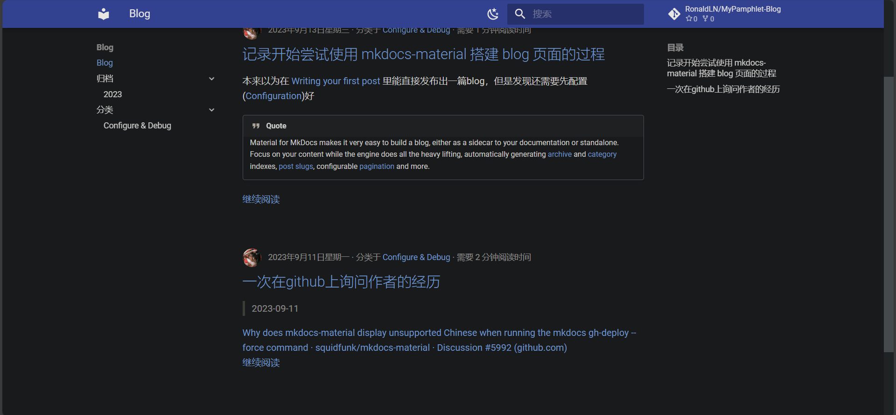
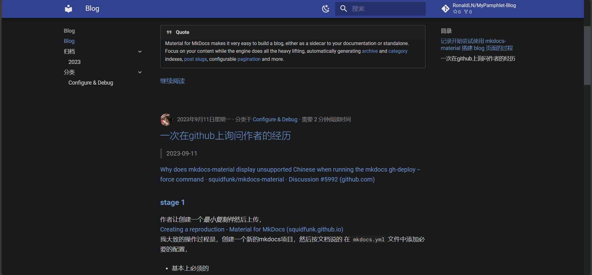

# 记录开始尝试使用 mkdocs-material 搭建 blog 页面的过程

本来以为在 [Writing your first post](https://squidfunk.github.io/mkdocs-material/setup/setting-up-a-blog/#writing-your-first-post) 里能直接发布出一篇blog，但是发现还需要先配置([Configuration](https://squidfunk.github.io/mkdocs-material/setup/setting-up-a-blog/#configuration))好

!!! quote

    Material for MkDocs makes it very easy to build a blog, either as a sidecar to your documentation or standalone. Focus on your content while the engine does all the heavy lifting, automatically generating [archive](https://squidfunk.github.io/mkdocs-material/setup/setting-up-a-blog/#archive) and [category](https://squidfunk.github.io/mkdocs-material/setup/setting-up-a-blog/#categories) indexes, [post slugs](https://squidfunk.github.io/mkdocs-material/setup/setting-up-a-blog/#+blog.post_url_format), configurable [pagination](https://squidfunk.github.io/mkdocs-material/setup/setting-up-a-blog/#pagination) and more.

<!-- more -->

[手册28](https://ronaldln.github.io/MyPamphlet/markdown%E7%9B%B8%E5%85%B3/mkdocs%28material%29/#28)

## 配置文件

先基本地添加blog插件，

```yaml
plugin:
  - blog
```

如果使用默认配置，文件结构应该为：

```bash
.
├─ docs/
│  └─ blog/
│     ├─ posts/
│     └─ index.md
└─ mkdocs.yml
```

并且**必须**将 `blog` 路径下的 `index.md` 添加到目录的配置中：

```yaml
nav:
  - Blog:
    - blog/index.md 
```

>   `index.md` 内官方给出的模板：
>
>   ```markdown
>   # Blog
>   ```
>
>   当然想添加其他东西也可以自己添加

在 [`blog-dir`](https://squidfunk.github.io/mkdocs-material/setup/setting-up-a-blog/#+blog.blog_dir) 中说到，如果想将网页制作成一个*独立博客(standalone blog)*，可以将 `blog-dir` 设置成 `.` ：

```yaml
plugins:
  - blog:
      blog_dir: .
```

那么如果其他的路径使用默认的设置的话，文件结构应该变成

```bash
.
├─ docs/
│  ├─ posts/
│  └─ index.md
└─ mkdocs.yml
```

那么之前的目录的设置应该改成

```yaml
nav:
  - Blog:
    - index.md 
```

之后我为了图省事，能使用默认的就使用默认的设置(推荐设置和默认设置一样的选项)，只添加推荐的配置和默认不一样的：

[`blog_toc`](https://squidfunk.github.io/mkdocs-material/setup/setting-up-a-blog/#+blog.blog_toc) 、 [`post_date_format`](https://squidfunk.github.io/mkdocs-material/setup/setting-up-a-blog/#+blog.post_date_format) 、 [`pagination_format`](https://squidfunk.github.io/mkdocs-material/setup/setting-up-a-blog/#+blog.pagination_format) 、 [`pagination_keep_content`](https://squidfunk.github.io/mkdocs-material/setup/setting-up-a-blog/#+blog.pagination_keep_content) 、 [`draft_if_future_date`](https://squidfunk.github.io/mkdocs-material/setup/setting-up-a-blog/#+blog.pagination_keep_content)

最后最终我的配置为：

```yaml
plugins:
  - blog:
      blog_dir: .
      blog_toc: true
      post_date_format: full
      archive_toc: true
      categories_toc: true
      pagination_format: "$link_first $link_previous ~2~ $link_next $link_last"
      pagination_keep_content: true
      draft_if_future_date: true
```

!!! quote

    Note that this setting is also used as the default value for `archive_toc` and `categories_toc`, unless those settings are explicitly defined.

## 发布第一篇blog

我先直接copy了 [Writing your first post](https://squidfunk.github.io/mkdocs-material/setup/setting-up-a-blog/#writing-your-first-post) ，发布第一篇blog，

>   在之前的posts文件夹中新建博客的文档 `test.md` :
>
>   ```markdown
>   ---
>   draft: true 
>   date: 2022-01-31 
>   categories:
>     - Hello
>     - World
>   ---
>   
>   # Hello world!
>   ...
>   
>   ```

然后慢慢添加设置

### 设置摘要

[Adding an excerpt](https://squidfunk.github.io/mkdocs-material/setup/setting-up-a-blog/#adding-an-excerpt)

可以在主页只显示blog中 `<!-- more -->` 之上的内容，而隐藏之后的内容:

```markdown
---
draft: false
date: 2023-09-11
authors:
  - ronald_luo
categories:
  - Configure & Debug
---

# 一次在github上询问作者的经历

>   2023-09-11

[Why does mkdocs-material display unsupported Chinese when running the mkdocs gh-deploy -- force command · squidfunk/mkdocs-material · Discussion #5992 (github.com)](https://github.com/squidfunk/mkdocs-material/discussions/5992)

<!-- more -->

## **stage 1**

作者让创建一个*最小复制件*然后上传，

...
```

=== "有摘要"

    { loading=lazy }

=== "无摘要"

    { loading=lazy }

### 设置作者

[Adding authors](https://squidfunk.github.io/mkdocs-material/setup/setting-up-a-blog/#adding-authors)

**要在之前设置的blog的对应的路径下创建一个 `.author.yml` 文件**：

```yaml
authors:
  ronald_luo:
    name: Ronald Luo
    description: I'm A Student
    avatar: https://github.com/RonaldLN/MyPamphlet-Blog/blob/main/assets/avatar.jpg?raw=true
```

**并且 `name` `description` `avatar` 三个选项均为必须**

`avatar` 必须填入的图片的URL链接，不能填本地的路径

在单篇blog中加入作者( `authors` 选项)：

```markdown
---
...
authors:
  - ronald_luo
  ...
...
---

# 记录开始尝试使用 mkdocs-material 搭建 blog 页面的过程

...
```

---

[Adding categories](https://squidfunk.github.io/mkdocs-material/setup/setting-up-a-blog/#adding-categories)

设置分类比较简单 易懂

[Adding tags](https://squidfunk.github.io/mkdocs-material/setup/setting-up-a-blog/#adding-tags)

添加tags在我的尝试过程中只能在搜索结果中显示tag，文章顶部并不能显示tag，感觉实用性不是很高，所以就没有添加这个东西

[Setting the reading time](https://squidfunk.github.io/mkdocs-material/setup/setting-up-a-blog/#setting-the-reading-time)

阅读时间在blog插件里内置有这个功能，不用设置也能显示阅读时间，但是如果认为不准的话，可以自己对单篇blog设置阅读时间而覆盖掉自动计算的

---

剩余的我认为有用的两个功能都需要赞助的版本才能使用

-   (在blog的左侧元数据部分)添加相关的链接 [Adding related links](https://squidfunk.github.io/mkdocs-material/setup/setting-up-a-blog/#adding-related-links)
-   设置默认的数据，包括作者什么的 Setting defaults](https://squidfunk.github.io/mkdocs-material/setup/setting-up-a-blog/#setting-defaults)

## 插曲

测试时编写blog文档：

```markdown
---
...
---

# Hello World

# Hello World

...
```

发现单篇blog中并没有显示目录(table of contents)，不像[官方文档中的blog](https://squidfunk.github.io/mkdocs-material/blog/2022/09/12/blog-support-just-landed/)那样

于是在官方github上询问

[How can I make the table of content appear for each post in my blog? · squidfunk/mkdocs-material · Discussion #5998 (github.com)](https://github.com/squidfunk/mkdocs-material/discussions/5998#discussioncomment-6993353)

作者[回复](https://github.com/squidfunk/mkdocs-material/discussions/5998#discussioncomment-6993353)，只有只设置了一个一级标题，才能显示目录

经过测试和修改之后成功显示了目录