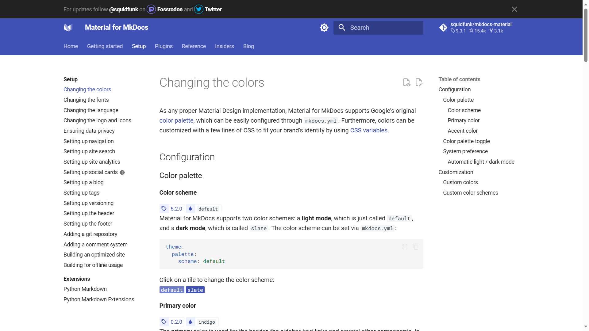
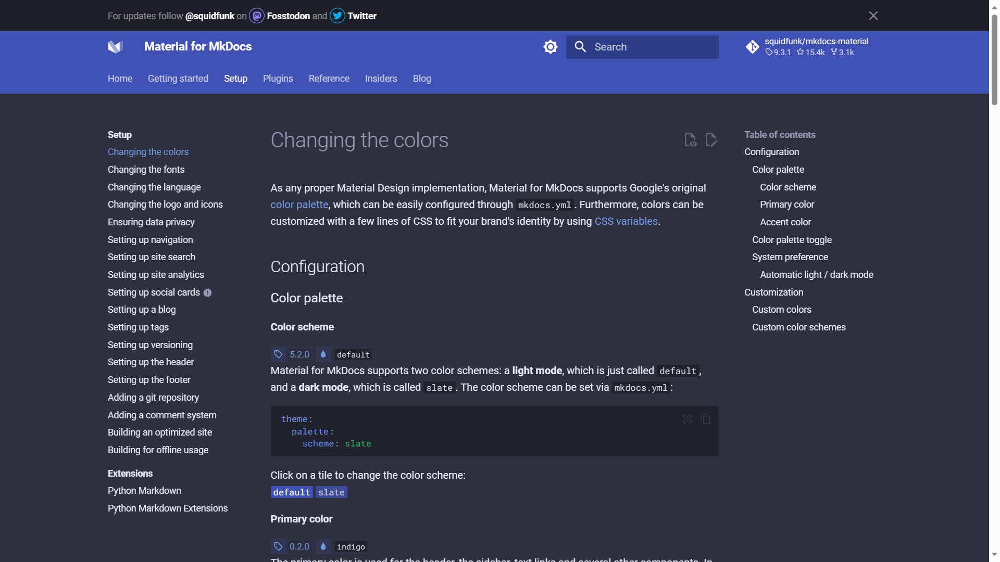
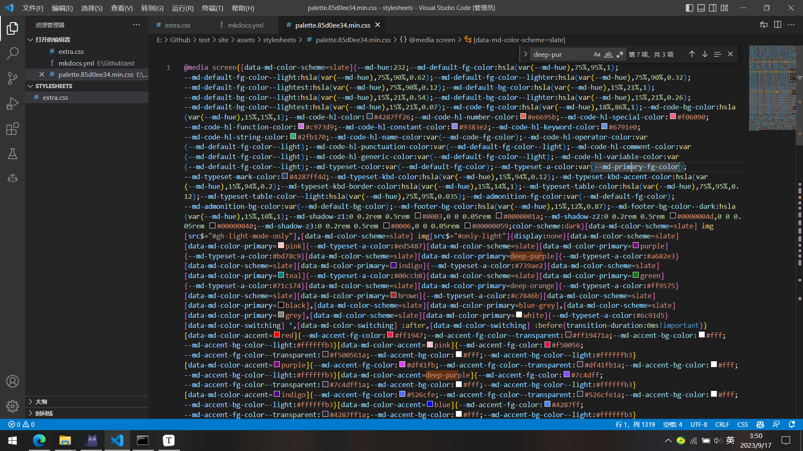
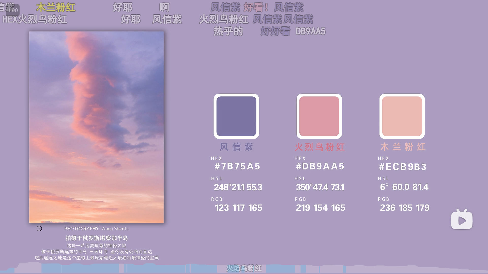
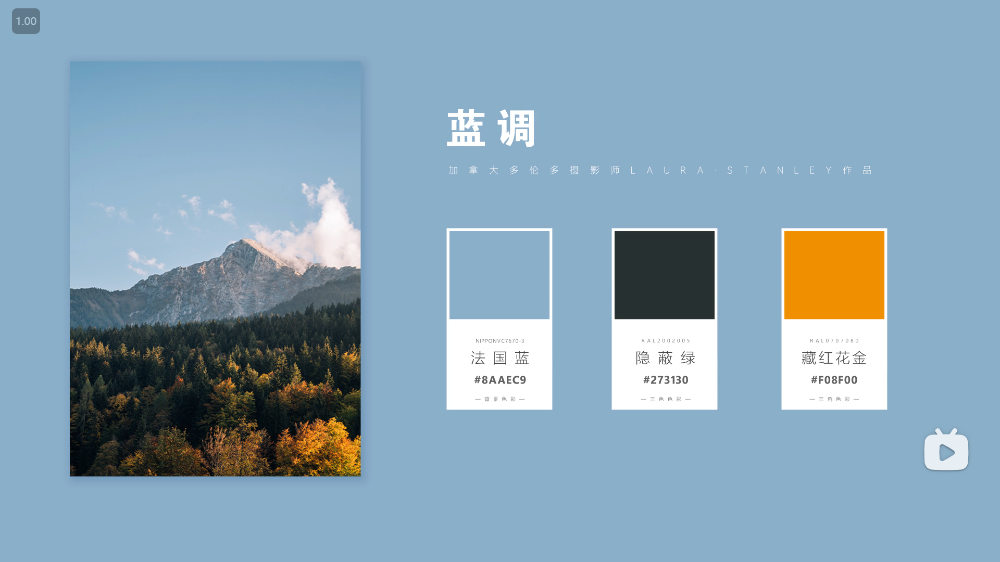
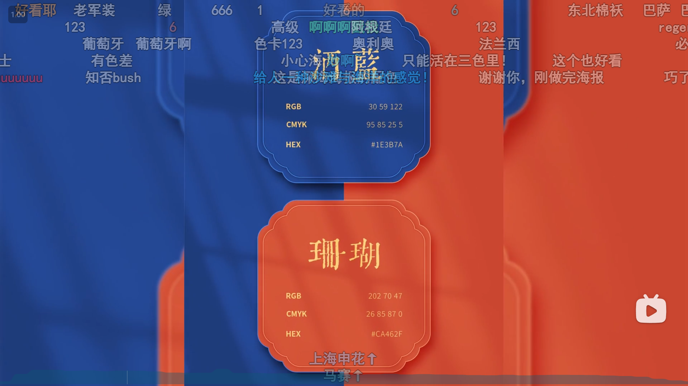

# 尝试更改和调整 mkdocs-material 页面的颜色的过程记录

因为感觉用mkdocs-material构建出来的网页页面(使用默认颜色/主题)看起来几乎都一样，所以想给*我的手册*改变一下颜色，使得手册和其他用mkdocs-material构建出来的网页看起来不一样

<!-- more -->

## 查阅官方文档更改配色的相关说明

[Changing the colors - Material for MkDocs (squidfunk.github.io)](https://squidfunk.github.io/mkdocs-material/setup/changing-the-colors/)

发现官方文档中，[网页底色](https://squidfunk.github.io/mkdocs-material/setup/changing-the-colors/#color-scheme)只有两种颜色，即 白天模式下的纯白色 和 黑夜模式下的 *slate 板岩* 色

=== "`default`"

    { loading=lazy }

=== "`slate`"

    { loading=lazy }

并且底色在官方文档中不能自定义更改，

而[顶部栏的颜色](https://squidfunk.github.io/mkdocs-material/setup/changing-the-colors/#primary-color)和[*强调色(指位于鼠标下的可点的链接的颜色)*](https://squidfunk.github.io/mkdocs-material/setup/changing-the-colors/#accent-color)可以有多种颜色可以选择，也可以[自定义颜色](https://squidfunk.github.io/mkdocs-material/setup/changing-the-colors/#customization)

## 尝试/探索自定义颜色/主题

[Custom color schemes](https://squidfunk.github.io/mkdocs-material/setup/changing-the-colors/#custom-color-schemes)

按照官方文档，在对应目录下创建了文件 `docs/stylesheets/extra.css` ：

```css
[data-md-color-scheme="youtube"] {
  --md-primary-fg-color:        #EE0F0F;
  --md-primary-fg-color--light: #ECB7B7;
  --md-primary-fg-color--dark:  #90030C;
}
```

并且在 `mkdocs.yml` 中设置好

```yaml
theme:
  palette:
    scheme: youtube
extra_css:
  - stylesheets/extra.css
```

经过测试有**两个发现**：

-   `css` 文件中的 `data-md-color-scheme=` 后的引号中的内容，就是可以/应该写在 `mkdocs.yml` 中 `scheme:` 后的*关键字*，(之后的实践发现，**如果想设置的*关键字*不止一个单词**，那么 `css` 文件中的设置**单词之间应该用短横线 `-` 连接**)

    所以在 [Color palette toggle](https://squidfunk.github.io/mkdocs-material/setup/changing-the-colors/#color-palette-toggle) 中的设置

    ```yaml
    theme:
      palette:
    
        # Palette toggle for light mode
        - media: "(prefers-color-scheme: light)"
          scheme: default
          toggle:
            icon: material/brightness-7
            name: Switch to dark mode
    
        # Palette toggle for dark mode
        - media: "(prefers-color-scheme: dark)"
          scheme: slate
          toggle:
            icon: material/brightness-4
            name: Switch to light mode
    ```

    中的 `scheme:` 后也可以填

-   按照官方文档的这个方法，在 `scheme:` 填好相应配置后，也只能更改顶部栏的颜色，并不能更改网页的底色

### 发现可行的更改网页底色的可行方法

由于官方文档中写的是使用css文件来自定义颜色/主题，所以突然想到能不能从 `mkdocs build` 之后产生的网页文件里面，找到相应的网页配色的css文件，

经过尝试后，在 `site/assets/stylesheets` 目录下找到 `palette.xxxxxxxx.min.css` 文件，

然后尝试将其中的 `[data-md-color-scheme=slate]{...}` 的内容

```css
[data-md-color-scheme=slate]{
  --md-hue:232;
  --md-default-fg-color:hsla(var(--md-hue),75%,95%,1);
  --md-default-fg-color--light:hsla(var(--md-hue),75%,90%,0.62);
  --md-default-fg-color--lighter:hsla(var(--md-hue),75%,90%,0.32);
  --md-default-fg-color--lightest:hsla(var(--md-hue),75%,90%,0.12);
  --md-default-bg-color:hsla(var(--md-hue),15%,21%,1);
  --md-default-bg-color--light:hsla(var(--md-hue),15%,21%,0.54);
  --md-default-bg-color--lighter:hsla(var(--md-hue),15%,21%,0.26);
  --md-default-bg-color--lightest:hsla(var(--md-hue),15%,21%,0.07);
  --md-code-fg-color:hsla(var(--md-hue),18%,86%,1);
  --md-code-bg-color:hsla(var(--md-hue),15%,15%,1);
  --md-code-hl-color:#4287ff26;
  --md-code-hl-number-color:#e6695b;
  --md-code-hl-special-color:#f06090;
  --md-code-hl-function-color:#c973d9;
  --md-code-hl-constant-color:#9383e2;
  --md-code-hl-keyword-color:#6791e0;
  --md-code-hl-string-color:#2fb170;
  --md-code-hl-name-color:var(--md-code-fg-color);
  --md-code-hl-operator-color:var(--md-default-fg-color--light);
  --md-code-hl-punctuation-color:var(--md-default-fg-color--light);
  --md-code-hl-comment-color:var(--md-default-fg-color--light);
  --md-code-hl-generic-color:var(--md-default-fg-color--light);
  --md-code-hl-variable-color:var(--md-default-fg-color--light);
  --md-typeset-color:var(--md-default-fg-color);
  --md-typeset-a-color:var(--md-primary-fg-color);
  --md-typeset-mark-color:#ffb7424d;
  --md-typeset-kbd-color:hsla(var(--md-hue),15%,94%,0.12);
  --md-typeset-kbd-accent-color:hsla(var(--md-hue),15%,94%,0.2);
  --md-typeset-kbd-border-color:hsla(var(--md-hue),15%,14%,1);
  --md-typeset-table-color:hsla(var(--md-hue),75%,95%,0.12);
  --md-typeset-table-color--light:hsla(var(--md-hue),75%,95%,0.035);
  --md-admonition-fg-color:var(--md-default-fg-color);
  --md-admonition-bg-color:var(--md-default-bg-color);
  --md-footer-bg-color:hsla(var(--md-hue),15%,12%,0.87);
  --md-footer-bg-color--dark:hsla(var(--md-hue),15%,10%,1);
  --md-shadow-z1:0 0.2rem 0.5rem #0003,0 0 0.05rem #0000001a;
  --md-shadow-z2:0 0.2rem 0.5rem #0000004d,0 0 0.05rem #00000040;
  --md-shadow-z3:0 0.2rem 0.5rem #0006,0 0 0.05rem #00000059;
  color-scheme:dark
}
```

复制到 `docs/stylesheets/extra.css` 中，

然后尝试**更改 `--md-hue:232;` 为其他的数值**，发现网页底色改变了，并且在更改了 `data-md-color-scheme=` 后的内容以及其相应配置后，网页底色依旧改变

## 开始配置自定义的网页底色

测试后发现，只是复制并更改 `--md-hue` 还有某些地方的颜色不能更改：

{ loading=lazy }

如图中的 `MkDocs`

经过测试发现，这部分的颜色，是由[这里](#尝试/探索自定义颜色/主题)的这三行配置决定

```css
  --md-primary-fg-color:        #EE0F0F;
  --md-primary-fg-color--light: #ECB7B7;
  --md-primary-fg-color--dark:  #90030C;
```

### 插曲：突然理解官方文档中写的操作

官方文档在 [Custom color schemes](https://squidfunk.github.io/mkdocs-material/setup/changing-the-colors/#custom-color-schemes) 中记录一种更改网页底色的操作：

>   Additionally, the `slate` color scheme defines all of it's colors via `hsla` color functions and deduces its colors from the `--md-hue` CSS variable. You can tune the `slate` theme with:
>
>   ```css
>   [data-md-color-scheme="slate"] {
>     --md-hue: 210; 
>   }
>   ```

可能的原理是，**将 `mkdocs build` 之后自己生成的css文件中的 `[data-md-color-scheme="slate"] {...}` 中的 `--md-hue:` 部分更改成相对应的值**，并且经过测试后，能与之前发现的非官方解决方法达到一样的颜色效果

所以，官方文档中的这种方法**有好有坏**：

-   优点：只用编写三行代码
-   缺点：只能对 `slate` 一种主题生效，也就是说，只能有一种配色方案

### 自定义浅色/白天模式下的颜色

经过测试发现，[这里](#发现可行的更改网页底色的可行方法)的配置代码中，只有这一行

```css
  --md-default-bg-color:hsla(var(--md-hue),15%,21%,1);
```

会影响到网页的底色，

>   (我猜测可能含 `bg` 的属性应该是配套的，所以打算附带上下面三行一起添加上)
>
>   ```css
>     --md-default-bg-color:hsla(var(--md-hue),15%,21%,1);
>     --md-default-bg-color--light:hsla(var(--md-hue),15%,21%,0.54);
>     --md-default-bg-color--lighter:hsla(var(--md-hue),15%,21%,0.26);
>     --md-default-bg-color--lightest:hsla(var(--md-hue),15%,21%,0.07);
>   ```

经过测试发现，上面代码中，最后三个数值中的前两个(即 `15%` 和 `20%` )分别对应的位置，似乎是 **色彩饱和度** 和 **亮度** ，再加上第一个参数(应该是跟 `--md-hue` 的数值一样)的属性，应该是**通过[HSL](https://www.w3school.com.cn/css/css_colors_hsl.asp)色彩空间的模式**设置网页底色

---

发现这一行是设置代码块的底色：

```css
  --md-code-bg-color:hsla(var(--md-hue),15%,15%,1);
```

而且似乎代码块的底色只比网页底色亮度大概少个5%左右，我感觉浅色模式下差值设置成 4% 或 3% 就行

### 其他发现

发现 `mkdocs.yml` 配置中的 `scheme` 会覆盖掉 `primary` ，

所以如果底色和顶部栏都想修改颜色，得将修改primary的几个css代码添加到自定义的scheme中

---

发现 `--md-default-bg-color:` 和 `--md-primary-fg-color:` 等属性也可以使用HEX来设置颜色，如 `#f6b4a6` 

---

{ loading=lazy }

由于尝试多种方法无法更改图中 `MkDocs` 等字的颜色，而按照 [Custom colors](https://squidfunk.github.io/mkdocs-material/setup/changing-the-colors/#custom-colors) 中的方法设置了 `primary: custom` 之后，又能改变颜色，所以怀疑关于这些字的颜色的属性可能跟 `--md-default-bg-color` 一样使用了关于 `primary` 的某个参数，

所以查看css文件中的代码，然后发现

{ loading=lazy }

只有 `--md-typeset-a-color` 跟 `primary` 有关，且只与 `--md-primary-fg-color` 有关

经过测试，发现这个参数就是控制上述字颜色的参数

---

还需要添加：

```css
  --md-admonition-fg-color: var(--md-default-fg-color);
  --md-admonition-bg-color: var(--md-default-bg-color);
```

要不然 [Admonitions](https://squidfunk.github.io/mkdocs-material/reference/admonitions/#admonitions) 不会改变颜色

### 寻找合适的颜色

[颜色计算器 - 在线颜色工具 - PhotoKit.com](https://photokit.com/colors/color-calculator/?lang=zh)

这个网站可以转换HSL、HSV、HEX、RGB等值

---

[`my_scheme.css`](https://github.com/RonaldLN/MyPamphlet-Blog/blob/main/docs/stylesheets/my_scheme.css) ：

```css
[data-md-color-scheme="sunset-glow"] {
  --md-hue: 6;
  --md-default-bg-color: hsla(var(--md-hue), 90%, 93%, 1);
  --md-default-bg-color--light: hsla(var(--md-hue), 90%, 93%, 0.54);
  --md-default-bg-color--lighter: hsla(var(--md-hue), 90%, 93%, 0.26);
  --md-default-bg-color--lightest: hsla(var(--md-hue), 90%, 93%, 0.07);
  --md-code-bg-color: hsla(var(--md-hue), 90%, 95%, 1);

  --md-primary-fg-color: #7b75a5;
  --md-primary-fg-color--light: #c4c1d7;
  --md-primary-fg-color--dark: #4e496f;
  --md-primary-bg-color: #fff;
  --md-primary-bg-color--light: #ffffffb3;

  --md-typeset-a-color: var(--md-primary-fg-color);

  --md-accent-fg-color: #db9aa5;
  --md-accent-fg-color--transparent: #f500561a;
  --md-accent-bg-color: #fff;
  --md-accent-bg-color--light: #ffffffb3;

  --md-admonition-fg-color: var(--md-default-fg-color);
  --md-admonition-bg-color: var(--md-default-bg-color);
}

[data-md-color-scheme="sunset"] {
  --md-hue: 6;
  --md-default-bg-color: hsla(var(--md-hue), 90%, 93%, 1);
  --md-default-bg-color--light: hsla(var(--md-hue), 90%, 93%, 0.54);
  --md-default-bg-color--lighter: hsla(var(--md-hue), 90%, 93%, 0.26);
  --md-default-bg-color--lightest: hsla(var(--md-hue), 90%, 93%, 0.07);
  --md-code-bg-color: hsla(var(--md-hue), 90%, 95%, 1);

  --md-primary-fg-color: hsl(358, 81%, 65%);
  --md-primary-fg-color--light: #c4c1d7;
  --md-primary-fg-color--dark: #4e496f;
  --md-primary-bg-color: #fff;
  --md-primary-bg-color--light: #ffffffb3;

  --md-typeset-a-color: var(--md-primary-fg-color);

  --md-accent-fg-color: hsl(330, 27%, 48%);
  --md-accent-fg-color--transparent: #f500561a;
  --md-accent-bg-color: #fff;
  --md-accent-bg-color--light: #ffffffb3;

  --md-admonition-fg-color: var(--md-default-fg-color);
  --md-admonition-bg-color: var(--md-default-bg-color);
}

[data-md-color-scheme="sunrise"] {
  --md-hue: 280;
  --md-default-fg-color: hsla(var(--md-hue), 75%, 95%, 1);
  --md-default-fg-color--light: hsla(var(--md-hue), 75%, 90%, 0.62);
  --md-default-fg-color--lighter: hsla(var(--md-hue), 75%, 90%, 0.32);
  --md-default-fg-color--lightest: hsla(var(--md-hue), 75%, 90%, 0.12);
  --md-default-bg-color: hsla(var(--md-hue), 15%, 21%, 1);
  --md-default-bg-color--light: hsla(var(--md-hue), 15%, 21%, 0.54);
  --md-default-bg-color--lighter: hsla(var(--md-hue), 15%, 21%, 0.26);
  --md-default-bg-color--lightest: hsla(var(--md-hue), 15%, 21%, 0.07);
  --md-code-fg-color: hsla(var(--md-hue), 18%, 86%, 1);
  --md-code-bg-color: hsla(var(--md-hue), 15%, 15%, 1);
  --md-code-hl-color: #4287ff26;
  --md-code-hl-number-color: #e6695b;
  --md-code-hl-special-color: #f06090;
  --md-code-hl-function-color: #c973d9;
  --md-code-hl-constant-color: #9383e2;
  --md-code-hl-keyword-color: #6791e0;
  --md-code-hl-string-color: #2fb170;
  --md-code-hl-name-color: var(--md-code-fg-color);
  --md-code-hl-operator-color: var(--md-default-fg-color--light);
  --md-code-hl-punctuation-color: var(--md-default-fg-color--light);
  --md-code-hl-comment-color: var(--md-default-fg-color--light);
  --md-code-hl-generic-color: var(--md-default-fg-color--light);
  --md-code-hl-variable-color: var(--md-default-fg-color--light);
  --md-typeset-color: var(--md-default-fg-color);
  --md-typeset-a-color: var(--md-primary-fg-color);
  --md-typeset-mark-color: #ffb7424d;
  --md-typeset-kbd-color: hsla(var(--md-hue), 15%, 94%, 0.12);
  --md-typeset-kbd-accent-color: hsla(var(--md-hue), 15%, 94%, 0.2);
  --md-typeset-kbd-border-color: hsla(var(--md-hue), 15%, 14%, 1);
  --md-typeset-table-color: hsla(var(--md-hue), 75%, 95%, 0.12);
  --md-typeset-table-color--light: hsla(var(--md-hue), 75%, 95%, 0.035);
  --md-admonition-fg-color: var(--md-default-fg-color);
  --md-admonition-bg-color: var(--md-default-bg-color);
  --md-footer-bg-color: hsla(var(--md-hue), 15%, 12%, 0.87);
  --md-footer-bg-color--dark: hsla(var(--md-hue), 15%, 10%, 1);
  --md-shadow-z1: 0 0.2rem 0.5rem #0003, 0 0 0.05rem #0000001a;
  --md-shadow-z2: 0 0.2rem 0.5rem #0000004d, 0 0 0.05rem #00000040;
  --md-shadow-z3: 0 0.2rem 0.5rem #0006, 0 0 0.05rem #00000059;
  color-scheme: dark;

  --md-primary-fg-color: hsl(358, 81%, 65%);
  --md-primary-fg-color--light: #c4c1d7;
  --md-primary-fg-color--dark: #4e496f;
  --md-primary-bg-color: #fff;
  --md-primary-bg-color--light: #ffffffb3;

  --md-typeset-a-color: var(--md-primary-fg-color);

  --md-accent-fg-color: #db9aa5;
  --md-accent-fg-color--transparent: #f500561a;
  --md-accent-bg-color: #fff;
  --md-accent-bg-color--light: #ffffffb3;
}

[data-md-color-scheme="forest"] {
  --md-hue: 82;
  --md-default-bg-color: hsla(var(--md-hue), 93%, 90%, 1);
  --md-default-bg-color--light: hsla(var(--md-hue), 93%, 90%, 0.54);
  --md-default-bg-color--lighter: hsla(var(--md-hue), 93%, 90%, 0.26);
  --md-default-bg-color--lightest: hsla(var(--md-hue), 93%, 90%, 0.07);
  --md-code-bg-color: hsla(var(--md-hue), 58%, 88%, 1);

  --md-primary-fg-color: hsl(38, 100%, 34%);
  --md-primary-fg-color--light: hsl(38, 91%, 82%);
  --md-primary-fg-color--dark: hsl(25, 26%, 34%);
  --md-primary-bg-color: #fff;
  --md-primary-bg-color--light: #ffffffb3;

  --md-typeset-a-color: var(--md-primary-fg-color);

  --md-accent-fg-color: hsl(36, 100%, 45%);
  --md-accent-fg-color--transparent: #f500561a;
  --md-accent-bg-color: #fff;
  --md-accent-bg-color--light: #ffffffb3;

  --md-admonition-fg-color: var(--md-default-fg-color);
  --md-admonition-bg-color: var(--md-default-bg-color);
}

[data-md-color-scheme="forest-dark"] {
  --md-hue: 221;
  --md-default-fg-color: hsla(var(--md-hue), 75%, 95%, 1);
  --md-default-fg-color--light: hsla(var(--md-hue), 75%, 90%, 0.62);
  --md-default-fg-color--lighter: hsla(var(--md-hue), 75%, 90%, 0.32);
  --md-default-fg-color--lightest: hsla(var(--md-hue), 75%, 90%, 0.12);
  --md-default-bg-color: hsla(var(--md-hue), 45%, 22%, 1);
  --md-default-bg-color--light: hsla(var(--md-hue), 45%, 22%, 0.54);
  --md-default-bg-color--lighter: hsla(var(--md-hue), 45%, 22%, 0.26);
  --md-default-bg-color--lightest: hsla(var(--md-hue), 45%, 22%, 0.07);
  --md-code-fg-color: hsla(var(--md-hue), 18%, 86%, 1);
  --md-code-bg-color: hsla(var(--md-hue), 45%, 16%, 1);
  --md-code-hl-color: #4287ff26;
  --md-code-hl-number-color: #e6695b;
  --md-code-hl-special-color: #f06090;
  --md-code-hl-function-color: #c973d9;
  --md-code-hl-constant-color: #9383e2;
  --md-code-hl-keyword-color: #6791e0;
  --md-code-hl-string-color: #2fb170;
  --md-code-hl-name-color: var(--md-code-fg-color);
  --md-code-hl-operator-color: var(--md-default-fg-color--light);
  --md-code-hl-punctuation-color: var(--md-default-fg-color--light);
  --md-code-hl-comment-color: var(--md-default-fg-color--light);
  --md-code-hl-generic-color: var(--md-default-fg-color--light);
  --md-code-hl-variable-color: var(--md-default-fg-color--light);
  --md-typeset-color: var(--md-default-fg-color);
  --md-typeset-a-color: var(--md-primary-fg-color);
  --md-typeset-mark-color: #ffb7424d;
  --md-typeset-kbd-color: hsla(var(--md-hue), 15%, 94%, 0.12);
  --md-typeset-kbd-accent-color: hsla(var(--md-hue), 15%, 94%, 0.2);
  --md-typeset-kbd-border-color: hsla(var(--md-hue), 15%, 14%, 1);
  --md-typeset-table-color: hsla(var(--md-hue), 75%, 95%, 0.12);
  --md-typeset-table-color--light: hsla(var(--md-hue), 75%, 95%, 0.035);
  --md-admonition-fg-color: var(--md-default-fg-color);
  --md-admonition-bg-color: var(--md-default-bg-color);
  --md-footer-bg-color: hsla(var(--md-hue), 15%, 12%, 0.87);
  --md-footer-bg-color--dark: hsla(var(--md-hue), 15%, 10%, 1);
  --md-shadow-z1: 0 0.2rem 0.5rem #0003, 0 0 0.05rem #0000001a;
  --md-shadow-z2: 0 0.2rem 0.5rem #0000004d, 0 0 0.05rem #00000040;
  --md-shadow-z3: 0 0.2rem 0.5rem #0006, 0 0 0.05rem #00000059;
  color-scheme: dark;

  --md-primary-fg-color: hsl(30, 78%, 61%);
  --md-primary-fg-color--light: hsl(38, 91%, 82%);
  --md-primary-fg-color--dark: hsl(25, 26%, 34%);
  --md-primary-bg-color: #fff;
  --md-primary-bg-color--light: #ffffffb3;

  --md-typeset-a-color: var(--md-primary-fg-color);

  --md-accent-fg-color: hsl(36, 100%, 45%);
  --md-accent-fg-color--transparent: #f500561a;
  --md-accent-bg-color: #fff;
  --md-accent-bg-color--light: #ffffffb3;
}
```

---

主要参考：

[提升审美色感 |“漫天云彩，治愈色彩”高级感治愈天空配色\_哔哩哔哩\_bilibili](https://www.bilibili.com/video/BV1sr4y1t7u6/)

{ loadin=lazy }

[提升审美 | 迷失在静谧森林的暗绿 | 高级感色彩配色\_哔哩哔哩\_bilibili](https://www.bilibili.com/video/BV1gY4y1K7L6/)

{ loading=lazy }

{ loading=lazy }

[【世界经典顶级撞色】你还不会配色吗？结合当下流行色系，视觉的盛宴|提升色感审美\_哔哩哔哩\_bilibili](https://www.bilibili.com/video/BV1j8411c7Su/)

{ loading=lazy }

