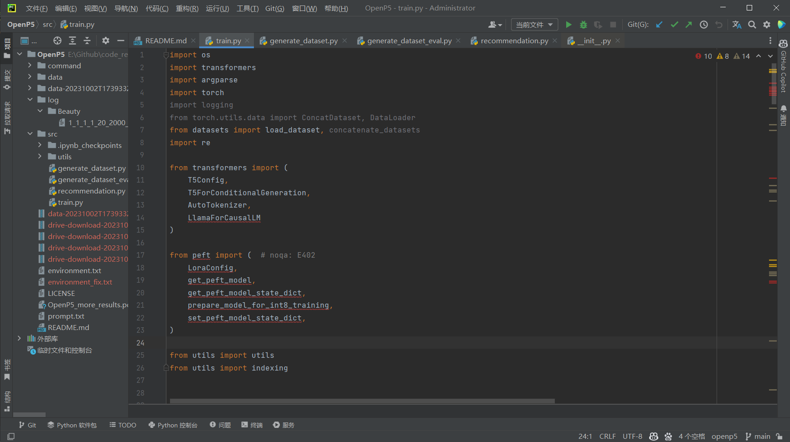
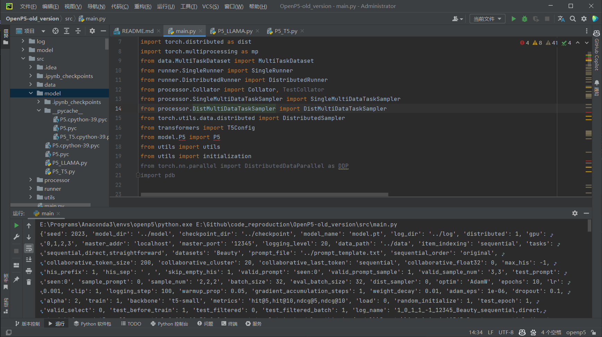

# 复现代码过程记录

## OpenP5

论文网址：

[OpenP5: Benchmarking Foundation Models for Recommendation | Papers With Code](https://paperswithcode.com/paper/openp5-benchmarking-foundation-models-for)

代码地址：

[agiresearch/OpenP5: OpenP5: An Open-source Platform for Developing, Fine-tuning, and Evaluating LLM-based Recommenders (github.com) - https://github.com/agiresearch/OpenP5](https://github.com/agiresearch/OpenP5)

<!-- more -->

环境 `environment.txt` :

```txt
python==3.9.7
transformers==4.26.0
torch==1.8.1+cu111
sklearn==1.1.2
torchvision==0.9.1+cu111
tqdm==4.64.1
time
collections
argparse
os
sys
numpy==1.23.1
```

由于 `time` `colloctions` `os` `sys` 好像都是自带的不能装，而 `torch` `torchvision` 需要装的是 cuda 版的，所以我将其修改为

```txt
transformers==4.26.0
scikit-learn==1.1.2
tqdm==4.64.1
argparse
numpy==1.23.1
```

其中 `sklearn` 在之前安装时发现说是更改成了 `scikit-learn` 所以我也进行了修改

这样就可以直接运行命令来安装对应的包

```bash
pip install -r environment.txt
```

---

安装好这些后，打开 clone 的仓库，发现 `train.py` 中还是有一些报错



并且 `README.md` 中写着

>   ## Usage
>
>   Download the data from [Google Drive link](https://drive.google.com/drive/folders/1W5i5ryetj_gkcOpG1aZfL5Y8Yk6RxwYE?usp=sharing), and put them into `./data` folder.
>
>   The training command can be found in `./command` folder. Run the command such as
>
>   ```bash
>   cd command
>   sh ML1M_random.sh
>   ```

然而并没有 `./command` 文件夹，然后我发现，从main分支里下载的文件里面并没有command文件夹，

而有一个 old_version分支里面有，并且 `./command/ML1M_random.sh` 文件中的命令是要运行 `./src/main.py` 文件，而这个文件只在 old_version 分支中有，并且几乎所装的包都在 `main.py` 中被导入，所以我决定使用 old_version

---

由于需要执行 `.sh` 文件，这个在windows的cmd中好像不能使用，只能在git bash终端中使用，而我又需要使用 conda 环境，

所以发现在 bash 中不能像cmd中一样运行 `conda activate openp5` 

搜索后发现了这个方法有效

[Conda environment fails to activate with Git Bash · Issue #19534 · microsoft/vscode-python (github.com)](https://github.com/microsoft/vscode-python/issues/19534#issuecomment-1194774160)

>   [手册 - Anaconda](https://ronaldln.github.io/MyPamphlet/系统%26环境/anaconda/#5)

`source` anaconda3 安装路径下的 `/Scripts/activate`

```bash
source /e/Programs/Anaconda3/Scripts/activate
```

然后就会启动 anaconda 的 base 环境，这时 `conda activate openp5` 就有可以使用 openp5 的虚拟环境了

---

### 解决 `.pyc` 文件导入问题

old_version的 `main.py` 中有一处报错，

{ loading=lazy }

是使用了自己的包，而好像 pycharm 中 `./src/model` 文件夹中并没有这个 `P5` 的东西

经过一顿折腾之后，偶然发现了，原本的仓库里面， `model` 文件夹下有一个 `__pycache__` 文件夹，里面有一个 `P5.cpython-39.pyc` 文件，我认为这个应该就是 `main.py` 要导的包，

所以开始查询如何在 pycharm 中才能导入这个包(因为最近也有一个类似的情况(编译Orbbec SDK) - 在终端中能使用/导入pyc文件，而在pycharm中会报错)，然后发现了

[python - Cannot see pyc files in PyCharm - Stack Overflow](https://stackoverflow.com/questions/64209855/cannot-see-pyc-files-in-pycharm)

这个的[回答](https://stackoverflow.com/a/64214290)

需要在 pycharm 的 **==设置 - 编辑器 - 文件类型 - 忽略的文件和文件夹==** 里，把 `*.pyc` 和 `__pycache__` 去掉

---

但经过测试之后发现，即使能看到pyc文件也还是会报错

想起来在 [Orbbec SDK for Python 使用手册 测试 Sample](https://vcp.developer.orbbec.com.cn:9001/project-2/doc-70/#测试-sample) 里，终端上使用时，需要设置一个 `PYTHONPATH` 的环境变量，

```bash
# set PYTHONPATH environment variable to include the lib directory in the install directory
export PYTHONPATH=$PYTHONPATH:$(pwd)/install/lib/
```

所以开始查询如何在 pycharm 中设置 `PYTHONPATH` 环境变量，然后从

[python - PyCharm and PYTHONPATH - Stack Overflow](https://stackoverflow.com/questions/28326362/pycharm-and-pythonpath)

[Manage interpreter paths | PyCharm Documentation (jetbrains.com)](https://www.jetbrains.com/help/pycharm/installing-uninstalling-and-reloading-interpreter-paths.html)

找到了方法：

**==设置 - 项目 - Python解释器 - 在 `Python 解释器:` 右侧的框的右侧点击向下的三角/箭头 - 全部显示 - 在左上角图标中找到 `显示解释器路径` - 添加相应的路径==**

{ loading=lazy }

{ loading=lazy }

由于 `main.py` 文件中，是

```python
from model.P5 import P5
```

所以应该是把 `model` 的父目录(即项目的根目录)添加上

```txt
E:\Github\code_reproduction\OpenP5-old_version
```

添加完了之后，即使还是会有红色的警告，但能运行了

{ loading=lazy }

---

## 报错

??? quote "error info"

    ```bash
    $ sh ML1M_random.sh
    {'seed': 2023, 'model_dir': '../model', 'checkpoint_dir': '../checkpoint', 'model_name': 'model.pt', 'log_dir': '../log', 'distributed': 1, 'gpu': '0,1', 'master_addr': 'localhost', 'master_port': '1991', 'logging_level': 20, 'data_path': '../data', 'item_indexing': 'random', 'tasks': 'sequential,straightforward', 'datasets': 'ML1M', 'prompt_file': '../prompt.txt', 'sequential_order': 'original', 'collaborative_token_size': 200, 'collaborative_cluster': 20, 'collaborative_last_token': 'sequential', 'collaborative_float32': 0, 'max_his': 20, 'his_prefix': 1, 'his_sep': ' , ', 'skip_empty_his': 1, 'valid_prompt': 'seen:0', 'valid_prompt_sample': 1, 'valid_sample_num': '3,3', 'test_prompt': 'seen:0', 'sample_prompt': 1, 'sample_num': '3,3', 'batch_size': 128, 'eval_batch_size': 20, 'dist_sampler': 0, 'optim': 'AdamW', 'epochs': 10, 'lr': 0.001, 'clip': 1, 'logging_step': 100, 'warmup_prop': 0.05, 'gradient_accumulation_steps': 1, 'weight_decay': 0.01, 'adam_eps': 1e-06, 'dropout': 0.1, 'alpha': 2, 'train': 1, 'backbone': 't5-small', 'metrics': 'hit@5,hit@10,ndcg@5,ndcg@10', 'load': 0, 'random_initialize': 1, 'test_epoch': 0, 'valid_select': 0, 'test_before_train': 0, 'test_filtered': 0, 'test_filtered_batch': 1, 'log_name': '1_1_1_1_20_1991_ML1M_sequential,straightforward_t5-small_random_0.001_10_128_3,3_prompt', 'model_path': '../model\\ML1M\\1_1_1_1_20_1991_ML1M_sequential,straightforward_t5-small_random_0.001_10_128_3,3_prompt.pt', 'rank': 0}
    '(MaxRetryError("HTTPSConnectionPool(host='huggingface.co', port=443): Max retries exceeded with url: /t5-small/resolve/main/tokenizer_config.json (Caused by ConnectTimeoutError(<urllib3.connection.HTTPSConnection object at 0x0000018265B83BB0>, 'Connection to huggingface.co timed out. (connect timeout=10)'))"), '(Request ID: 703c57e1-700e-4497-8fdf-3cf500baea63)')' thrown while requesting HEAD https://huggingface.co/t5-small/resolve/main/tokenizer_config.json
    '(MaxRetryError("HTTPSConnectionPool(host='huggingface.co', port=443): Max retries exceeded with url: /t5-small/resolve/main/tokenizer_config.json (Caused by ConnectTimeoutError(<urllib3.connection.HTTPSConnection object at 0x0000018265B83BB0>, 'Connection to huggingface.co timed out. (connect timeout=10)'))"), '(Request ID: 703c57e1-700e-4497-8fdf-3cf500baea63)')' thrown while requesting HEAD https://huggingface.co/t5-small/resolve/main/tokenizer_config.json
    '(MaxRetryError("HTTPSConnectionPool(host='huggingface.co', port=443): Max retries exceeded with url: /t5-small/resolve/main/config.json (Caused by ConnectTimeoutError(<urllib3.connection.HTTPSConnection object at 0x000001821CE4F7C0>, 'Connection to huggingface.co timed out. (connect timeout=10)'))"), '(Request ID: fece3cd4-12a5-4ab5-b3a2-7fea10c749bf)')' thrown while requesting HEAD https://huggingface.co/t5-small/resolve/main/config.json
    '(MaxRetryError("HTTPSConnectionPool(host='huggingface.co', port=443): Max retries exceeded with url: /t5-small/resolve/main/config.json (Caused by ConnectTimeoutError(<urllib3.connection.HTTPSConnection object at 0x000001821CE4F7C0>, 'Connection to huggingface.co timed out. (connect timeout=10)'))"), '(Request ID: fece3cd4-12a5-4ab5-b3a2-7fea10c749bf)')' thrown while requesting HEAD https://huggingface.co/t5-small/resolve/main/config.json
    Traceback (most recent call last):
      File "E:\Programs\Anaconda3\envs\openp5\lib\site-packages\urllib3\connection.py", line 203, in _new_conn
        sock = connection.create_connection(
      File "E:\Programs\Anaconda3\envs\openp5\lib\site-packages\urllib3\util\connection.py", line 85, in create_connection
        raise err
      File "E:\Programs\Anaconda3\envs\openp5\lib\site-packages\urllib3\util\connection.py", line 73, in create_connection
        sock.connect(sa)
    socket.timeout: timed out
    
    The above exception was the direct cause of the following exception:
    
    Traceback (most recent call last):
      File "E:\Programs\Anaconda3\envs\openp5\lib\site-packages\urllib3\connectionpool.py", line 790, in urlopen
        response = self._make_request(
      File "E:\Programs\Anaconda3\envs\openp5\lib\site-packages\urllib3\connectionpool.py", line 491, in _make_request
        raise new_e
      File "E:\Programs\Anaconda3\envs\openp5\lib\site-packages\urllib3\connectionpool.py", line 467, in _make_request
        self._validate_conn(conn)
      File "E:\Programs\Anaconda3\envs\openp5\lib\site-packages\urllib3\connectionpool.py", line 1092, in _validate_conn
        conn.connect()
      File "E:\Programs\Anaconda3\envs\openp5\lib\site-packages\urllib3\connection.py", line 611, in connect
        self.sock = sock = self._new_conn()
      File "E:\Programs\Anaconda3\envs\openp5\lib\site-packages\urllib3\connection.py", line 212, in _new_conn
        raise ConnectTimeoutError(
    urllib3.exceptions.ConnectTimeoutError: (<urllib3.connection.HTTPSConnection object at 0x000001821CE4F7C0>, 'Connection to huggingface.co timed out. (connect timeout=10)')
    
    The above exception was the direct cause of the following exception:
    
    Traceback (most recent call last):
      File "E:\Programs\Anaconda3\envs\openp5\lib\site-packages\requests\adapters.py", line 486, in send
        resp = conn.urlopen(
      File "E:\Programs\Anaconda3\envs\openp5\lib\site-packages\urllib3\connectionpool.py", line 844, in urlopen
        retries = retries.increment(
      File "E:\Programs\Anaconda3\envs\openp5\lib\site-packages\urllib3\util\retry.py", line 515, in increment
        raise MaxRetryError(_pool, url, reason) from reason  # type: ignore[arg-type]
    urllib3.exceptions.MaxRetryError: HTTPSConnectionPool(host='huggingface.co', port=443): Max retries exceeded with url: /t5-small/resolve/main/config.json (Caused by ConnectTimeoutError(<urllib3.connection.HTTPSConnection object at 0x000001821CE4F7C0>, 'Connection to huggingface.co timed out. (connect timeout=10)'))
    
    During handling of the above exception, another exception occurred:
    
    Traceback (most recent call last):
      File "E:\Programs\Anaconda3\envs\openp5\lib\site-packages\huggingface_hub\file_download.py", line 1232, in hf_hub_download
        metadata = get_hf_file_metadata(
      File "E:\Programs\Anaconda3\envs\openp5\lib\site-packages\huggingface_hub\utils\_validators.py", line 118, in _inner_fn
        return fn(*args, **kwargs)
      File "E:\Programs\Anaconda3\envs\openp5\lib\site-packages\huggingface_hub\file_download.py", line 1599, in get_hf_file_metadata
        r = _request_wrapper(
      File "E:\Programs\Anaconda3\envs\openp5\lib\site-packages\huggingface_hub\file_download.py", line 417, in _request_wrapper
        response = _request_wrapper(
      File "E:\Programs\Anaconda3\envs\openp5\lib\site-packages\huggingface_hub\file_download.py", line 452, in _request_wrapper
        return http_backoff(
      File "E:\Programs\Anaconda3\envs\openp5\lib\site-packages\huggingface_hub\utils\_http.py", line 274, in http_backoff
        raise err
      File "E:\Programs\Anaconda3\envs\openp5\lib\site-packages\huggingface_hub\utils\_http.py", line 258, in http_backoff
        response = session.request(method=method, url=url, **kwargs)
      File "E:\Programs\Anaconda3\envs\openp5\lib\site-packages\requests\sessions.py", line 589, in request
        resp = self.send(prep, **send_kwargs)
      File "E:\Programs\Anaconda3\envs\openp5\lib\site-packages\requests\sessions.py", line 703, in send
        r = adapter.send(request, **kwargs)
      File "E:\Programs\Anaconda3\envs\openp5\lib\site-packages\huggingface_hub\utils\_http.py", line 63, in send
        return super().send(request, *args, **kwargs)
      File "E:\Programs\Anaconda3\envs\openp5\lib\site-packages\requests\adapters.py", line 507, in send
        raise ConnectTimeout(e, request=request)
    requests.exceptions.ConnectTimeout: (MaxRetryError("HTTPSConnectionPool(host='huggingface.co', port=443): Max retries exceeded with url: /t5-small/resolve/main/config.json (Caused by ConnectTimeoutError(<urllib3.connection.HTTPSConnection object at 0x000001821CE4F7C0>, 'Connection to huggingface.co timed out. (connect timeout=10)'))"), '(Request ID: fece3cd4-12a5-4ab5-b3a2-7fea10c749bf)')
    
    The above exception was the direct cause of the following exception:
    
    Traceback (most recent call last):
      File "E:\Programs\Anaconda3\envs\openp5\lib\site-packages\transformers\utils\hub.py", line 409, in cached_file
        resolved_file = hf_hub_download(
      File "E:\Programs\Anaconda3\envs\openp5\lib\site-packages\huggingface_hub\utils\_validators.py", line 118, in _inner_fn
        return fn(*args, **kwargs)
      File "E:\Programs\Anaconda3\envs\openp5\lib\site-packages\huggingface_hub\file_download.py", line 1349, in hf_hub_download
        raise LocalEntryNotFoundError(
    huggingface_hub.utils._errors.LocalEntryNotFoundError: An error happened while trying to locate the file on the Hub and we cannot find the requested files in the local cache. Please check your connection and try again or make sure your Internet connection is on.
    
    During handling of the above exception, another exception occurred:
    
    Traceback (most recent call last):
      File "E:\Github\code_reproduction\OpenP5-old_version\src\main.py", line 233, in <module>
        single_main()
      File "E:\Github\code_reproduction\OpenP5-old_version\src\main.py", line 92, in single_main
        tokenizer = AutoTokenizer.from_pretrained(args.backbone)
      File "E:\Programs\Anaconda3\envs\openp5\lib\site-packages\transformers\models\auto\tokenization_auto.py", line 613, in from_pretrained
        config = AutoConfig.from_pretrained(
      File "E:\Programs\Anaconda3\envs\openp5\lib\site-packages\transformers\models\auto\configuration_auto.py", line 852, in from_pretrained
        config_dict, unused_kwargs = PretrainedConfig.get_config_dict(pretrained_model_name_or_path, **kwargs)
      File "E:\Programs\Anaconda3\envs\openp5\lib\site-packages\transformers\configuration_utils.py", line 565, in get_config_dict
        config_dict, kwargs = cls._get_config_dict(pretrained_model_name_or_path, **kwargs)
      File "E:\Programs\Anaconda3\envs\openp5\lib\site-packages\transformers\configuration_utils.py", line 620, in _get_config_dict
        resolved_config_file = cached_file(
      File "E:\Programs\Anaconda3\envs\openp5\lib\site-packages\transformers\utils\hub.py", line 443, in cached_file
        raise EnvironmentError(
    OSError: We couldn't connect to 'https://huggingface.co' to load this file, couldn't find it in the cached files and it looks like t5-small is not the path to a directory containing a file named config.json.
    Checkout your internet connection or see how to run the library in offline mode at 'https://huggingface.co/docs/transformers/installation#offline-mode'.
    ```