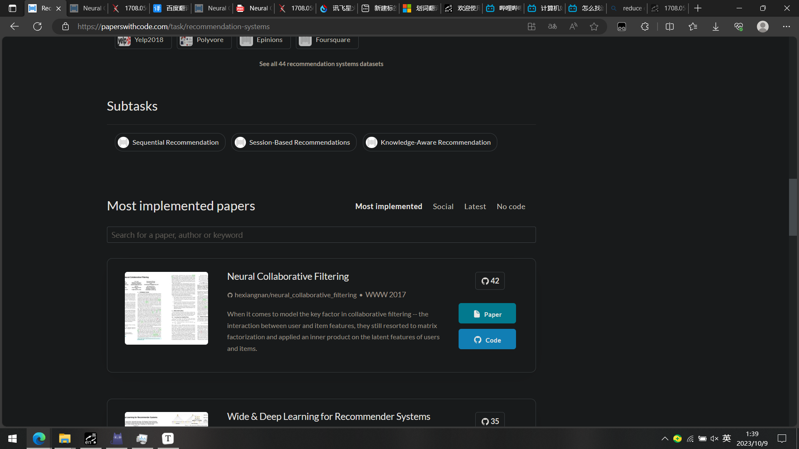
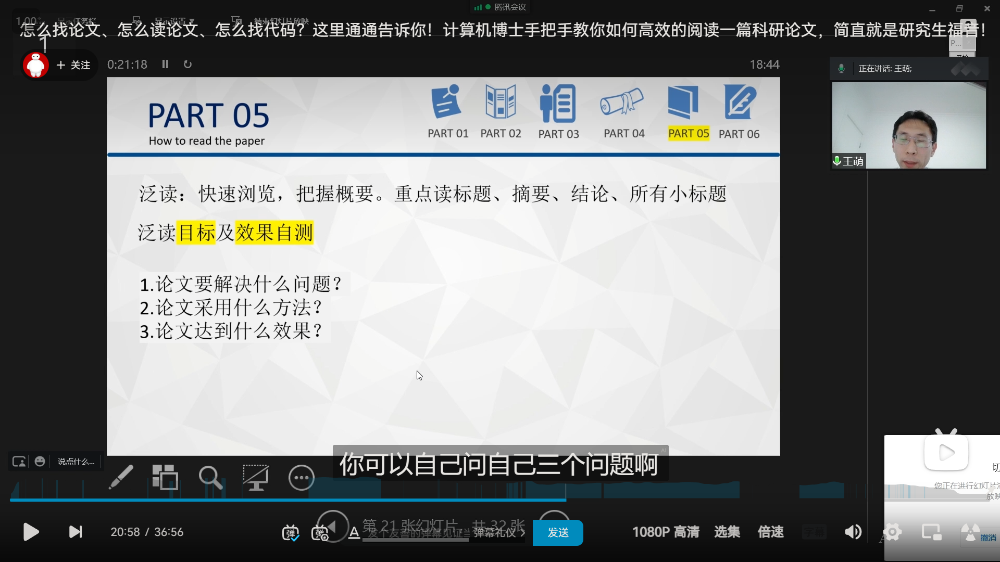
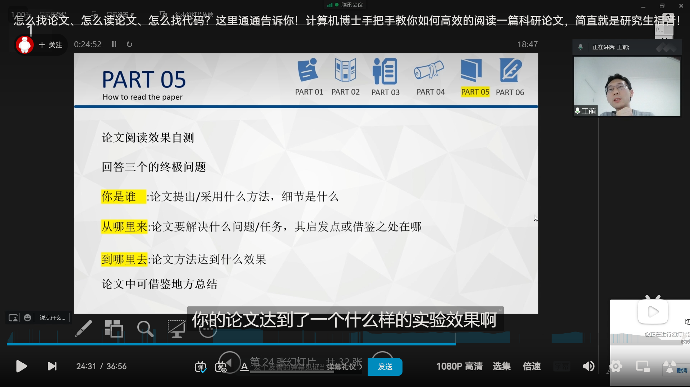
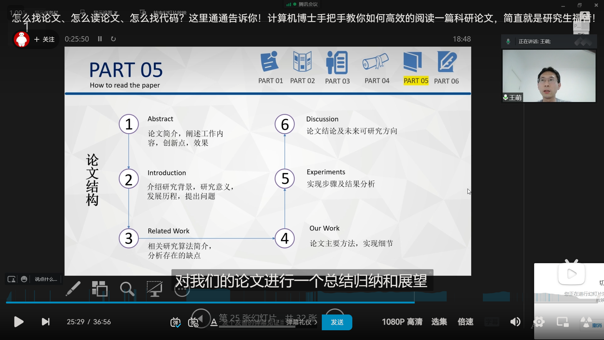
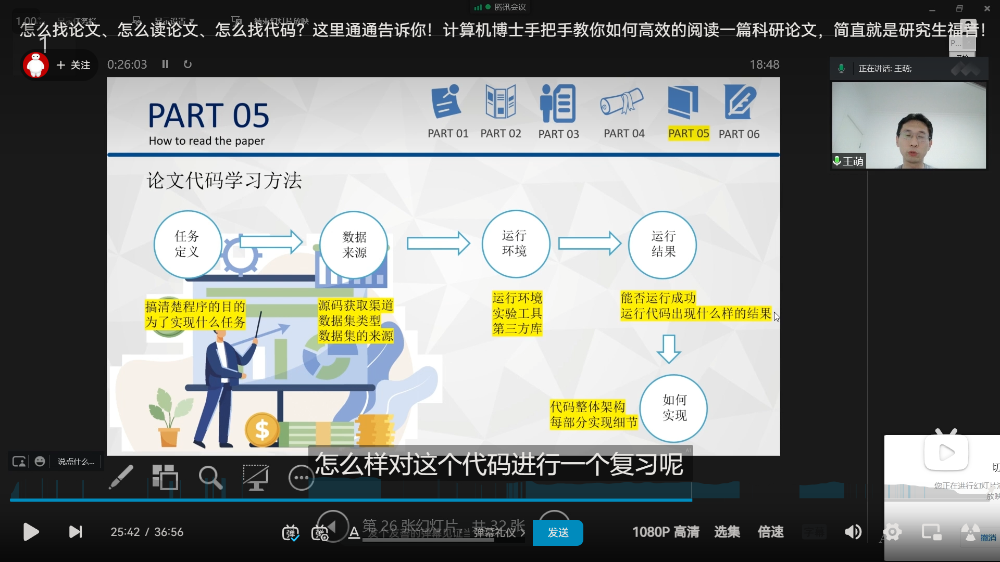

# 阅读第一篇论文 [*Neural Collaborative Filtering*](https://paperswithcode.com/paper/neural-collaborative-filtering)

## 起因

由于缺乏一定基础，所以学长告诉我可以阅读一些相对基础的论文，而 [Papers With Code](https://paperswithcode.com/) 上有一些高被引论文，是领域内相对基础的论文，

而 *推荐系统 (Recommendation Systems)* 相关的可见于 [Recommendation Systems | Papers With Code - https://paperswithcode.com/task/recommendation-systems](https://paperswithcode.com/task/recommendation-systems)

<!-- more -->

翻到页面下方有个 ***Most implemented papers*** 部分，就可以看到高被引论文

{ loading=lazy }

>   发现从主页点击 [Browse State-of-the-Art](https://paperswithcode.com/sota) 可以看到各个领域，然后可以找到 *推荐系统 Recommendation Systems* 
>
>   { loading=lazy }

所以我打算看看排在第一的论文 [*Neural Collaborative Filtering*](https://paperswithcode.com/paper/neural-collaborative-filtering)

## 准备

B站上简单搜索了应该如何去阅读论文文献，

[怎么找论文、怎么读论文、怎么找代码？这里通通告诉你！计算机博士手把手教你如何高效的阅读一篇科研论文，简直就是研究生福音！_哔哩哔哩_bilibili](https://www.bilibili.com/video/BV1ZM411C7cz)

=== "screenshot 1"

    { loading=lazy }

=== "screenshot 2"

    { loading=lazy }

=== "screenshot 3"

    { loading=lazy }

=== "screenshot 4"

    { loading=lazy }

=== "screenshot 5"

    { loading=lazy }

=== "screenshot 6"

    { loading=lazy }

## 泛读论文

### 摘要 Abstract

-   **背景**：
    -   *深度神经网络 DNN (Deep Neural Networks)* 在诸多领域取得巨大成功/广泛应用，但在推荐系统领域受到的关注相对较小
    -   推荐系统领域中，主流的方法在*模型化*关键的因素时，是将信息存储在矩阵当中，然后计算 *内积 (inner product)* 来表现潜在的特征
-   **采用的方法概述**：通过用一种神经架构来替代计算内积，提出了一个通用框架 Neural network-based Collaborative Filtering
-   **效果**：相比与(当时)最先进的方法显示出了巨大的提升

### 结论 Conclusion

他们的框架是 *简单而通用 simple and generic* 的，不局限于论文中的模型，而其设计目的是作为开发 *推荐 recommendation* 深度学习方法的指南，这补充了主流的筛选/过滤模型，开创了一个新的研究基于深度学习的*推荐*的通道

## 精读论文

>   10.10

### 引言 Introduction

Introduction部分主要讲了

-   在模型化用户偏好/构建用户的偏好模型的过程中，*矩阵分解 Matrix Factorization (MF)* 是最流行的方法

-   Matrix Factorization (MF) 方法具有局限性，

    1.   其表现/效果容易被一些微小的改变妨碍/影响，如 简单的内积的选择
    2.   只是简单混合了模型特征的乘积的内积，可能不足以抓取/获取到用户交互数据的复杂结构

-   深度神经网络 Deep Neural Network (DNN) 在多个领域内都表现良好，但在推荐系统方面却只有相对较少的应用，并且大都是将DNN应用于MF中

-   在他们研究的DNN应用中，注重*隐式的反馈 implicit feedback*，即一些不直接反映用户偏好的行为，如观看视频，购买产品。

    相比于*显式反馈 (explicit feedback)*，*隐式反馈*能被自动追踪，因而跟容易收集

-   在该文的研究中，他们主要探索如何应用DNN来使用复杂/嘈杂的*隐式反馈*信号来构建模型

    主要的贡献有

    1.   提供了一个神经网络架构来模型化用户和物品之间的潜在特征，开发一个通用的框架NCF
    2.   展示出MF能被解释成一个特殊化的NCF(NCF的一个特例)，应用多层感知器为NCF模型化过程赋予了高非线性的(处理)能力
    3.   在两组真实世界的数据集上广泛地试验，论证了NCF方法的有效性和深度学习对于*协同过滤*的可靠性/可行性/保障性
