# 2023中国机器人大赛先进视觉专项赛3D识别项目参加比赛过程纪实

>   2023-10-09 --- 2023-10-14

本文在时间线上紧接[上文 - *记录十一假期准备2023中国机器人大赛先进视觉专项赛*](2023-09-29.md)

由于从出发到比赛当天期间都在忙着修改代码而无多余时间来进行记录，所以到了今天，由于早上3D视觉比赛第二轮结束，而之后下午和明早的工业测量项目未进行准备而打算直接弃赛，才有空开始对这几天的相关过程进行记录

<!-- more -->

## 10.9 出发日

上火车前在火车上与学长分析*去年的代码*(实为前年代码)时了解到，通信方面主要有**三个地方需要发送信息**，刚开始点击按钮时需要立即发送队伍编号，转动摄像头时发送开始转动的信号(2次)，超时前发送最终识别结果

## 10.10 行程中

!!! tip

    晚上在火车上研究学长给的*去年的代码*时，发现之前给的是前年的而不是去年的，所以重新找到了真正去年的代码，
    
    然后重新开始研究
    
    ---
    
    最后大概从晚上10点看到了11点半，由于一些我个人的事情需要处理，就停止了当晚的工作

### 梳理去年代码流程

>   代码的主要部分在 `3ddetect_1.py` 中

先查看 `if __name__ == '__main__':` 部分

```python
if __name__ == '__main__':
    print("[INFO] YoloV5目标检测-程序启动")
    print("[INFO] 开始YoloV5模型加载")
    # YOLOV5模型配置文件(YAML格式)的路径 yolov5_yaml_path
    app = QApplication(sys.argv)
    soc = socket.socket(socket.AF_INET,socket.SOCK_STREAM)
    soc.connect(("localhost",6666))
    model = YoloV5(yolov5_yaml_path='config/yolov5s.yaml')
    model.setWindowTitle("yolov5Gui")
    print("[INFO] 完成YoloV5模型加载")
    
    model.show()
    sys.exit(app.exec_())
```

初次查看，我想找到调用**自定义**的函数或者类的代码(因为程序的主题我认为肯定是自定义的部分)，通过观察我猜测可能只有

```python
    app = QApplication(sys.argv)
```

和

```python
    model = YoloV5(yolov5_yaml_path='config/yolov5s.yaml')
```

是调用自定义的功能，

然后点击查看定义， `QApplication` 是 `PyQt5` 里面的一个类，所以 ==自定义的部分是 `YoloV5` 这一行==

---

然后查看 `YoloV5` 类的构造函数，

经过分析，摘选出主要的部分(其余的部分我个人认为算是一些*常规代码*或者说是一些只需要执行一遍的代码，所以不需要过多进行在意)

```python
    def __init__(self, yolov5_yaml_path='config/yolov5s.yaml'):
        ...
        self.setupUi(self)
        ...
        self.init_model()
        ...
        self.videobtn.clicked.connect(self.init_model1)
        ...
```

于是分别查看这三个方法，发现

-   `.setupUi()` 整个方法都是在使用 `PyQt5` 的方法/函数在去*画*图形化界面(GUI)
-   `.init_model()` 内部并没有调用其他自定义的方法，而它的大部分代码是在调用 yolov5 的一些函数
-   上面第三行的代码的作用(根据之前分析前年代码时的猜测的结论)是，将 `.init_model1()` 方法*连接到*GUI中的按键上，而**用户/使用者点击按键程序就会调用这个传入的方法/函数**

继而查看 `.init_model1()` 方法，发现其的大致结构是

```python
    def init_model1(self,dict):
        ... # 定义一些变量
        ... # 发送队伍ID
        while True:
            ... # 获取当前图像，并进行识别
            if ...: # 终止循环条件
                break
        ... # 将结果保存为 result.txt 文件，并发送结果，最后结束视频流
```

所以发现了 `.init_model1()` 方法就是整个程序的流程中最核心的部分

## 10.11 抵达酒店

!!! tip

    由于第二天就需要到比赛场地进行现场调试了，所以我认为当晚需要将所有的代码整合起来并在板子上能跑通程序，因此当天从下午1点一直弄到了凌晨5点，最后除了通信没弄清楚要具体要怎么改，其余代码能在板子上跑了

由于运行板子需要显示器，而我们出发时没带显示器，所以最后使用酒店的电视作为显示器

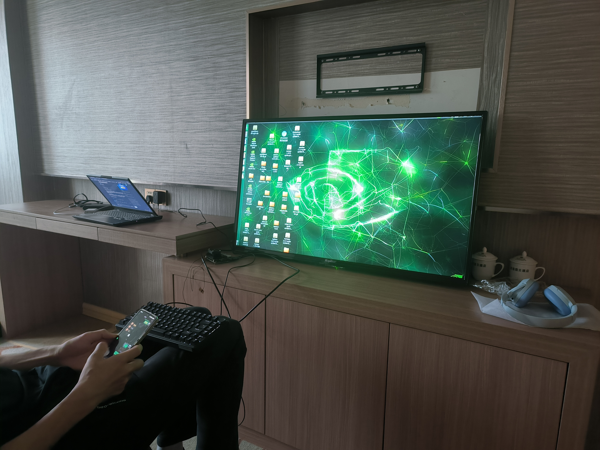{ loading=lazy }

于是在板子上装好了之前没装的 socket

### 再次梳理去年代码的大致流程

经过讨论、整理之前的分析，我们大概能弄清出流程为

1.   程序开始运行后，先进入 `__main__` ，然后进入到自定义类 `YoloV5` 的构造函数中
2.   在 `YoloV5` 的构造函数中，大致会先加载 GUI，然后进入 `init_model()` 进行识别模型的预加载(学长之前告诉说，由于比赛规则中，是在==开始点击GUI的按钮之后才开始计时==，所以==可以在加载出GUI之前预加载模型==)，最后将 GUI 按键连接到 `init_model1()` 上
3.   用户点击GUI上的按键后，就会进入 `init_model1()` ，然后会进行相机视频图像读取、识别、保存/输出识别结果等操作，最后结束整个流程

### 写代码(第一轮比赛)，整合各个部分

由于所剩的时间非常有限，所以我打算以能把代码跑出来为优先考虑，然后时间如果充足则再进行改善，

**因此想法是基本按照去年的代码的框架，然后将调用相机、分割、识别功能部分的代码换成我们之前写的代码**，而我==一开始打算直接在原来的 `3ddetect_1.py` 上直接替换掉相应的代码==，但**刚开始尝试就感觉对去年的代码无从下手**，所以我打算，自己**==重新开始写 `.init_model()` 和 `.init_model1()` 方法==**(其他部分的代码我认为直接cv没什么问题，因为都是一些非关键/核心的部分)，

所以新建了一个项目 `3D-detect_2023`

#### 复制一些必要部分的文件(为了基本能使得能够运行不会报错)

-   `./config/` : 这个文件夹本来以为不是必要的，但如果没有目录下的 `yolov5s.yaml` 会报错
-   `./utils/` : 是一些yolov5的文件
-   `./best.pt` : 权重文件
-   `./circle.png` : 图片素材
-   `./requirements.txt` 
-   `./yolov3Gui4.py` : 里面有画 GUI 的函数

#### 初步编写主体代码文件 `3ddetect_1.23.py`

我将原 `3ddetect_1.py` 文件中的部分代码(核心流程的部分)复制到 `3ddetect_1.23.py` 中，并导入相关的包

```python
...

class YoloV5(QMainWindow, Ui_Form):
    def __init__(self, yolov5_yaml_path='config/yolov5s.yaml'):
        ...
        
    def init_model(self):
        pass
    
    def init_model1(self):
        pass
    
    
if __name__ == '__main__':
    app = QApplication(sys.argv)
    soc = socket.socket(socket.AF_INET, socket.SOCK_STREAM)
    soc.connect(("localhost", 6666))
    model = YoloV5(yolov5_yaml_path='config/yolov5s.yaml')
    model.show()
    sys.exit(app.exec_())
```

一开始没有添加 `app = QApplication(sys.argv)` 这一行，然后程序报错了，队友告知这一行代码应该是配置了一些东西，是必须的一行代码，然后添加了这行代码再运行就没有报错了

#### 将 `detect2.2` 中的队友打包的识别功能部分的代码整合到新项目中

将必要的文件/文件夹复制到 `3D-detect_2023` 中

-   `./models`
-   `./utils`
-   `./3.2.2'`
-   `./Arial.ttf`
-   `./best.pt`
-   `./detect.py`

`models` 和 `utils` 文件夹(应该)是yolov5需要调用的一些函数，

`3.2.2'` 和 `Arial.ttf` 两个文件是队友说须要的文件，所以我就直接复制了(没有测试缺少这两个文件会报什么错)，

`best.pt` 是训练好的模型

`detect.py` 就是队友打包好的识别函数( `run()` )的文件

#### 将 `pyorbbecsdk` 中之前编写和整理的相机调用功能和分割算法的文件整合到新项目中

我将 `pyorbbecsdk` 中的 `./install` 文件夹(含有 `pyorbbecsdk` 的包)，和仅保留了 `new3.py` `new4.py` `utils.py` 三个文件的 `./examples` 文件夹复制到新项目

然后将 `new3.py` 重命名成 `MyCam.py` ，`new4.py` 重命名成 `MySegment.py`

由于识别函数 `run()` 是需要把要识别的图片保存到 `./images` 路径下，所以对 `MySegment.py` 中保存图像的路径修改成相应的路径

```python
    # 保存结果
    cv2.imwrite("images/segmented_color_image.jpg", segmented_color_image)
```

#### 编写预加载 `init_model()` 的代码

由于 `detect.py` 中的 `run()` 很复杂，本来想尝试分离出识别前的操作，然后放在 `init_model()` 中执行，但是发现有点不好操作，

这时，我突然想到了 cs61a 中学到的生成器相关的知识(迭代生成器时会执行到下一个 `yield` 然后暂停执行，等待下一次迭代)， **`yield` 语句**我感觉可以产生**==类似于暂停函数的效果==**，于是我直接对 `detect.py` 进行修改

我在 `# Dataloader，加载待预测的图片` 前，加上第一个 `yield` ，然后将之后的代码放入一个死循环中，每次循环 `yield` 依次，因此，得到新的 `run()` 函数返回的生成器后，**第一次 `yield` 就等于预加载了这个识别函数，而之后的每一次 `yield` 都会执行一次循环，也就是进行一次识别的操作**，

所以最后修改的 `run()` 函数

```python
def run():
    ...
    imgsz = check_img_size(imgsz, s=stride)  # check image size,判断是否为步长stride=64的倍数
    
    yield 1
    
    while True:
        ...
        if update:
            strip_optimizer(weights)  # update model (to fix SourceChangeWarning)
        yield 1
```

并相应在 `3ddetect_1_23.py` 中，

在代码最开始添加 `detector = run()` (获得全局生成器 `detector` )

在 `init_model()` 中，加上 `next(detector)` (通过迭代 `detector` 进行一次识别)

---

相机调用方面，我也是想借鉴去年代码的思路，在一开始就将相机启动好，在点击按钮之后再去读取图像然后进行识别，

而我一开始的想法也是使用 `yield` ，但是试了一下似乎会报错，所以打算更换另一个思路

于是最后想出的是，对 `MyCam.py` 原有的 `main()` 进行修改，用原本循环内的(循环读取视频流图像的)代码构建出一个嵌套的函数 `get_images()` ，外函数返回内函数和 `pipeline` (用于关闭相机)

所以最后改成

```python
def activate_cam(argv):
    ...
    try:
        pipeline.start(config)
    except Exception as e:
        print(e)
        return
    
    def get_images():
        try:
            ...
            if ... is None:
                return
        except KeyboardInterrupt:
            return
    return get_images, pipeline
```

其中， `get_images()` 函数内代码中，原本是 `continue` 和 `break` 的部分被我改成了 `return` (之后发现这个更改留下了一些隐患)

于是，在 `3ddetect_1_23.py` 中，为了能够代码中使用返回值，我也对应新设了两个全局变量，

因此最后

```python
...

detector = run()
get_images, pipeline = None, None

class YoloV5(QMainWindow, Ui_Form):
    ...
    def init_model(self):
        next(detector)
        global get_images, pipeline
        get_images, pipeline = activate_cam(sys.argv[1:])
    ...
```

#### 编写核心部分 `init_model1()` 代码

也是一开始借鉴去年代码的框架，

去年代码中，`init_model1()` 一开始设置了 序号到物品类编号 的字典，以及编号对应识别结果的字典，我对去年的代码**稍加了修改和调整**，我将字典变量改为全局变量

并且，我这时打算通过计时的方式(达到一定时间)来结束程序并输出结果

```python
...

# 设置的识别时间的上限
time_limit = 35

num_to_id = {0: 'CA001', 1: 'CA002', 2: 'CA003', 3: 'CA004',
             4: 'CB001', 5: 'CB002', 6: 'CB003', 7: 'CB004',
             8: 'CC001', 9: 'CC002', 10: 'CC003', 11: 'CC004',
             12: 'CD001', 13: 'CD002', 14: 'CD003', 15: 'CD004',
             }
id_counter = {id: 0 for id in num_to_id.values()}

class YoloV5(QMainWindow, Ui_Form):
    ...
    def init_model1(self):
        time_start = time.time()
        global get_images, pipeline, each_id_counter
    ...
```

---

循环读取视频流图像并识别的部分，我基本上按照去年代码的顺序，来编写我的代码

```python
    def init_model1(self):
        ...
        while True:
            get_images()
            
            color_image = np.load("color_image.npy")
            depth_data = np.load("depth_data.npy")
            
            my_seg(depth_data, color_image)
            
            next(detector)
            
            counter_of_frame = read_result_of_frame()
            for id in counter_of_frame:
                id_counter[id] = max(counter_of_frame[id], id_counter[id])

            time_count = time.time()
            if time_count - time_start > time_limit:
                break
        ...
        
def read_result_of_frame():
    counter_of_frame = {id: 0 for id in num_to_id.values()}
    if not os.path.exists("detect/exp/labels/segmented_color_image.txt"):
        return counter_of_frame
    with open("detect/exp/labels/segmented_color_image.txt", "r") as f:
        # read by lines
        lines = f.readlines()
        for line in lines:
            # id = num_to_id[int(line[0])]
            id = num_to_id[int(line.split(" ")[0])]
            counter_of_frame[id] += 1
    return counter_of_frame
```

我采取的思路是，将每一帧的识别结果和总结果对比，每个种类取最大的个数进行保存，就是说，如果当前帧的识别结果比原有的多就更新，少就保留原有的结果，这样就可以保证不会漏掉结果，但会多识别出东西，**但是我觉得板子的性能可能不足以支撑复杂的筛选算法，并且也所剩时间也不多，优先以能跑通为目的，就采用了这样简单的方法**

其中我将读取每一帧的识别结果的代码封装成了一个函数，原本是采用 `id = num_to_id[int(line[0])]` 来将结果加到结果字典中，但是之后测试时发现，如果序号是两位数，那么 `line[0]` 就只会取十位，所以将这行代码改成了 `id = num_to_id[int(line.split(" ")[0])]`

---

最后是结束读取视频流，处理最终结果，保存到 `txt`文件并发送的部分

这部分需要处理通信，我一开始不太清除应该怎么写，向学长求助，学长说cv去年代码中相应的通信部分就行了，

因此最终

```python
    def init_model1(self):
        Data = bytes("Y2309T20178", encoding="utf-8")
        DataHead = struct.pack("!ii", 0, len(Data))
        # DataHead 第一个变量是0，代表报ID,4代表长度
        # print(DataHead)
        soc.sendall(DataHead)
        soc.sendall(Data)
        time_start = time.time()
        ...
        while True:
            ...
            
        f = open('result.txt', 'w+')

        message = "START\n"
        for id in id_counter:
            if id_counter[id] == 0:
                continue
            message += "Goal_ID=" + id + ";Num=" + str(id_counter[id]) + "\n"
        message += "END"
        f.write(message)
        print(message)
        print(len(message))
        print("TCP:准备传输文件")
        Data = bytes(message, encoding="utf-8")

        DataHead = struct.pack("!ii", 1, len(Data))
        soc.sendall(DataHead)
        time.sleep(1)
        soc.sendall(bytes(Data))
        pipeline.stop()
```

---

至此，基本上初步的代码整合完成了

#### 一些总结

初步的代码整合从大概下午3点开始，一直到晚上9点半左右完成(学长还说了句，效率还蛮高)，我认为能在这样相对较短的时间内完成代码的整合，有几点值得注意，由于时间有限，所以

首先，**==我以能够完成基本的功能为优先的目的(就是说不管优化的效果以及代码的清晰程度，先达到最基本的要求/实现最基本的功能，再去考虑优化)==**，

其次，**==为了减少工作量，所以我尽可能参考去年代码，尽可能去使用其代码框架(所以我就不需要过多地去自己构思代码的框架)==**

### 初次测试

由于通信还没弄，所以初次测试时，我将通信相关的代码都注释掉了，然后将代码复制到板子上测试运行效果

#### `pyorbbecsdk` 模块缺失问题

一开始我是将 `3D-detect_2023` 文件夹复制到板子的用户目录下，并对之前 `~/.bashrc` 中关于 `pyorbbecsdk` 包python环境变量的配置命令进行了相应的修改，但是最后尝试了几种修改方法都还是会报 `pyorbbecsdk` 模块缺失的错，

因此最终我直接将 `3D-detect_2023` 文件夹重命名成 `pyorbbecsdk` ，然后跟原来桌面上的同名文件夹(能使用 `pyorbbecsdk` 包)合并，并且把 `~/.bashrc` 中的命令改了回去，最终能正常运行

#### 识别结果label不保存为 `.txt` 文本文件的问题

某次测试过程中，报错找不到 `detect/exp/labels/segmented_color_image.txt` 文件，然后去查看发现真没有这个文件，

但是我单独运行 `detect.py` 又能生成识别结果的文本文件，所以目前还不清楚具体是什么原因，

然后我开始查看代码，看看有没有相关的选项能够选择生成识别结果文本文件，然后注意到 `save_txt` 这个参数，

```python
def run(...
        save_txt=False,  # save results to *.txt
        ...
        ):#这些是run函数的形参即opt
```

然后 ctrl 点击这个参数，并查看了 70 行、 150 行的两处用法，确定这个参数就是控制生成识别结果文本文件的参数，然后我将其默认值改成 `True` ，最后之后的多次测试中，均生成了识别结果文本文件

#### 识别结果 `.txt` 文件中结果写入错误的相关问题

**每次的识别结果累加，或者说每次识别结束没用清空文件**

在一次给学长展示运行效果的时候(本来以为已经没有bug了)，发现最后识别结果出错了，

大概的错误情况是，在运行时，我注意到了**最后识别结果中的数据比识别过程中每帧图像结果的最大数据还要多**(一开始设计的是，最后的识别结果中，每个类的数据应该是过程中该类的最大值)，具体是香蕉类最后显示有4个，但过程中每帧的识别结果最多只有1个

于是我去查看识别结果的文本文件，发现最后的文本文件确实错了，所以这时我大致确定问题出在识别结果写入文本文件的地方，

思考了一会，突然想到可能是写入模式的问题，然后查看 `detect.py` 里相关地方的代码

```python
def run(...):
    ...
                        if save_txt:  # Write to file
                            ...
                            with open(txt_path + '.txt', 'a') as f:
                                f.write(('%g ' * len(line)).rstrip() % line + '\n')#逐行写入txt文件
    ...
```

所以知道了问题所在，即**由于是追加模式写入，那么识别结果文本文件中的数据只会越来越多，所以需要在每一帧读取后清除原有的结果**，

于是这时我将 `a` 改成 `w` ，然后进行测试，出现了新的问题

---

**识别结果中只有一条**

查看了生成的文件，结果确实只有一条，

经过思考，我想到了问题是出在我将 `a` 改成 `w` 写入，那么每次写入就会清空文件，而 `run()` 在识别时是**每次写入一条结果**，所以就只会存在一个结果，所以我应该**要在每一帧识别开始前，清空上一帧的结果**，于是

```python
def run(...):
    ...
    while True:
        ...
                        if save_txt:  # Write to file
                            ...
                            with open(txt_path + '.txt', 'a') as f:
                                f.write(('%g ' * len(line)).rstrip() % line + '\n')#逐行写入txt文件
        ...
        yield 1
        with open(txt_path + '.txt', 'w+') as _:
            pass
```

这样每次识别结束，就函数就会暂停在 `yield 1` 这一行，再次识别时，就会执行下面两行清除原有的识别结果的代码

然后进行测试，最后显示的识别结果正确

### 没有弄好通信

由于这时第一轮的代码除了通信基本算是能正常跑，正常运行了，所以我就打算用网线把板子和我的电脑连上(本来还没带网线，然后之前运行给学长看时，让我美团买一条网线连电脑带上通信一起测试)，然后弄好通信后连带着通信一起运行调试

但是一直尝试了很久，可能尝试了一个小时左右都没有弄懂要如何去设置，此时已经大约凌晨2点，为了节省精力，我打算先去弄第二轮的代码，并且我让同学添加相应的 PyQt 的设置，让GUI上显示相应的信息

### 基于第一轮代码，编写整合第二轮代码

第二轮与第一轮流程很相似，只是由一张桌子增加到了三个桌子，因此主要是通信上需要添加两次向裁判盒发送转动信号的代码

#### 查看去年代码

去年学长的代码，他们写了一个 检测是否还在转动 的函数 `moving_detect()` ，用于通过彩色帧检测摄像头是否还在转动，如果检测到停止转动，就开始识别(我和同学讨论添加这个判断功能的原因是可以节省时间，因为规则文件里写 **摄像头转速由裁判临场决定**，而赛前裁判老师说 **摄像头转动时间不超过10秒**)，检测的机制大概是 **通过比较当前帧和上一帧的差异程度来判断是否还在转动**(如果差异小就认为已经结束转动)

所以我打算也使用学长写的这个函数，我打算第二轮识别部分就基本上借鉴去年代码的框架，然后再按照第一轮的代码来写

#### 编写第二轮的 `.init_model1()`

由于除了识别部分流程几乎一样，所以除了 `.init_model1()` 之外几乎都可以直接复制粘贴，

然后经过耗时不长的编写(大约花了一个小时左右)，大致完成了第二轮的代码

```python
...

detector = run()
get_images, pipeline = None, None

# 设置的识别时间的上限
time_limit_12 = 25
time_limit_3 = 125

num_to_id = {0: 'CA001', 1: 'CA002', 2: 'CA003', 3: 'CA004',
             4: 'CB001', 5: 'CB002', 6: 'CB003', 7: 'CB004',
             8: 'CC001', 9: 'CC002', 10: 'CC003', 11: 'CC004',
             12: 'CD001', 13: 'CD002', 14: 'CD003', 15: 'CD004',
             }
each_id_counter = {id: 0 for id in num_to_id.values()}
final_id_counter = dict(each_id_counter)

class YoloV5(QMainWindow, Ui_Form):
    
    def __init__(self, yolov5_yaml_path='config/yolov5s.yaml'):
        ...
        self.is_not_turning = True
        ...
    ...
    def init_model1(self):
        ... # 发送队伍ID
        time_start = time.time()
        second_time_start = None
        position = 0
        global get_images, pipeline, each_id_counter

        last_image = None

        while True:
            # if position == 1 and self.is_not_turning:
            if position == 1 and second_time_start is None:
                second_time_start = time.time()
            
            ... # 获取图像

            # 判断摄像头是否在转动
            if not self.is_not_turning:
                if last_image is not None:
                    if not moving_detect(last_image, color_image):
                        time.sleep(0.5)
                        last_image = color_image
                        continue
                    else:
                        self.is_not_turning = True
           
                if not self.is_not_turning:
                    last_image = color_image
                    time.sleep(0.5)
                    print(self.is_not_turning)
                    continue

            ... # 分割和识别
            
            time_count = time.time()
            if position == 0:
                if time_count - time_start > time_limit_12:
                    for id in each_id_counter:
                        final_id_counter[id] += each_id_counter[id]
                        each_id_counter[id] = 0
                    position = 1
                    self.start_to_turn()
            elif position == 1:
                if time_count - second_time_start > time_limit_12:
                    for id in each_id_counter:
                        final_id_counter[id] += each_id_counter[id]
                        each_id_counter[id] = 0
                    position = 2
                    self.start_to_turn()
            elif position == 2:
                if time_count - time_start > time_limit_3:
                    for id in each_id_counter:
                        final_id_counter[id] += each_id_counter[id]
                    break

        ... # 处理最终结果，关闭相机视频流
        
    def start_to_turn(self):
        self.is_not_turning = False

        Data = bytes("0000", encoding="utf-8")
        DataHead = struct.pack("!ii", 3, len(Data))
        # DataHead 第一个变量是0，代表报ID,4代表长度
        # print(DataHead)
        soc.sendall(DataHead)
        soc.sendall(Data)
        print("TCP:开始转动")
        self.CameraTurn.setIcon(QIcon("circle.png"))
        time.sleep(5)


def read_result_of_frame():
    ...
       
        
def moving_detect(frame1, frame2):
    img1 = cv2.cvtColor(frame1, cv2.COLOR_BGR2GRAY)
    img2 = cv2.cvtColor(frame2, cv2.COLOR_BGR2GRAY)
    grey_diff = cv2.absdiff(img1, img2)  # 计算两幅图的像素差
    change = np.average(grey_diff)

    if change > 10:  # 当两幅图的差异大于给定的值后，认为画面有物体在动
        return False
    else:
        return True
```

我对第一轮中的时间上限进行了一些修改(因为第二轮有三个桌子)，识别结果的字典也稍微修改，`each_id_counter` 用于记录每个桌子的结果(和第一轮的 `id_counter` 类似)，`final_id_counter` 用于存储三个桌子加起来的结果(即每个桌子结束后把 `each_id_counter` 加到 `final_id_counter` 上)，

**摄像头转动方面**

我先是添加了一个*属性* `self.is_not_turning` 用于记录摄像头是否处于转动的状态(去年代码中是使用 `self.idle` 来记录)，处于转动就不进行识别

然后，我设计的是到达一定的时间就开始结束当前桌子的识别而开始转动，第一个桌子用 当前时间 与 `time_start` ( `.init_model()` 开始的时间)的差值来判断，第二个桌子用 当前时间 与 第二个桌子开始识别的时间 `second_time_start` 的差值来判断，第三个桌子用 当前时间 与 `time_start` 来判断(防止程序总的时间超时)

达到设置的时间后，就将当前桌子的识别结果 `each_id_counter` 加到最终的识别结果 `final_id_counter` ，并将 `each_id_counter` 清空，然后调用 `.start_to_turn()` 方法开始发送转动信号，

而之后，在 `.start_to_turn()` 方法中，会将 `self.is_not_turning` 设置为 `False` ，

然后，在进入新的循环时(此时还在转动状态)，就会通过 `moving_detect()` 来检测转动是否结束，然后进行新的桌子的识别

---

于是这时，基本上第二轮的代码编写完成

### 编写 `.sh` 脚本

由于(听学长说)比赛需要在桌面有一个可以直接运行的 `.sh` 脚本文件，所以我将桌面除了 `pyorbbecsdk` 文件夹之外的其他文件和文件夹都移动到了用户目录下，

然后分别编写第一轮和第二轮的脚本

`activate1.sh`

```bash
python3 3ddetect_1_23.py
```

`activate1.sh`

```bash
python3 3ddetect_1_23.py
```

但是测试运行时，发现好像**==由于运行 `.sh` 脚本文件时是在 `~/Desktop` 路径下，所以在进行导包、加载文件等操作时会在该目录下进行==**，

所以我稍加了修改

`activate1.sh`

```bash
cd pyorbbecsdk
python3 3ddetect_1_23.py
```

`activate1.sh`

```bash
cd pyorbbecsdk
python3 3ddetect_1_23.py
```

### 结束这一天的工作

然后我把第二轮的代码也给了同学，让他添加相应的 PyQt 的设置，然后我继续去尝试通信

但是经过一段时间的尝试，最终还是没弄好通信，此时已经凌晨5点，突然感到有些困了，所以我们打算就暂时到这，明天(也是今天，12号)到了比赛场地时，再去弄通信，然后再连带着通信一起运行测试

**GUI方面**

由于GUI显示图像直接加载 `.jpg` 文件比较方便，于是我将 `MyCam.py` 中的

```python
            ...
            # cv2.imwrite("color_viewer.jpg", color_image)
            np.save("color_image", color_image)
            ...
```

`cv2.imwrite("color_viewer.jpg", color_image)` 的注释放开了

于是，最后同学添加的 PyQt 相关设置的代码

`3ddetect_1_23.py` 和 `3ddetect_2_23.py`

```python
...

class YoloV5(QMainWindow, Ui_Form):
    ...
    def init_model1(self):
        ...
        while True:
            ... # 获取图像
            
            # show
            image = QPixmap("./color_viewer.jpg")
            self.image_show_label.setPixmap(image)
            my_seg(depth_data, color_image)
            
            ... # 识别
        ...
        message = "START\n"
        text = ""
        for id in id_counter:
            if id_counter[id] == 0:
                continue
            message += "Goal_ID=" + id + ";Num=" + str(id_counter[id]) + "\n"
            text += "目标ID：" + id + " 数量：" + str(id_counter[id]) + "\n"
        ...
        print(message)
        self.output_text.setText(text)
        ...
```

`3ddetect_2_23.py`

```python
...

class YoloV5(QMainWindow, Ui_Form):
    ...
    def start_to_turn(self):
        ... # 设置状态，发送转动信息
        self.status_tetx.setPlainText("转动中")
        print("TCP:开始转动")
        self.CameraTurn.setIcon(QIcon("circle.png"))
        time.sleep(5)
        self.CameraTurn.setIcon(QIcon())
```

## 10.12 赛前调试

!!! tip

    这一天的情况有些波折，最后到了晚上的6点我们才得以开始调试板子，最终同学把通信弄好了，并且在板子上运行了程序，能接收到结果

这天早上，一开始出发去比赛场地时，由于没有屏幕，所以向学长借了他的便携屏，但是到了赛场却发现没有合适的HDMI线，因为便携屏是只有 Mini HDMI 接口，所以板子没办法连接上便携屏，然后打车回酒店拿线(本来以为学长有 Mini HDMI 的线)，但是发现学长也没有这种线，于是我看了一下美团，发现能买到这种线的转接头，于是一边打车回赛场一边在美团上买这个线，

回到赛场后没多久线就到了，于是我们尝试连接板子，发现屏幕能显示板子的界面了，**==但是这时，屏幕亮了一下就黑了，我们以为是板子的问题，于是拔了电源线重启了一次，然后出现了一样的情况，之后再次拔插电源线，板子都启动不了==**，这时我们不知道是板子出了问题还是电源线出了问题，

过了一段时间，有电工来检查我们座位旁边的电源，然后发现是电源的电压高了(据说是工业电压 380V )，所以把电源线给烧了

>   在我之前回酒店的过程中，比赛群里也有队伍反映他们充电器被烧了的问题，然后之前已经有电工来修过场地的电源，
>
>   就在我们连接好板子和显示屏时，准备插上充电器之前，还问了电工电源是否修好了，并且得到肯定的答复，于是我们才插上去，结果最后电源线就因此烧了，只能说这种意外谁也想不到😟😞

之后我们面临的就是缺少电源线，期间我向学长借线而发现电压电流不匹配、在网上买线发现买不到，折腾了大半天😔(大概从中午11点一直到下午3点)，但还是解决不了缺少电源线的问题，

最后到了下午5点多左右，这时周围基本上很多队伍都已经结束了基本的调试，

{ loading=lazy }

所以我让同学向一个(看起来好借的)队伍询问借用她们的电源线，然后借到了，所以**这时我们才得以开始调试**，

这时由于折腾了快一天，并且昨晚只睡了两小时，所以我因为有些累而睡着了，大概过了半个小时后醒来，同学告诉我**通信调好了，板子能连接上电脑了**，

### 弄好了通信

>   设置通信前需要先用网线连接板子和运行裁判盒软件的电脑

#### 设置的方法

**板子上**

需要在终端上通过 `ifconfig` 命令设置 以太网 的 ip，

```bash
ifconfig eth0 192.168.1.67 netmask 255.255.255.0
```

因为裁判老师说，要将板子的ip设置为 `192.168.1.67` ，掩码 24 ，然后我们查询，掩码 24 就是 `255.255.255.0` ，然后就需要按照上面的命令进行设置

**裁判盒电脑上**

裁判老师说 裁判盒ip设置成 `192.168.1.66`

需要在 **控制面板 - 网络和 Internet - 网络和共享中心** 中，点击左侧的 **更改适配器设置**

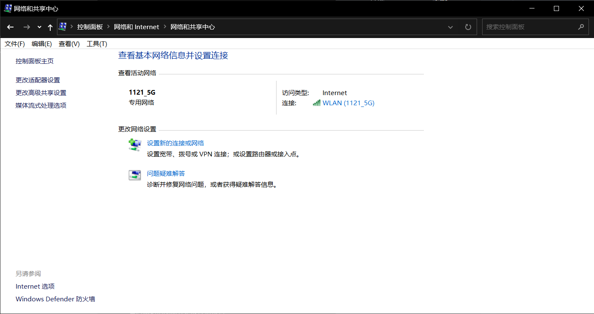{ loading=lazy }

或者(window 10)在 **设置** 中点击 **网络和 Internet** ，里面在 **高级网络设置** 下也可以点击 **更改适配器选项**，然后都会进入

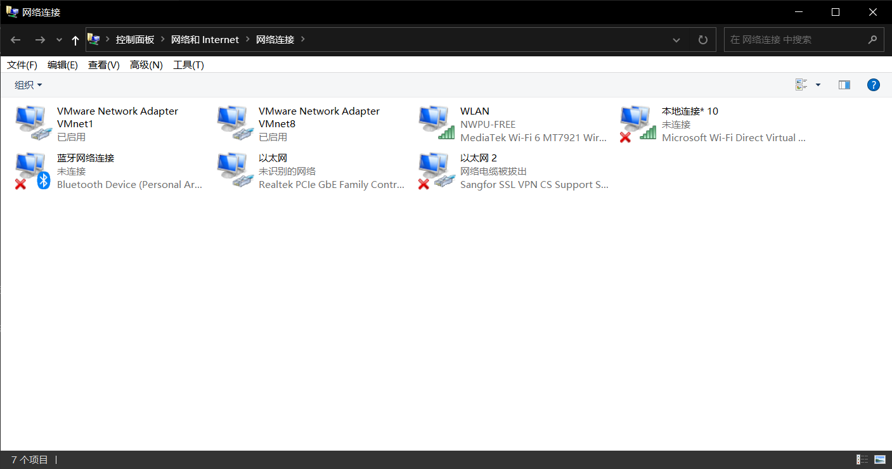{ loading=lazy }

然后右键点击 **以太网** ，选择 **属性** ，

在 **此连接使用下列项目** 中，选中 **==Internet 协议版本 4 (TCP/IPv4)==** ，然后点击 **属性** ，

然后在 属性 页面中，选择 **使用下面的 IP 地址**，以及填写

-   **==IP 地址: `192.168.1.66`==**
-   **==子网掩码: `255.255.255.0`==** (掩码和板子上的一样)

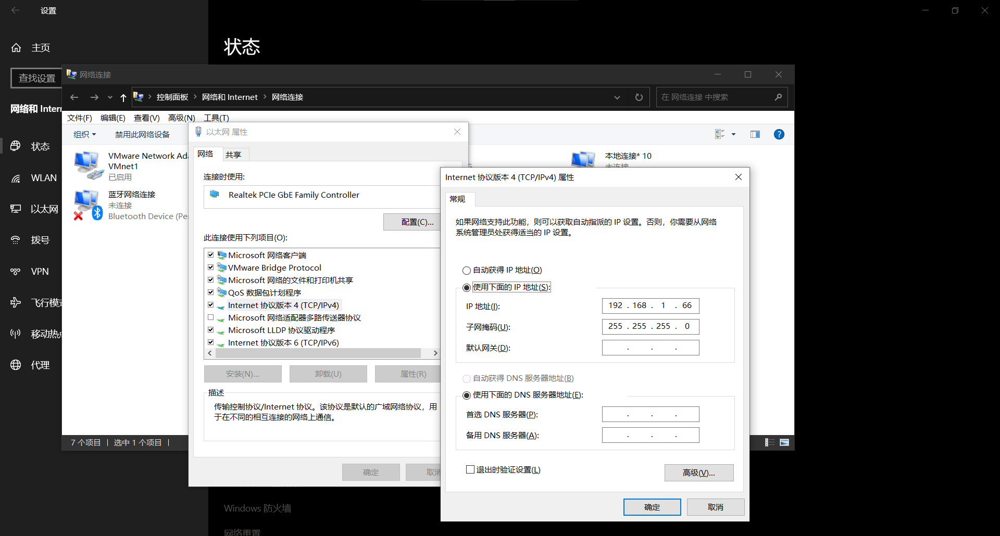{ loading=lazy }

#### 测试连接

在板子的终端上，运行 `ping` 命令， `ping` 裁判盒的 ip 地址

```bash
ping 192.168.1.66
```

如果能连续地输出一些信息，则说明 `ping` 通了，

然后**测试端口能否正常连接**，运行下面命令

```bash
nc -zv 192.168.1.66 6666
```


{ loading=lazy }

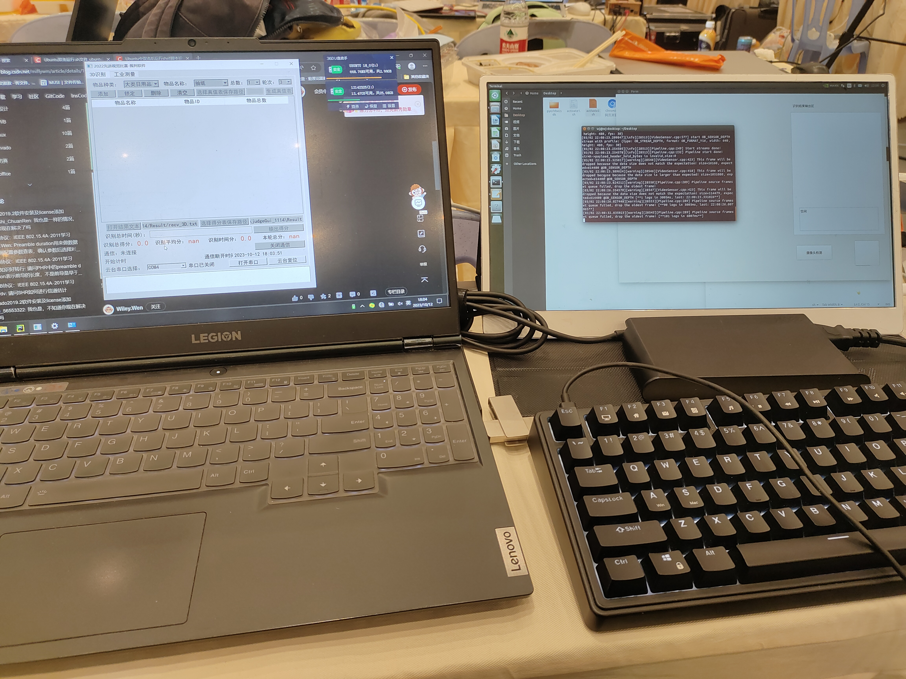{ loading=lazy }

---

然后我们就加上通信一起在板子上测试，发现裁判盒能接受到最后传输的结果，于是我们打算最后再在比赛的电脑上去测试运行一下

之后大概等到了9点多，比赛的电脑终于没有人用了，我们就开始连上我们的板子测试，发现能运行并且有传输的结果，于是我们就这天就没有再进行修改，而从赛场返回酒店了

回到酒店之后，由于接连劳累了两天，躺在床上没多久就睡着了😪，一直到第二天10点

### 一些现场调试的感受

这天到了比赛现场与其他队伍一对比，才发现我们的设备很简陋，

首先显示屏就是借学长的(所以赛前应该要带上显示屏)，基本上其他队伍都有显示屏，

然后，其他很多队伍都会自己带自己的方桌、圆盘，甚至还有不同颜色的卡纸(用于铺/贴在桌子上)，以及摄像头的支架、打侧光的灯(几乎跟之后比赛中使用的灯是一样的)，

{ loading=lazy }

并且很多队伍会把需要识别的各种物品都带到现场去拍，有些拿着几个大塑料袋装，有些甚至拿一个行李箱来装，

由于调试这天早上会公布未知物品，未知物品是规则文件中没有写的物品类，

今年的未知物品

{ loading=lazy }

然后他们就会现场进行数据集的拍摄，然后当晚进行模型的训练(我们旁边某个队伍的队员亲口说的，好像就是之后的第一名)，

所以很多队伍感觉基本上是之前已经把流程跑通了，然后调试这一天基本上都在拍摄数据集，然后进行训练

## 10.13 第一轮比赛

!!! tip

    这天下午进行了3D识别项目的第一轮比赛，而我们的程序运行超时了，没有输出识别结果，所以这天晚上在酒店我对第二轮的代码开始修改，尝试使得第二轮至少能不超时输出结果，最后这天改代码加调试又弄到凌晨3点

### 进行第一轮比赛

这天早上起床(10点)后我们直接去了比赛场地，因为12点开始第一轮的比赛，而我们需要提前把板子交上去，最后是11点半开始上交板子

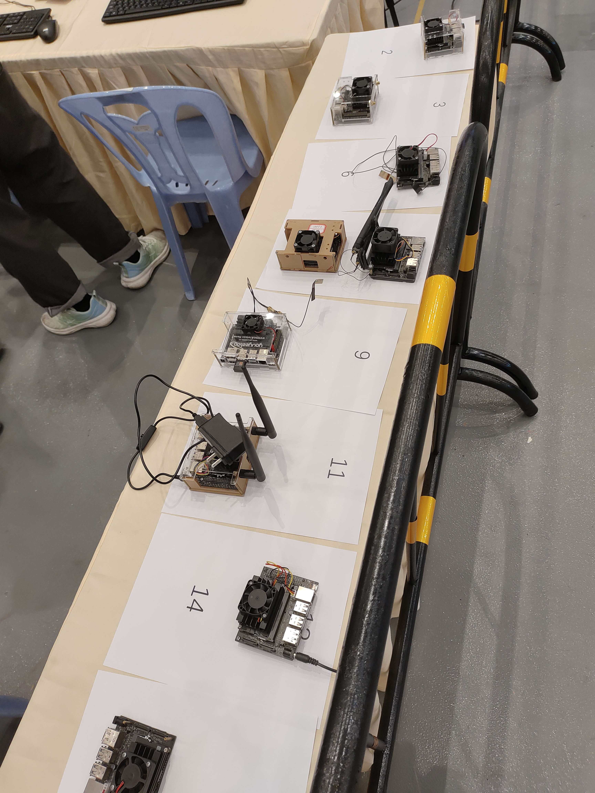{ loading=lazy }

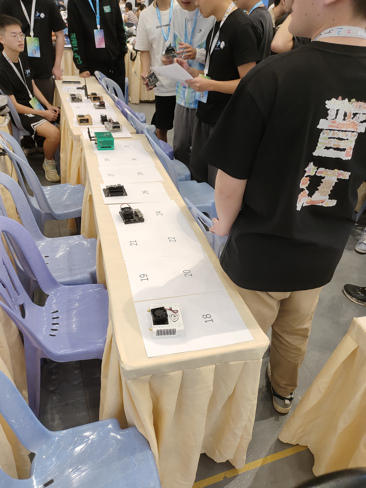{ loading=lazy }

到了12点，裁判老师开始布置场地，

{ loading=lazy }

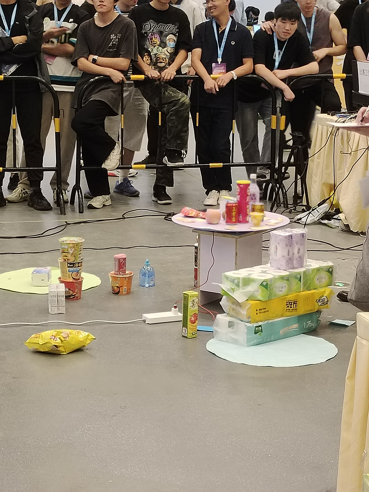{ loading=lazy }

大概布置了一个小时左右，到了下午一点，比赛开始

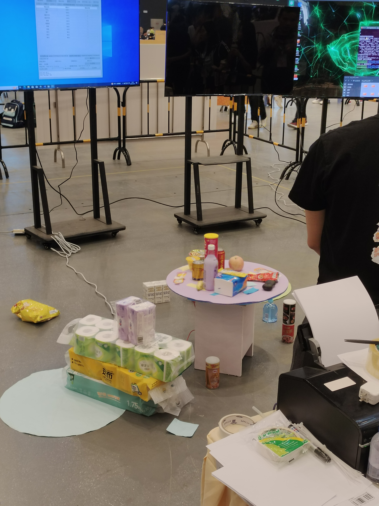{ loading=lazy }

由于我们之前打算使用比赛组委会提供的测试的板子(想着会不会组委会的板子性能会比我们的板子更好一些)，然后跟裁判老师询问时，他让在轮到我们的时候，再把我们的卡插到测试的板子上，

于是到了我们运行程序的时候，就使用了组委会提供的板子，

然后在比赛时，我们程序运行超时了(超时为0分)

### 反思

第一轮比赛结束后，我思考了一下，我认为应该是程序运行过程中，可能是摄像头读取或者识别部分运行时卡了，所以导致计时没有用，因为我设置的是通过计算时间来结束识别提交结果，并且已经预留了充分的时间容错，而我本来也以为设置了时间之后应该不会超时，所以**==之前在板子上运行测试时，没有计时，没有看有没有超时==**

然后跟学长讨论了一下，我觉得第二轮先不考虑其他的程序优化以及识别的效果如何，先让程序能在规定时间内输出结果，所以我这时打算第二轮进行时，直接读取几帧图片然后进行识别然后输出就行了，把视频流阉割掉

### 连夜修改第二轮的代码

吃完晚饭后，大概10点回到酒店，休息了20分钟之后，我开始着手调整第二轮的代码

#### 尝试第一种方案

由于之前在板子上运行程序时，总是会时不时显示类似

```bash
[03/02 21:02:12.479876][warning][7924][Pipeline.cpp:299] Pipeline source frameset queue fulled, drop the oldest frame! [**1419 logs in 48009ms**]
```

的信息，

我一开始的理解是，摄像头开太久了，所以由于 某个存储视频流图像帧的东西(就是pipeline代表的东西) 满了，所以旧的帧被删除掉，那么获取图像就失败了，

所以我一开始计划修改的方案是，在每次开始识别之后再打开摄像头，然后直接进行图像读取，再关闭摄像头，我觉得这样就不会出现上面的信息，

于是我先将判断转动的代码注释掉，我打算直接设置成暂停10秒(因为裁判老师说过转动时间不超过10秒)之后开始新的识别

```python
class YoloV5(QMainWindow, Ui_Form):
    ...
    def init_model1(self):
        ...
        while True:
            ...
            # # 判断摄像头是否在转动
            # if not self.is_not_turning:
            #     if last_image is not None:
            #         if not moving_detect(last_image, color_image):
            #             time.sleep(0.5)
            #             last_image = color_image
            #             continue
            #         else:
            #             self.is_not_turning = True
            #
            #     if not self.is_not_turning:
            #         last_image = color_image
            #         time.sleep(0.5)
            #         print(self.is_not_turning)
            #         continue
            ...
            if position == 0:
                ...
                self.start_to_turn()
                time.sleep(5)
            elif position == 1:
                ...
                self.start_to_turn()
                time.sleep(5)
            ...
```

这里 `time.sleep(5)` 是因为，在 `.start_to_turn()` 中已经设置了暂停5秒，所以这里就再加上5秒就是10秒，

然后我将 `get_images, pipeline = activate_cam(sys.argv[1:])` 这行代码从 `.init_model()` 中挪到了 `.init_model1()` 中，然后先进行一次计时的运行测试，看看点击识别按钮之后再打开摄像头之后能不能在50秒内获取到图像并识别出结果，

但是经过测试发现，运行了快两分钟才有结果显示出来，这大大超出我的预料，

然后我开始去测试直接运行 `MyCam.py` 文件，我将 `__main__` 设置成

```python
if __name__ == "__main__":
    get_images, pipeline = activate_cam(sys.argv[1:])
    
    while True:
        get_images()
        key = cv2.waitKey(1)
        if key == ord('q') or key == ESC_KEY:
            break

    pipeline.stop()
```

运行发现，从开始运行文件到能显示出图像，就已经隔了很久了(可能有一分多钟了)，

而我又重新去运行了 `pyorbbecsdk` 中 `./examples` 中的 `depth_color_sync_align_viewer.py` ，发现运行时又能很快显示出图像，

所以得出结论是 `MyCam.py` 中的函数本身的问题，

然后我进行了很多次修改的尝试，但是一直无法使得摄像头开始显示图像的时间变得较早，

于是，这让我有点不知道要如何修改第二轮的代码，有些心灰意冷了，因为如果在规定时间之内连一帧图像都获取不了，那么输出识别结果也是空谈，所以我这时感到有些沮丧无力😟😞

#### 成功解决摄像头耗时问题，并重新调整策略

突然我注意到一个点，在之前的(所有启动摄像头的)运行过程中，**摄像头每次启动后，基本上都是要显示两到三次**

```bash
[03/02 21:02:12.479876][warning][7924][Pipeline.cpp:299] Pipeline source frameset queue fulled, drop the oldest frame! [**1419 logs in 48009ms**]
```

**之类的信息(大约会耗时几十秒)，然后才能开始读取图像，并且** **==之后读取图像基本都很顺畅不会卡顿==**，

所以我突然想到，为了应对摄像头的这种情况，应该也可以**像预加载识别模型一样，在显示GUI图像之前进行处理**，

经过短暂思考，我的想法是，在 `.init_model()` 这个地方，先循环进行摄像头图像的获取，直到能成功获取出图像后，再显示 GUI 界面，识别物品等，

而之后在识别时，我就(为了节省时间)每个桌子只读取个几帧，然后就用这几帧进行识别(在与同学讨论后，我将读取的帧数设置为5)，

于是，我为了备份这时的代码(**因为将要对代码进行比较大的改动，以防之后的测试仍然不成功，需要回到原来的代码**)将 `MyCam.py` 和 `3ddetect_2_23.py` 都先复制了一份，并分别命名为 `MyCam_old.py` 和 `3ddetect_2_23_old.py` ，

然后，我对 `MyCam.py` 中的 嵌套函数 `get_images()` 进行了修改

```python
def activate_cam(argv):
    def get_images():
        i = 0
        while i < 5:
            try:
                ...
                cv2.imwrite(f"color_viewer_{i}.jpg", color_image)
                np.save(f"color_image_{i}", color_image)
                key = cv2.waitKey(1)
                output_data(depth_data, i)
                i += 1
            ...
        return True
    ...

    
def output_data(depth_data, i):
    np.save(f"depth_data_{i}", depth_data)
```

首先是设置了 `get_images()` 的返回值，如果能正常读取出图像，那么就会返回 `True` ，如果不能正常读取就(应该)会进入中间的各个 `return` 中的一个(于是返回 `None` )，

然后是将保存图像文件的相关代码进行了修改，文件名上加上了保存的序号，

然后修改 `3ddetect_2_23.py` 中 `.init_model()`

```python
class YoloV5(QMainWindow, Ui_Form):
    ...
    def init_model(self):
        ...
        get_images, pipeline = activate_cam(sys.argv[1:])
        can_get_image = False
        while not can_get_image:
            can_get_image = get_images()
```

我设置成，如果能成功读取出图像，那么才会结束循环，`.init_model()` 函数才会结束，

以及修改 `.init_model()`

```python
class YoloV5(QMainWindow, Ui_Form):
    ...
    def init_model1(self):
        ... # 发送队伍ID
        
        global get_images, pipeline

        # time_start = time.time()
        # second_time_start = None
        position = 0
        # global get_images, pipeline, each_id_counter
        global each_id_counter

        # last_image = None

        time.sleep(2)

        while True:
            get_images()
            print("finish getting images")
            
            self.status_tetx.setPlainText("识别中")
            
            for i in range(5):
                color_image = np.load(f"color_image_{i}.npy")
                depth_data = np.load(f"depth_data_{i}.npy")

                # show
                image = QPixmap(f"./color_viewer_{i}.jpg")
                self.image_show_label.setPixmap(image)

                my_seg(depth_data, color_image, i)
                
            next(detector)

            for i in range(5):
                counter_of_frame = read_result_of_frame(i)
                for id in counter_of_frame:
                    each_id_counter[id] = max(counter_of_frame[id], each_id_counter[id])
            
            if position == 0:
                # if time_count - time_start > time_limit_12:
                ... # 与之前相同的代码，只是取消了 if 判断，下同
            elif position == 1:
                # if time_count - second_time_start > time_limit_12:
                ...
            elif position == 2:
                # if time_count - time_start > time_limit_3:
                ...
                break

            clear_labels()
        
    ...
    
...
def clear_labels():
    for i in range(5):
        if os.path.exists(f"detect/exp/labels/segmented_color_image_{i}.txt"):
            os.remove(f"detect/exp/labels/segmented_color_image_{i}.txt")
```

由于采用新的策略之后，每个桌子就只会读取几张不同的图像，就是说不会像之前一样读取同一张图像，然后

然后在板子上进行测试，

经过了几次测试，我发现**有一两次能显示出GUI(说明 `.init_model()` 结束运行了)，而很多次都一直不能显示出GUI**，

于是我加入一行代码，**对 `can_get_image` 进行查看**

```python
class YoloV5(QMainWindow, Ui_Form):
    ...
    def init_model(self):
        ...
        while not can_get_image:
            can_get_image = get_images()
            print(can_get_image)
```

然后进行测试，发现不能显示出GUI的，( `can_get_image` )都一直显示 `False` ，

于是我对 `get_images()` 进行查看(我认为可能是这里出了问题)，

然后发现了原因，应该是**==由于循环中4个 `if ... is None:` 后都是 `return` ，所以如果进入了 `if` 语句，就会直接退出函数==**，

于是我将这些 `return` 都改成了 `break` ，然后开始运行测试，

这回测试发现，基本上都能正常显示出GUI，打印的 `can_get_image` 也是 `True` ，但是出现了一个问题，在点击GUI上的按钮而开始正式识别之后，**在用 `numpy` 加载已经获取的图像时，显示没有对应的文件**，

然后我进入文件夹中进行查看，发现读取出的图像文件，只有编号为0和1的，之后的却没有了，

于是回头继续查看 `get_images()` ，看了一下，突然想到问题可能出在刚刚修改的地方，于是查看初始的 `depth_color_sync_align_viewer.py` 文件，发现**==循环里的4个 `if ... is None:` 后，应该是 `continue`==**(这就是[之前](#编写预加载 `init_model()` 的代码)修改 `MyCam.py` 时提到的隐患)，于是对 `get_images()` 中的相应代码进行修改(**==这里注意最后的 `except` 后应该还是用 `break` ，和 `depth_color_sync_align_viewer.py` 中一样==**)，

然后在板子上运行测试，发现**终于能正常生成5帧的图像了**😭

#### 调整代码，进行*预识别*，大幅度缩短用时

在 成功解决摄像头耗时问题之后 的几次测试中，我注意到**==第一个桌子的识别耗时，明显要比之后的两个桌子识别的时间要长==**，于是我有了一个大胆的想法🤔，**==在预加载部分 `.init_model()` 中，先进行一次识别==**，这样可能之后的识别就能节省时间，

于是我稍微修改了 `.init_model()`

```python
class YoloV5(QMainWindow, Ui_Form):
    ...
    def init_model(self):
        ...
        while not can_get_image:
            ...
        for i in range(5):
            color_image = np.load(f"color_image_{i}.npy")
            depth_data = np.load(f"depth_data_{i}.npy")

            my_seg(depth_data, color_image, i)

        next(detector)
```

然后再板子上进行了测试，经过数次测试，发现虽然GUI显示出来之前，程序加载耗时非常长，但是之后的耗时相当地短，

于是我有了一个更加大胆的想法，将使用的识别模型从 `n` 换成最大的模型 `x` 😏，

我将 `x` 模型重命名为 `best_x.pt` ，然后在 `detect.py` 中进行修改

```python
...
def run(weights=ROOT / 'best_x.pt',
        ...
        ):
    ...
```

最后测试发现，即使使用 `x` 模型，最后的耗时也足够的短😆(可能是由于在酒店测试是识别出的东西较少，所以耗时短，比赛时就差一点点超时了，但无论如何，还是比之前所用的时间短了很多)，

{ loading=lazy }

{ loading=lazy }

所以最后我和同学决定明天(也是今天，14号)就使用 `x` 模型去跑程序

#### 小总结

最后晚上最终弄完第二轮的代码是已经到了凌晨3点了，中间最耗时间的我认为其实上是在板子上进行测试，首先板子运行速度很慢，每次运行都要等很久(可能一次完整的运行需要耗时2~3分钟)，然后，**这个板子每次开机只能运行一次程序，第二次运行必定会卡死🤬，而这条“铁律”经过了我的数次实践验证**，所以到了后面我都运行完就直接把电源线拔了再重启一次板子，

总的来说还算有点累的，但是由于我们认为解决了第二轮会超时的问题，所以还蛮高兴的😄

## 10.14 第二轮比赛

8点50开始上交板子，由于昨晚/这天凌晨在酒店我们拿自己的板子运行的效果还不错，并且根据昨天第一轮拿测试的板子运行的效果看，测试的板子和我们的板子性能差别感觉不大，所以我让同学第二轮直接用我们的板子来跑

9点10分结束上交板子，然后裁判老师开始布置场地

{ loading=lazy }

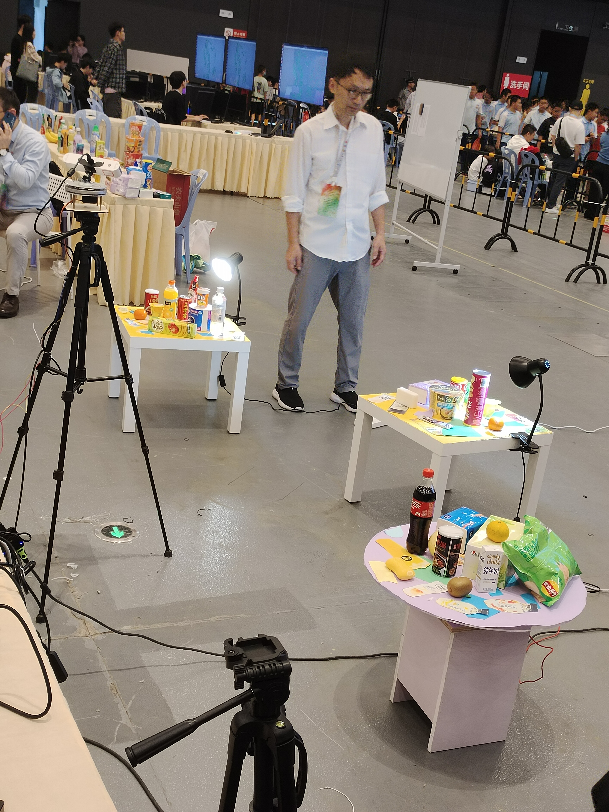{ loading=lazy }

**大概布置了一个小时左右**，过了10点没多久，1号队伍开始运行程序了，

而开始之后，我发现，**摄像头转动的速度其实根本不慢，根本用不到10秒，可能大约3秒就转完了**，早知道我就设置成暂停5秒了，

然后大概到了10点40，就轮到我们运行了，

最后我们是差一点点就超时了，或者说超时了一点点，具体是 志愿者说超时 的时候，我们才刚好将识别结果传输过去，

最终我们的成绩

{ loading=lazy }

虽然分很低，但是至少有分数了，而且是正的，感觉还算是让我觉得不错的结果

>   对于成绩中的瓶装洗手液的识别错误，我个人猜测应该是把瓶装饮用水识别成了洗手液

一些比赛时识别出的结果图片(最后一张旋转的圆桌，之前两个桌子的图片被覆盖了)，

=== "比赛运行效果1"

    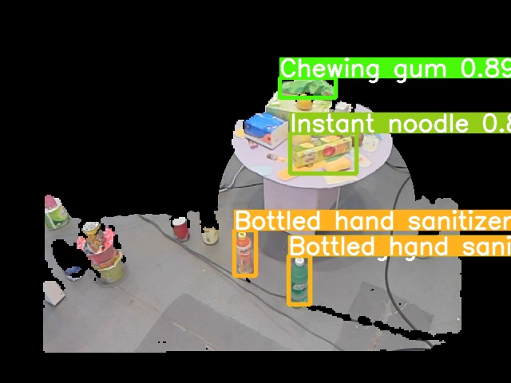{ loading=lazy }

=== "比赛运行效果2"

    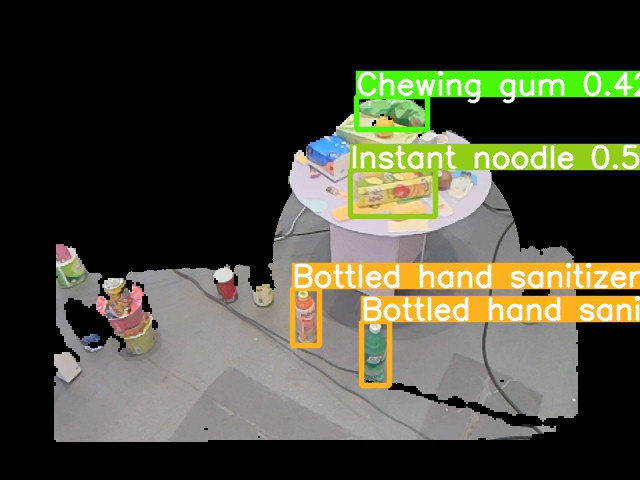{ loading=lazy }

=== "比赛运行效果3"

    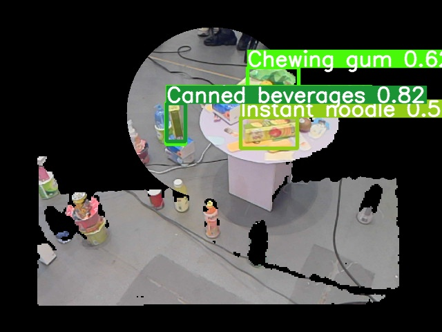{ loading=lazy }

=== "比赛运行效果4"

    { loading=lazy }

=== "比赛运行效果5"

    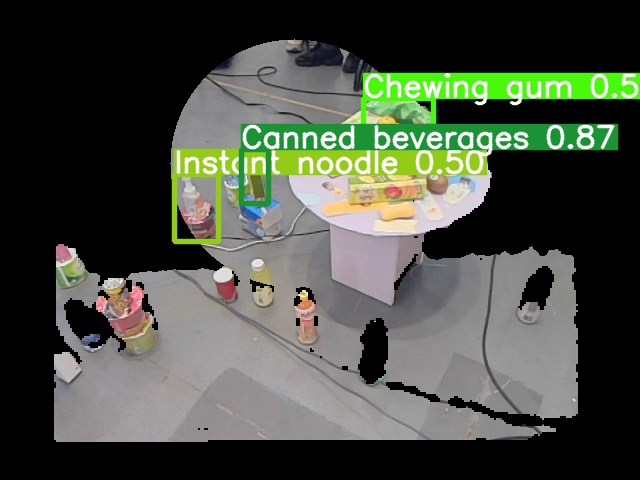{ loading=lazy }

所以到这时，最后3D识别项目就算是基本上结束了

## 一些总结

经过这次比赛，我认为，在出发前需要准备好东西，要不然到了现场再买很难及时地买到，就会很耽误调试的时间，

**最基本的东西有**

1.   板子(这就不用说了)
2.   显示器(这个主要是如果没有的话，很难借到)
3.   电源线(一定得带，否则很难买到，基于这次的经历，**最好还能有一个备用的**，要不然没了也很难借)
4.   摄像头
5.   键盘、鼠标、网线、HDMI线(需要匹配显示屏)、U盘(这几个虽然如果忘记带或者漏带了还能借到或者买到，但最好出发前就都准备好)

**如果要现场进行数据集的拍摄，所需要的东西有**

-   方桌、可以转动的圆盘
-   各种需要拍摄的物品(可以带过去或者在当地买，未知物品肯定得现场买)
-   各色的大卡纸(用于铺在桌子/圆盘上拍摄数据集)
-   摄像头的支架
-   打光的灯
-   物品的贴纸(如果有贴纸排除的算法，即有使用贴纸的需求)

所以如果需要带上这些这么多东西，我感觉可能还是3个或者4个人分几部分带比较好，或者让其他项目的人帮带一部分(在比赛场地时感觉周围的队伍基本上都至少3个人，而我们只有两个人，有时会感觉有些忙不过来)

对于模型而言，**我认为应该还是现场拍摄的模型识别的效果最好**，即使在基地拍摄的数据集训练的模型训练得再好(比如对于各种环境都识别效果很好)，我感觉在比赛时可能还是不如在现场拍摄然后训练出来的模型好用

