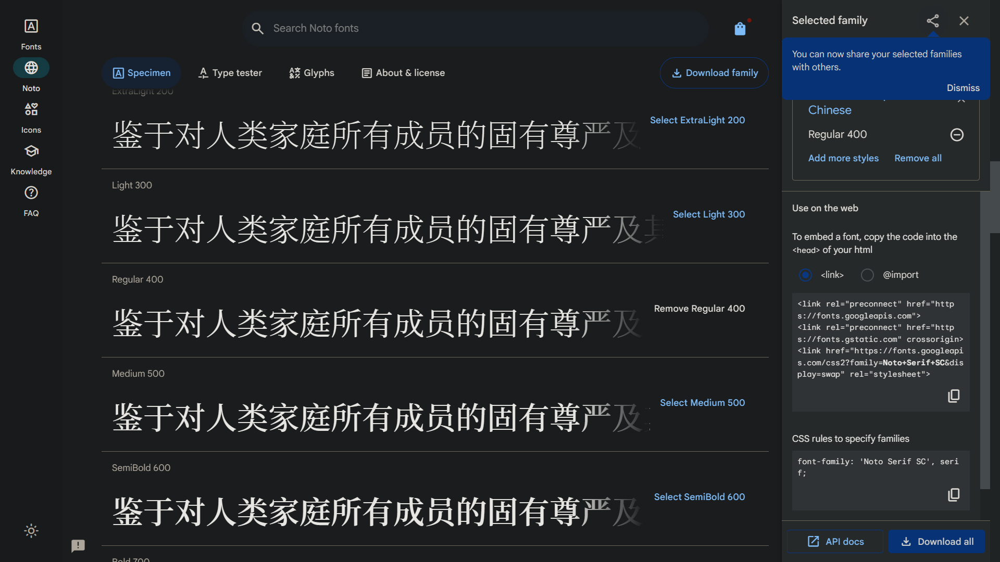

# 尝试修改 mkdocs-material 网页的字体的过程记录

## 起因

在前天上课时，偶然间发现了同学的博客网站 [GaoZQi's Note](https://gaozqi.github.io/note/) ，发现他的网站中普通页面(非blog页面)中有统计的数据，询问他说是使用了 [mkdocs-statistics-plugin](https://github.com/TonyCrane/mkdocs-statistics-plugin) 插件，然后为了查看这个插件的效果，前往了这个大佬作者的网页 [鹤翔万里的笔记本 (tonycrane.cc)](https://note.tonycrane.cc/) ，

然后主要是看到这个网站和同学的博客两个网站都是基于 mkdocs-material 搭建并且更换了字体，所以我就产生了更换字体的想法

## 尝试修改，寻找方法

由于我觉得 [鹤翔万里的笔记本](https://note.tonycrane.cc/) 网站的字体很好看，于是到github仓库中进行查看，

我先打开了 `/docs/css/custom.css` 

```css
:root {
  --md-text-font: "JetBrains Mono", "LXGW WenKai Screen"; 
  --md-code-font: "JetBrains Mono";
}

...
```

发现只有这里是进行了字体的设置，其中我知道 `JetBrains Mono` 是 JetBrains 开发的英文字体，那么 `LXGW WenKai Screen` 应该就是中文的字体了

但一开始我以为还会有其他的设置字体的 `css` 文件，因为之前看[同学博客的仓库](https://github.com/GaoZQi/note)里 `custom.css` 中的设置也是类似，但还有一个 `/docs/css/fonts.css` 文件

```css
/* JetBrains Mono */
@import url('https://fonts.loli.net/css?family=JetBrains Mono:400,500,600,700&display=swap');
/* Noto Sans SC */
@import url('https://fonts.loli.net/css2?family=Noto Sans SC&display=swap');
/* 思源宋体 */
@import url('https://fonts.googleapis.com/css2?family=Noto Serif SC&display=swap');
/* Roboto Slab */
@import url('https://fonts.googleapis.com/css2?family=Roboto Slab&display=swap');
/* Roboto*/
@import url('https://fonts.googleapis.com/css2?family=Roboto&display=swap');
```

来导入相关的字体，又或者设置相关的字体，

而且根据我的理解， `custom.css` 中的设置应该也只是设置了关键字，如果没有对对应字体进行设置或者导入的话，应该还是使用不了

>   然后我有进行过一次尝试，确实只在我的 `extra.css` 文件中设置 `--md-text-font` 和 `--md-code-font` 在预览中字体并没有改变

暂时没有头绪，然后想起官方文档中好像有设置字体相关的说明，于是前往查看 [Changing the fonts - Material for MkDocs (squidfunk.github.io)](https://squidfunk.github.io/mkdocs-material/setup/changing-the-fonts/#additional-fonts-docsstylesheetsextracss) ，

发现如果不使用自定义 `css` 文件的方法，只能选择 [Google Font](https://fonts.google.com/) 上有的字体(搜索发现 [Google Font](https://fonts.google.com/) 上没有 `LXGW WenKai Screen` 字体)，并且(应该)不能像上面说的两个网站一样设置多个字体(中文用一种，英文用另一种)，

于是查看自定义 `css` 的方法，

>    [Additional fonts](https://squidfunk.github.io/mkdocs-material/setup/changing-the-fonts/#additional-fonts)
>
>   `docs/stylesheets/extra.css`
>
>   ```python
>   @font-face {
>     font-family: "<font>";
>     src: "...";
>   }
>   ```

发现与那两个网站的设置方法不一样，

然后(由于还是没有头绪，所以)我在网上搜索 `LXGW WenKai Screen` ，找到了这个字体的 github 仓库

[lxgw/LxgwWenKai: An open-source Chinese font derived from Fontworks' Klee One. 一款开源中文字体，基于 FONTWORKS 出品字体 Klee One 衍生。 (github.com)](https://github.com/lxgw/LxgwWenKai)

在 `README.md` 中

>   若需要在网站上使用这款字体，请参阅 [Issue #24](https://github.com/lxgw/LxgwWenKai/issues/24)。

于是查看[该 Issue](https://github.com/lxgw/LxgwWenKai/issues/24) ，发现里面链接到另一个仓库 [chawyehsu/lxgw-wenkai-webfont: webfont package for the LXGW WenKai typeface (github.com)](https://github.com/chawyehsu/lxgw-wenkai-webfont) ，

本来从仓库的 `README.md` 的 [`Usage`](https://github.com/chawyehsu/lxgw-wenkai-webfont#usage) 中没找到合适的方法，但是在搜索 `mkdocs material 自定义字体` 时，发现了一片文章

[如何在Mkdocs里自定义字体（霞鹜文楷）-CSDN博客](https://blog.csdn.net/m0_63203517/article/details/131946304)

其中最下方 **基于Mkdocs的网站字体美化用法** 中的设置我看起来感觉和仓库中的设置有些相似(即添加字体的 `css` 文件来导入字体)，

>   在mkdocs.yml中添加以下内容
>
>   ```yaml
>   extra_css:
>     - https://cdn.jsdelivr.net/npm/lxgw-wenkai-webfont@1.1.0/style.css
>     # - https://cdn.jsdelivr.net/npm/lxgw-wenkai-lite-webfont@1.1.0/style.css
>     # - https://cdn.jsdelivr.net/npm/lxgw-wenkai-tc-webfont@1.0.0/style.css
>     # - https://cdn.jsdelivr.net/npm/lxgw-wenkai-screen-webfont@1.1.0/style.css
>   ```
>
>   然后在extra.css中添加以下内容
>
>   ```css
>   body {
>         font-family: "LXGW WenKai", sans-serif;
>         /* Lite version */
>         /* font-family: "LXGW WenKai Lite", sans-serif; */
>         /* TC version */
>         /* font-family: "LXGW WenKai TC", sans-serif; */
>         /* Screen version */
>         /* font-family: "LXGW WenKai Screen", sans-serif; */
>       }
>   ```
>
>   四选一，mkdocs.yml和extra.css相互对应

然后我进行了尝试，发现可行，

>   此外发现这篇文章其实是作者在他自己的博客上(这个博客好像之前另外一个同学还给我有提到过，大致看了一下里面似乎写了很多关于 mkdocs-material 的设置，以后有机会看看)
>
>   [Wcowin's Web](https://wcowin.work/)
>
>   写的 [修改网站字体 - Wcowin's Web](https://wcowin.work/blog/websitebeauty/mkdocsfont/) ，然后转发到 csdn 上的

然后我发现，这个方法中 `css` 中的 `font-family` 属性的设置，有在 [mkdocs-material 官方文档设置自定义字体](https://squidfunk.github.io/mkdocs-material/setup/changing-the-fonts/#additional-fonts) 中 `Regular font` 处代码中的 *评注 annotation* 中有提到过，所以我猜测，上面这个方法中 `font-family` 后填的*关键字*字符串，也可以在 `--md-text-font` `--md-code-font` 后，然后经过尝试，**发现可行**😆，

此时我又注意到，这个方法中，导入字体是在 `mkdocs.yml` 中 `extra_css` 中导入的，所以我才开始去查看 [鹤翔万里的笔记本 (tonycrane.cc)](https://note.tonycrane.cc/) 的 `mkdocs.yml`

```yaml
extra_css:
  - https://cdn.tonycrane.cc/jbmono/jetbrainsmono.css
  - https://cdn.tonycrane.cc/lxgw/lxgwscreen.css
```

发现确实是在此处进行导入字体，

所以，到这里，我终于弄明白了，**==可以直接在 `mkdocs.yml` 中导入字体 `css` 文件，也可以像同学一样，通过 `css` 文件(他的 `fonts.css` )来导入字体的 `css` 文件，然后导入之后再设置 `--md-text-font` `--md-code-font` 属性就能更改网页的字体了==**😆

## 设置字体

### 选择字体

正文的字体我打算采用和 [鹤翔万里的笔记本 (tonycrane.cc)](https://note.tonycrane.cc/) 一样的字体(英文 `JetBrains mono` ，中文 霞鹜文楷)，于是 `--md-text-font` 设置成和作者一样，

然后这时我才意识到，**把英文字体放在前面，才能使得中英文字体不一样，因为这样才会英文字体找不到再在中文字体中寻找**，

而代码的字体，英文我也打算使用 `JetBrains mono` ，中文我选择了一会，打算使用 思源宋体 `Noto Serif SC` ，

### 查找字体 `css` 文件

于是开始查找 `Noto Serif SC` 的 `css` 文件，然后发现在 Google Font 上有这个字体，但是一开始没弄明白如何获取 `css` 文件，

经过一番摸索，发现需要在字体页面下方 `Styles` 处选择一个或多个*规格*，我选择了 `Regular 400` ，然后再点击网页右上角的像购物袋的(会显示 View selected famalies 的)图标，

{ loading=lazy }

然后在右侧可以找到对应的地址/链接

```css
https://fonts.googleapis.com/css2?family=Noto+Serif+SC&display=swap
```

以及字体对应的关键字 `Noto Serif SC`

然后将链接直接放入 `mkdocs.yml` 的 `extra_css` 中，再在自定义的 `css` 文件(这时我用的是 `extra.css` 来测试的)中设置关键字，

最后预览中能看到显示相应的字体😆

### 将 google 的地址换成国内的

由于注意到同学是用了 `fonts.loli.net` 的域名(可见上面 `fonts.css` 中的代码)，而我也认为可能把google相关的域名换成其他的会好一点，

于是搜索相关信息，然后发现一篇文章

[使用 CDN 或直接引入的方式，更换网站中文字体_html font字体 cdn链接-CSDN博客](https://blog.csdn.net/qq_43374102/article/details/118861080)

里面提到了四个站点/域名

-   ```css
    https://fonts.googleapis.cnpmjs.org
    ```
    
-   ```css
    https://fonts.font.im
    ```
    
-   ```css
    https://fonts.proxy.ustclug.org
    ```
    
-   ```css
    https://fonts.loli.net
    ```

>   `fonts.proxy.ustclug.org` 好像之前搜索的时候有看到这个是中科大的域名

最后我打算也采用 `fonts.loli.net` (跟同学一样😉)

### 最后修改后的效果

{ loading=lazy }