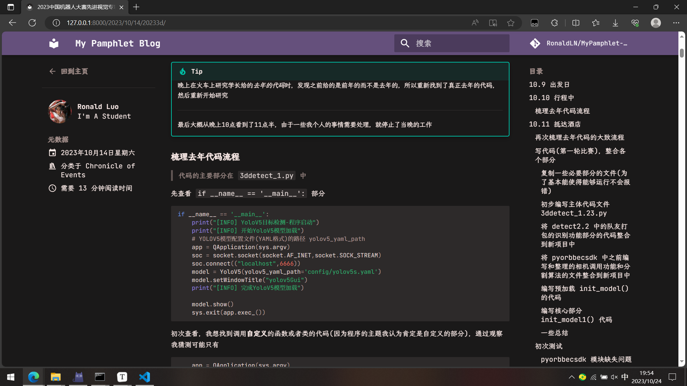
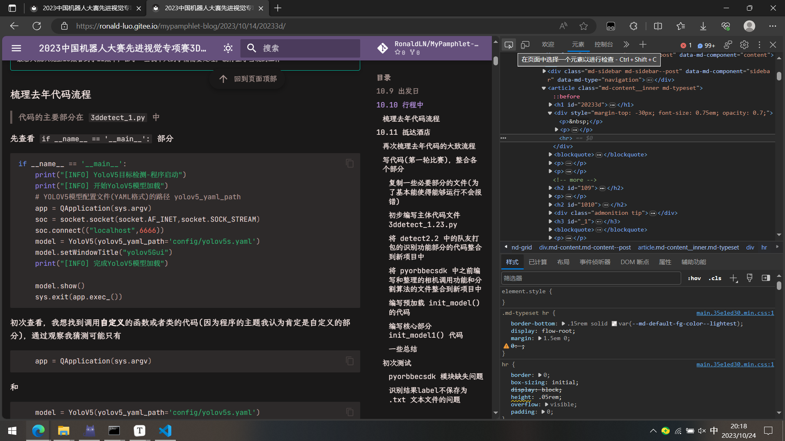
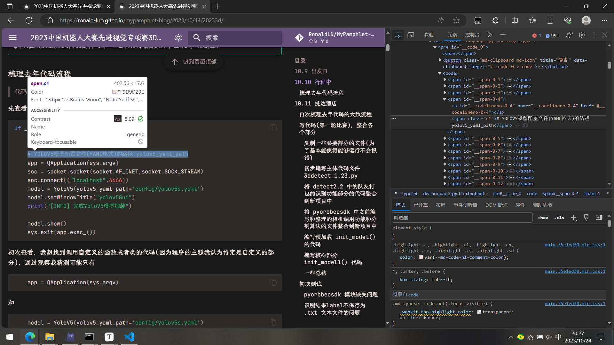
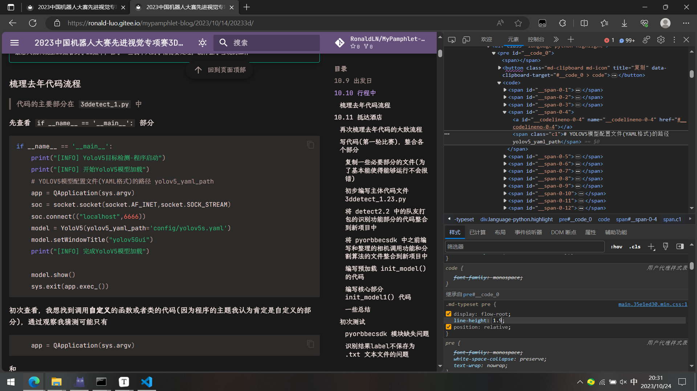
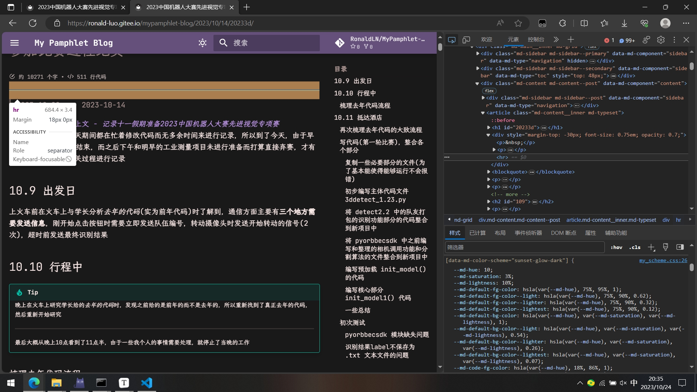
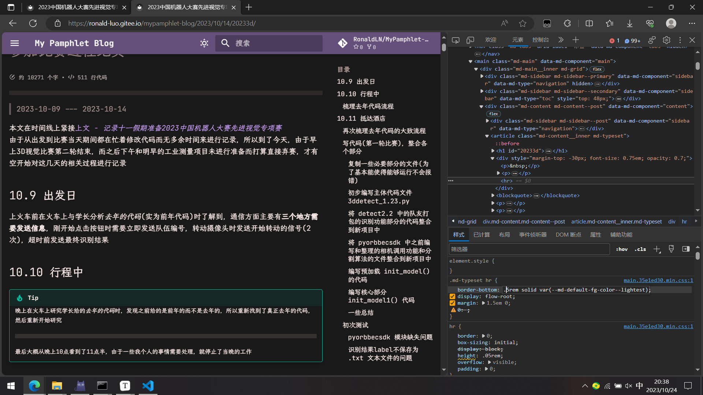
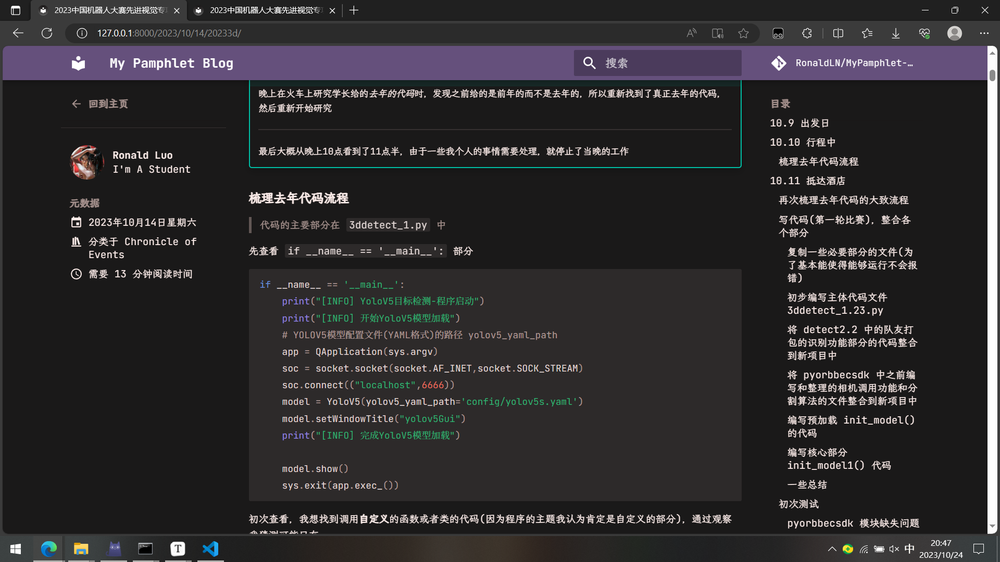

# 调整 mkdocs-material 网页外观过程记录

## 起因

跟前两篇一样😏，也是由于看到 [鹤翔万里的笔记本 (tonycrane.cc)](https://note.tonycrane.cc/) ，然后觉得比默认的设置要好看，所以打算对我的网页也尝试进行修改

<!-- more -->

## cv作者的css设置

[`/docs/css/custom.css`](https://github.com/TonyCrane/note/blob/master/docs/css/custom.css)

我先cv了

```css
@media screen and (min-width: 960px) {
  html {
    font-size: 137.5%;
  }
}

@media screen and (min-width: 100em) {
  html {
    font-size: 137.5%;
  }
}

@media screen and (min-width: 125em) {
  html {
    font-size: 137.5%;
  }
}
```

然后预览，发现左右侧边栏(导航栏和目录栏)相隔的间距变宽了，

然后继续cv了

```css
.md-typeset h1, .md-typeset h2 {
  font-weight: 600;
}

.md-typeset h3 {
  font-weight: 500;
}

.md-typeset h1, .md-typeset h2, .md-typeset h3, .md-typeset h4 {
  letter-spacing: 0;
}

.md-typeset {
  font-size: .7rem;
}

.md-typeset h3 {
  font-weight: 600;
}
```

然后经过几次代码注释的测试发现，

```css
.md-typeset {
  font-size: .7rem;
}
```

这一个设置是设置所有字体大小的，

继续复制，

```css
.md-typeset code:not(pre code) {
  font-size: inherit;
}
```

添加了这个设置之后，发现行内代码的字体变大了(而代码块中的代码没变大)，

>   此外还复制了
>
>   ```css
>   @media screen and (max-width: 59.9375em) {
>     .md-nav__source {
>       background-color: var(--md-primary-fg-color);
>     }
>   }
>   
>   @media screen and (max-width: 76.1875em) {
>     .md-nav--primary .md-nav__title {
>       background-color: var(--md-primary-fg-color);
>     }
>   }
>   ```
>
>   但还不清除有什么用

然后这时的效果如下

{ loading=lazy }

## 自己进行css的设置

这时我感觉代码块中的字/代码显得有些挤，所以想对代码块中的设置进行修改，

由于 `.md-typeset code:not(pre code)` 是只设置行内代码，然后我猜测可能去掉 `:not(pre code)` 说不定能设置代码块，发现果然可以，

```css
.md-typeset code {
  font-size: inherit;
}
```

{ loading=lazy }

但修改完发现，字体似乎又太大了，

然后因为感觉就这么盲目摸索摸不出来，所以搜索了一下 `css .md-typeset` ，然后看到了一篇文章

[如何在mkdocs中自定义css - 知乎 (zhihu.com)](https://zhuanlan.zhihu.com/p/568788779)

发现可以通过 ++f12++ 打开 ***开发人员工具*** (或者右键，点击 检查 (Edge 浏览器))，在其中可以看到对应外观的对应的css属性变量，并且可以直接在浏览器中修改进行效果的*预览*，

由于一开始没有找到修改属性的对应的区/窗口，又查看了另一篇文章作为辅助

[F12 - 开发者工具详解 - 知乎 (zhihu.com)](https://zhuanlan.zhihu.com/p/231865779)

然后摸索了一番，大致懂得如何操作了，

以我尝试的 ==查找 **代码块行间距** 和 **分割线宽度** 的对应属性== 为例，

**代码块行间距**

{ loading=lazy }

在开发者工具界面左上角点击 ***在页面中选择一个元素进行检查*** ，然后在页面中选择一个代码块的代码点击，

{ loading=lazy }

然后，*元素* 中就会选定并高亮对应的 html 语句，

然后就可以在下方的 ***样式*** 中，**==根据属性的英文名，以及属性的值的类型==**，来判断是否是想找的属性，

{ loading=lazy }

经过一会的翻找，我猜测 `line-height` 可能是设置代码块行间距的属性，

于是点击属性的值进行修改，看看是否代码块的行间距会变化

=== "修改后"

    { loading=lazy }

=== "修改前"

    { loading=lazy }

发现确实变化了，所以就可以得到，修改代码块行间距 应该添加的 css 代码

```css
.md-typeset pre {
  line-height: 1.8;
}
```

**分割线宽度**

大致的流程相同，

选中分割线进行查看

{ loading=lazy }

然后找到可能是设置 分割线宽度 的属性，改动它的值

=== "修改后"

    { loading=lazy }

=== "修改前"

    { loading=lazy }

发现 分割线宽度 确实改变了，所以得到相应的css设置代码

```css
.md-typeset hr {
  border-bottom: .10rem solid var(--md-default-fg-color--lightest);
}
```

---

经过一些尝试，最后代码的字体大小和行间距我设置成了我自认为比较合适的值

```css
/* 以下是从 TonyCrane/note 仓库 custom.css 复制的 */
@media screen and (min-width: 960px) {
  html {
    font-size: 137.5%;
  }
}

@media screen and (min-width: 100em) {
  html {
    font-size: 137.5%;
  }
}

@media screen and (min-width: 125em) {
  html {
    font-size: 137.5%;
  }
}

.md-typeset h1, .md-typeset h2 {
  font-weight: 600;
}

.md-typeset h3 {
  font-weight: 500;
}

.md-typeset h1, .md-typeset h2, .md-typeset h3, .md-typeset h4 {
  letter-spacing: 0;
}

.md-typeset {
  font-size: .7rem;
}

.md-typeset h3 {
  font-weight: 600;
}

@media screen and (max-width: 59.9375em) {
  .md-nav__source {
    background-color: var(--md-primary-fg-color);
  }
}

@media screen and (max-width: 76.1875em) {
  .md-nav--primary .md-nav__title {
    background-color: var(--md-primary-fg-color);
  }
}
/* 复制到此 */

/* 修改所有代码字体大小 */
.md-typeset code {
  font-size: .65rem;
}

/* (覆盖)修改行内代码字体大小 */
.md-typeset code:not(pre code) {
  font-size: inherit;
}

/* 修改代码块行间距 */
.md-typeset pre {
  line-height: 1.8;
}

/* 修改分割线的宽度 */
.md-typeset hr {
  border-bottom: .10rem solid var(--md-default-fg-color--lightest);
}
```

{ loading=lazy }

