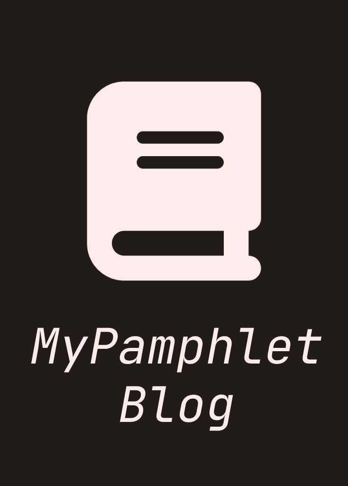
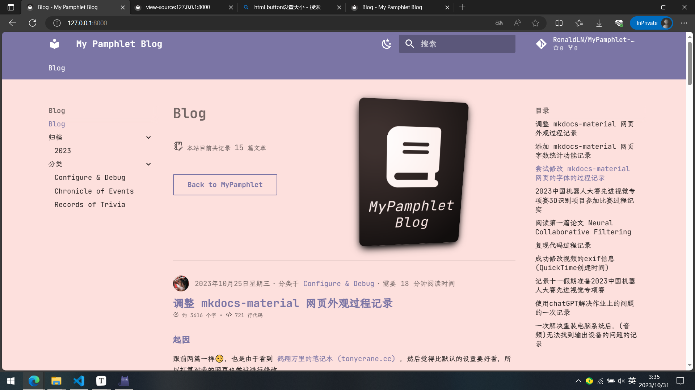

# 给 Blog *index* 页面添加*小卡片*

## 起因

同样也是由于 [鹤翔万里的笔记本 (tonycrane.cc)](https://note.tonycrane.cc/) 的首页中设置有卡片，我感觉很酷，所以在我的 Blog 网页上也想设置一个😂😂

<!-- more -->

## 开始尝试复刻

在仓库 README.md 中，作者说到了卡片效果的原仓库 [simeydotme/pokemon-cards-css](https://github.com/simeydotme/pokemon-cards-css/) ，和他修改后新建的一个仓库 [TonyCrane/note-homepage-cards](https://github.com/TonyCrane/note-homepage-cards/) ，

我去了原仓库去查看，发现并没有说明用法，然后去作者修改后的仓库，里面写着一个[用法](https://github.com/TonyCrane/note-homepage-cards/#usage)

!!! quote

    -   Install dependencies
    
        ```bash
        $ npm install
        ```
    
    -   Run locally for development
    
        ```bash
        $ npm run dev # open at https://localhost:5173/
        ```
    
    -   Build to static files
    
        ```bash
        $ npm run build
        ```
    
    -   Copy to note's mkdocs project
    
        -   Copy static files
    
            ```text
            dist/assets/index.???.css
            dist/assets/index.???.js
            public/*
            ```
    
        -   Insert html to homepage
    
            ```html
            <link rel="stylesheet" href="css/cards/base.css" />
            <link rel="stylesheet" href="css/cards/cards.css" />
            <script type="module" crossorigin src="/assets/cards/index.???.js"></script>
            <link rel="stylesheet" href="/assets/cards/index.???.css">
            <div id="app"></div>
            ```

这个用法的前半部分，应该是要用到 Node.js ，由于我并不是很熟悉，所以有点不想用 Node.js (怕弄不明白而无法进行调整)，而我注意了后半部分的用法，

于是我打算尝试一下，复制作者仓库中这些对应的文件，然后在生成的页面中导入看看效果，

于是我在仓库中找到了

-   [`docs/css/cards/cards.css`](https://github.com/TonyCrane/note/blob/master/docs/css/cards/cards.css)
-   [`docs/css/cards/base.css`](https://github.com/TonyCrane/note/blob/master/docs/css/cards/base.css)
-   [`docs/assets/cards/index.caca6175.js`](https://github.com/TonyCrane/note/blob/master/docs/assets/cards/index.caca6175.js)
-   [`docs/assets/cards/index.c9fa2768.css`](https://github.com/TonyCrane/note/blob/master/docs/assets/cards/index.c9fa2768.css)

这几个对应的文件，然后将 `cards.css` 和 `base.css` 复制到了 `docs/stylesheets/cards` 下，两个 `index` 文件复制到了同样的路径下，

并且还将仓库中 [`docs/assets/cards`](https://github.com/TonyCrane/note/tree/master/docs/assets/cards) 其余的图片也一并复制到我同样的路径下(先看看能不能显示出卡片，如果能就之后再设置我自己的卡片)，

然后由于我只想在 *index* 网页中显示卡片，(虽然作者好像是用 `home.html` 去覆写，但是)我打算直接将这几行html代码放在 `index.md` 中，

```html
<link rel="stylesheet" href="css/cards/base.css" />
<link rel="stylesheet" href="css/cards/cards.css" />
<script type="module" crossorigin src="/assets/cards/index.caca6175.js"></script>
<link rel="stylesheet" href="/assets/cards/index.c9fa2768.css">
<div id="app"></div>
```

然后预览，发现能显示出卡片，但卡片很大，和正文部分的宽度一样宽(长宽比例不变，所以就很长)，

## 尝试通过 `margin` 调整卡片大小，然后成功

由于添加的5行代码中，4行代码我认为都是导入文件，所以我认为 `<div id="app"></div>` 是设置卡片的代码，于是尝试添加了 `margin-left` 

```html
<div id="app" style="margin-left: 22.8rem"></div>
```

然后预览，发现卡片显示在了正文部分的右侧，==并且变小了==，

这意味着，我 **==可以通过几个 `margin` 属性来设置和调整 卡片的大小和位置==**，

## 设置自己的卡片

我在复制来的四个文件中进行搜索和查看，然后在 `index.caca6175.js` 中的底部，发现设置了使用的图片文件的代码

```javascript
...
function Vt(e) {
  const t = [
    ["#", "/assets/cards/back.png"]
    ["/cs/pl/riscv/", "/assets/cards/riscv.png"],
    ["/cs/pl/rust/basic/", "/assets/cards/rust.png"],
    ["/cs/pl/haskell/", "/assets/cards/haskell.png"],
    ["/cs/system/", "/assets/cards/system.png"],
    ["/cs/pl/asm/", "/assets/cards/asm.png"],
    ["/cs/algorithm/ds/", "/assets/cards/ds.png"],
    ["/cs/regex/", "/assets/cards/regex.png"],
    ["/cs/unicode/", "/assets/cards/unicode.png"],
    ["/cs/tools/", "/assets/cards/tools.png"],
    ["/sec/vulns/log4j/", "/assets/cards/log4j.png"],
    ["/web/svg/", "/assets/cards/svg.png"],
    ["/ctf/misc/qrcode/", "/assets/cards/qrcode.png"],
    ["/ctf/blockchain/eth/", "/assets/cards/eth.png"],
    ["/ctf/misc/escapes/pysandbox/", "/assets/cards/pyjail.png"],
    ["/writeups/", "/assets/cards/writeups.png"],
    ["#", "/assets/cards/donate.png"]
  ]
...
```

然后我尝试注释掉只剩下一两个，**发现不断预览的页面就只会出现那剩下的几个了**(并且发现了前面是对应的链接)，所以，只要我有自己的卡片图片，然后再在这处代码只设置我的图片就可以了，

于是我开始制作我自己的卡片图片，

最后制作成了

{ loading=lazy }

## 测试调整属性

然后为了方便测试属性，我将 `index.md` 中这行代码改成

```html
<div id="app" style="margin-left: 22.8rem; margin-top: -16rem; margin-bottem: 0rem; margin-right: 0rem;"></div>
```

然后网页的开发工具中进行调整和测试，

经过不断调整，适应我的网页，最后 `index.md` 设置成了

```markdown
# Blog

...

<div style="margin-top: 2rem"></div>

[Back to MyPamphlet](https://ronaldln.github.io/MyPamphlet/blog){ .md-button }

<link rel="stylesheet" href="stylesheets/cards/base.css" />
<link rel="stylesheet" href="stylesheets/cards/cards.css" />
<script type="module" crossorigin src="assets/cards/index.js"></script>
<link rel="stylesheet" href="assets/cards/index.css">
<div id="app" style="margin-left: 18.8rem; margin-top: -10rem; margin-bottem: 0rem; margin-right: 5rem;"></div>

---
```

>   其中我将两个 `index` css 和 js 文件的文件名中的数字字母给去除了

最后的效果

{ loading=lazy }

