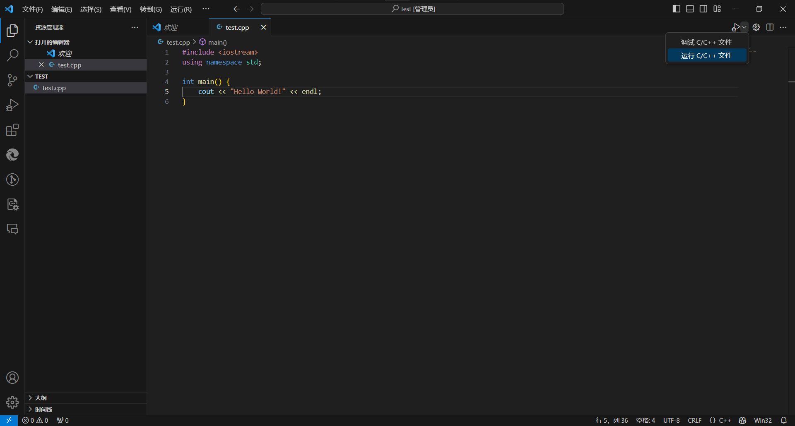
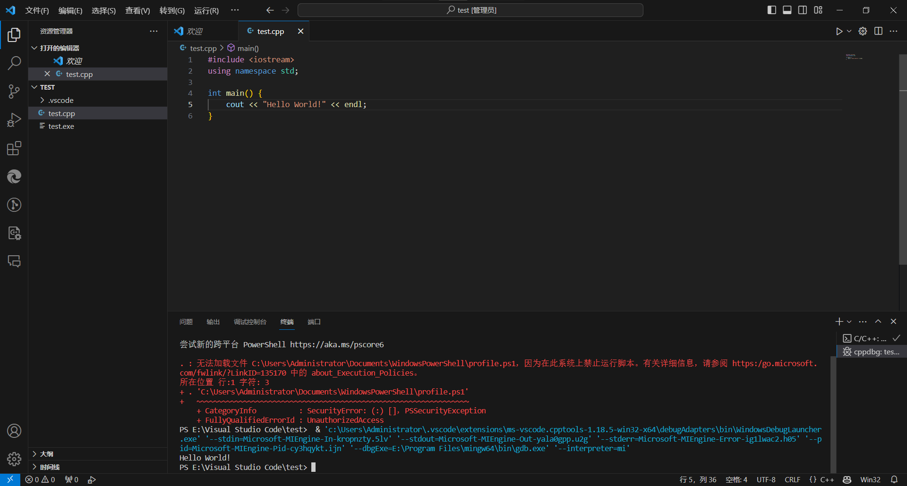
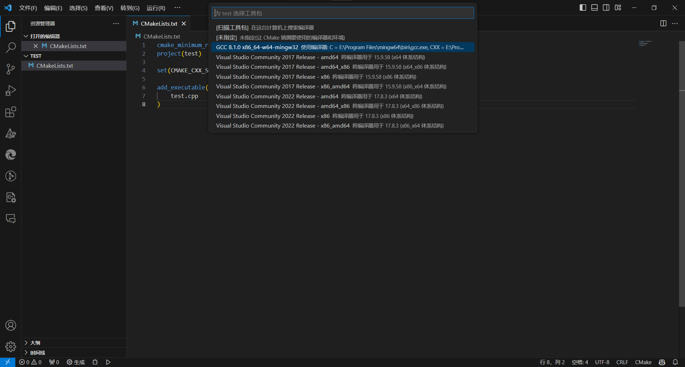

# 在 VSCode 上使用 cmake 来构建 C/C++ 项目

由于前几天在 vscode 上编写并运行简短的用来测试(瞎搞)的 python 代码时感觉使用起来非常方便和快捷，所以开始摸索在 vscode 上构建 C/C++ 的小项目。之前都是在 CLion 上运行 C/C++ 的代码，而在 CLion 上都是使用 cmake 来管理项目，所以在 vscode 上也想使用 cmake 来弄(因为习惯了)。

<!-- more -->

## 直接使用 gcc g++ 来编译 C/C++ 源文件

一开始先是去查看了 vscode 官方文档中编写 C/C++ 的相关说明

[C++ programming with Visual Studio Code](https://code.visualstudio.com/docs/languages/cpp)

安装上面的指示，我新建了文件夹，并创建了 `test.cpp` 文件，然后在右上角的图标中选择「运行 C/C++ 文件」，

{ loading=lazy }

然后会需要选择编译器(第一次运行或者调试，**之后都会默认使用**这次选的编译器)，c 就选择 gcc ，c++ 就选 g++

{ loading=lazy }

(第一次)运行之后会生成 `.vscode` 文件夹 和 编译出的 `exe` ，

{ loading=lazy }

但是我并不是很喜欢生成的 `exe` 文件和源文件在同一个目录下(可能经过一些配置可以更改 生成 `exe` 的路径，但我暂时不太清楚)，于是我就想尝试看看 vscode 上能不能像 CLion 上一样，使用 cmake 来构建项目，然后 `exe` 会生成在一个文件夹里

---

此外，摸索了一下，发现如果要直接使用 gcc g++ 来编译源文件，

-   调试对应的快捷键是 ++f5++
-   运行对应的快捷键是 ++ctrl+f5++

{ loading=lazy }

## 在 vscode 上使用 cmake

>   一开始先是在网上查到了官方文档中的这个
>
>   [Get started with CMake Tools on Linux (visualstudio.com)](https://code.visualstudio.com/docs/cpp/cmake-linux)
>
>   然后看到左边目录上，这一篇的上面有个 [`Build with CMake`](https://code.visualstudio.com/docs/cpp/build-with-cmake) ，于是点进去看，发现打开是个 github 仓库中的 `README.md` 文件，而里面又提到建议看上面那个官方文档那一篇😅，
>
>   但是看了之后，感觉写的有点复杂，于是自己摸索了起来

经过摸索，发现如果项目文件夹中已经有 `CMakeLists.txt` ，在打开这个项目文件夹的时候就会自动加载 cmake 的插件，

>   之后发现这一点在官方文档上写了
>
>   [Create a CMake project](https://code.visualstudio.com/docs/cpp/CMake-linux#_create-a-cmake-project)

!!! quote "&nbsp;"

    <big>[Create a CMake project](https://code.visualstudio.com/docs/cpp/CMake-linux#_create-a-cmake-project)</big>
    
    If you have an existing CMake project that already has a `CMakeLists.txt` file in the root directory, you can skip to [Select a kit](https://code.visualstudio.com/docs/cpp/CMake-linux#_select-a-kit) to configure your existing project.

而如果本来没有 `CMakeLists.txt` ，在打开项目后再新建 `CMakeLists.txt` 也不会加载 cmake ，所以关闭文件夹再重新打开一下就好了。

>   稍微提一下，
>
>   官方文档上还写了一个创建 cmake 项目的方法，可以使用命令 `Cmake: Quick Start` ：
>
>   -   先 ++ctrl+shift+p++ ，打开命令输入框(或者用其他方法打开)
>   -   然后输入后选择对应的命令
>
>   然后会需要再输入/选择一些 项目名、项目类型等之类的东西，然后就会创建一个 `CMakeList.txt` 和 一个输出 `Hello xxx` 的源文件(感觉很鸡肋😅)

我使用的 `CMakeLists.txt` 是直接从 CLion 中复制的

=== "C++项目"

    ```cmake
    cmake_minimum_required(VERSION 3.24)
    project(test)
    
    set(CMAKE_CXX_STANDARD 11)
    
    add_executable(test 
        main.cpp
    )
    ```

=== "C项目"

    ```cmake
    cmake_minimum_required(VERSION 3.24)
    project(test)
    
    set(CMAKE_C_STANDARD 11)
    
    add_executable(test
        main.c
    )
    ```

然后如果项目中已有 `CMakeLists.txt` 时，会让选择要使用的编译器，于是我选择了 mingw

{ loading=lazy }

选择好之后，就会构建/生成项目，

而且发现，每次修改并保存了 `CMakeLists.txt` 文件，或者在打开项目时，都会生成项目，或者点击左下角的「:octicons-gear-24:生成」也可以生成项目

### debug 调试 和 run 运行

我先是在官方文档那一篇上看到，可以 ++ctrl+shift+p++ 然后再选择 `Cmake: Debug` 命令来调试，然后发现这个命令可以用快捷键 ++ctrl+f5++ 来运行

{ loading=lazy }

然后又发现，运行对应的快捷键是 ++shift+f5++ (在上图中也可以看到)，以及之前的 生成项目 快捷键是 ++f7++ (cmake 插件生效后居然同一个快捷键映射的效果就改变了(原本 ++ctrl+f5++ 是使用 g++ 编译并运行，现在变成了 cmake 的调试)，感觉有点神奇)，

于是进行运行，发现 `exe` 文件就生成在 `build` 文件夹中了。

此外，左下角的 :octicons-bug-24:图标 和 :material-menu-right-outline:图标 也分别对应 调试 和 运行

---

### 小结

体验上，vscode 打开项目确实很快(虽然 CLion 打开速度已经不慢了，但是比 vscode 的打开速度还是慢些许)，所以对于我临时起意想要测试的 c/c++ 代码就会非常方便

