# 2024数模美赛参赛纪实(编程手视角)

>   2024-02-02 --- 2024-02-06

!!! tip

    比赛时间为 2号早上6点公布题目，6号早上9点开始提交论文(北京时间)

## Day 1

### 阅读题目 (早)

早上8点起来，6点起来的队友已经将每个题目都大致看了一遍，然后开始边吃早餐边看题目边和队友讨论题目。

<!-- more -->

队友说，还是打算在MCM的三题(A B C题)里面选，所以我就着重看了这三题，D E F三题就只是简单扫了一眼了解了一下😅。

A题是关于 *七鳃鳗 lampreys* 的，大概是生态相关的问题。

B题是关于潜水艇，但看完后面的问题后，我感觉在建立相关的模型时，会需要地理相关的一些数据以及知识，感觉不是很好搞到这些数据。然后队友也说在读题目时有一个术语都不能准确理解具体是什么意思，所以我们优先排除了B题。

C题是关于网球，大概是需要根据提供的比赛时的数据，找到某种潜在的比赛球员赢球的 ***势头 momentum***。

这时我和队友经过边看题边讨论，大概确定了选A题或C题，但还没最后确定选哪一题(队友说他打算第一天上午把题目确定好就行了)，然后我们就开始各自去查找资料(查找更多题目相关的资料来更深入了解题目，以便最终的选题确定)了。

### 了解网球规则

由于我理解的C题是需要寻找某种潜在的关系或者说规律，所以我觉得这很适合用**机器学习**来做，把C题所给的数据拿去跑。

于是我就开始去了解网球的规则(题目需要)，在b站上查看介绍网球比赛规则的相关视频，

-   [网球规则解释（得分，术语等）\_哔哩哔哩\_bilibili](https://b23.tv/oILc36E)
-   [网球记分规则｜Alex的知识分享，内附Alex亲自上场示范～\_哔哩哔哩\_bilibili](https://b23.tv/WxzHiT1)

看完这两个视频，明白了网球规则中的一些基础的概念，但还想再找更多的视频进行确认，而b站上感觉没有什么比较好且短的网球规则介绍视频了，于是我突然想到可以去油管上找，然后就找到一个帮助很大的视频(主要是英文的刚好能跟题目中的术语词汇对应上)，

-   [The Rules of Tennis - EXPLAINED! - YouTube](https://youtu.be/1P_Das6OjAk)

### 与老师讨论，确定选C题

到差不多11点左右，我们跟指导老师进行了讨论，老师当时主要看C题，并且也提到了可以运用机器学习去发掘潜在的关于*势头*的规律，(我的想法感觉跟老师不谋而合)于是我也跟老师说感觉这题适合用 神经网络 机器学习 来处理。

(我由于对模型和权重的概念还有些没厘清，于是向老师询问了一下)老师就进一步说到，这题大致的方案可以是先构建出模型，然后根据每个选手的数据训练出权重，最后应用权重在具体的数据上进行预测/估算。

因此我们最后决定了就选C题。

### 弄清楚字典中的各个术语

从11点半结束与老师的讨论，我们开始研究字典( `data_dictionary.csv` )中的那些变量名称，一直到12点左右各自去吃饭。其中几个比较关键的是

-   `serve_no` 发球次数，即(在当前分中)第1次还是第2次发球(第2次发球包含*双误 double fault*的情况)
-   `ace` 发球得分，仅通过发球直接赢得这一分(在油管视频中有介绍)
-   `xx_winner` 正面赢球，通过打出让对手接不到的球而得分(与之相对的是对手失误而得分)，因此可能存在 p1 p2 都为 0 的情况
-   `xx_double_fault` 双误，发球方在当前分发球两次都失误(下网或发球出界)，则会使对方得分
-   `xx_unf_err` *非受迫性失误 unforced error* ，类比羽毛球中的非受迫性失误，大概应该是主动失误丢分，像在**不是拿点非常不好或者非常被动**的情况下自己失误丢分
-   `xx_net_pt` 网前回球，选手最后赢/输的那一球是在网前回的
-   `xx_net_pt_won` 网前得分，与上面类似，只不过这球是赢了(感觉可能意味着拿点很好，因此会涨气势涨信心)
-   `xx_break_pt` 在这一局中，作为接发方，并且如果赢下当前分则赢下这一局

>   因此最后我弄清楚的网球比分的规则和比赛得分的流程是这样的：

??? tip

    网球比赛的记分从大到小有 ***盘 set*** ***局 game*** ***分 point*** ，通常是
    
    -   **5盘3胜**(男单是这样，其他好像有些会不一样)，即赢下3盘赢得这场比赛
    
    -   每盘中，赢下6局则赢得这盘比赛，但是**需要领先两局**，即如果出现 5:5 则需要赢下7局(类比羽毛球中 20:20 的加分)，而 6:6 则需要打 ***决胜局 tiebreaker*** ，赢下*决胜局*就赢得这盘(类比羽毛球中的29:29)
    
    -   每局中，需要赢下4分，且也有类似于领先两分才能赢得这局的规定。
    
        其中，还有 ***分数 score*** 的概念(来历可以看上面的第二个视频)，对应关系是
    
        | 分 point |   分数 score    |
        | :------: | :-------------: |
        |    0     | 0 (但读作 love) |
        |    1     |       15        |
        |    2     |       30        |
        |    3     |       40        |
    
        如果对手这一局没有拿到过3分，那么自己只需要赢下4分即可赢得这一局，如果对手拿到了3分，即分数中的40，则在之后的比分中会出现 **AD (advantage)** ，**AD**可以直接当作**第4分**，
    
        而出现了分数40:40(即3:3)之后的记分规则是，在40:40(这个特殊局面也叫做 Deuce，但是在这一题的数据中没有出现相关的数据)时 赢下这分的进入AD，在下一分中，分数为AD的如果赢则赢得这一局，如果输则退回分数40(可以理解成分数会减少，即如果4:3输了就会变成3:3)
    
        ---
    
        在*决胜局 tiebreaker*中，则是需要赢下**至少**7分(如果*盘*比为2:2，则是需要赢下至少10分(所以也被叫做**抢七**或**抢十**))(**至少**也是因为需要比对手多至少两分，如果7:6则需要像羽毛球一样加分，并且无上限)
    
    ---
    
    发球与接发，**每一局中发球方是固定的**，而下一局换成对方作为发球方，无论这局谁赢谁输(可以参考上面第二个视频后半部分的演示)
    
    ---
    
    在每一分中，发球方有两次发球的机会(即第一次发球如果失误，还能再次发球，即第一次发球失误不丢分)，如果两次发球均失误，即为*双误 double fault*，则失去这一分/对方得分，
    
    而发球方发球成功/合法发球之后，则进入正常的对局，即如果哪一方没有成功回球或者回球出界/犯规等，另一方得分(就和羽毛球一样了)

### 查找相关文献文章 (午)

下午从2点半左右到4点半左右，我和队友在查找运用 机器学习 神经网络 来对比赛形势进行预测的相关文献文章，

我主要找到了这两篇文献，

>   -   [A deep learning framework for football match prediction | Discover Applied Sciences (springer.com)](https://link.springer.com/article/10.1007/s42452-019-1821-5)
>   -   [Computers | Free Full-Text | On Predicting Soccer Outcomes in the Greek League Using Machine Learning (mdpi.com)](https://www.mdpi.com/2073-431X/11/9/133)

本来我是像通过查找文献来看能不能找到一些对于编程方面有用的一些东西，但是发现不太行，

所以在跟队友讨论了一下这两篇之后，就让他去参考这两篇文章去弄写作的事情去了，

### 初步复习以及进一步了解机器学习/神经网络

然后我开始在b站上搜索 机器学习/神经网络 相关的学习视频，我这时的想法是，找到一个教怎么去实现使用机器学习/神经网络的视频，然后我先跟着视频去实现/复现简单的神经网络，然后再根据题目的要求去修改代码，==最终能将题目提供的数据用来训练==

经过一番搜索，我发现了**这个课程**(一个非常好的课程，之前在23年4月在完成基地布置的考核任务时，任务中也有提到这个课程)，

[合集·斯坦福2021秋季·实用机器学习【中文】【合集】-哔哩哔哩](https://b23.tv/9N119Ny)

浏览了一下每节课的标题，然后直接从[3.1节 8分钟机器学习介绍](https://b23.tv/Ovnm772)开始看。

>   看到了5点多，然后6点队友想跟我讨论另一篇文献，讨论了大约半小时之后去吃饭了，吃完饭又感觉有点困不小心睡着了😅，到9点左右醒过来了，于是继续开始看

最后到这天晚上最后，大体看了这5节课

-   [3.1 8分钟机器学习介绍](https://b23.tv/Ovnm772)
-   [3.3 最简单也同样最常用的线性模型](https://b23.tv/18zab4N)
-   [3.5 多层感知机](https://b23.tv/a8ERuyM)
-   [3.6 卷积神经网络](https://b23.tv/fzoPdHl)
-   [3.7 循环神经网络](https://b23.tv/qS1V9QJ)

重新熟悉了一遍神经网络的基本的一些相关概念和大致结构，然后还新了解了 ***卷积神经网络CNN*** ***递归神经网络RNN*** (之前只是知道这个名字，但不知道具体的与一般神经网络的区别以及各自的适用用途)。

根据我的看完之后的理解，大致是这样，CNN和RNN都是对于普通神经网络在特定用途下进行的改进的产物 或者说分支，

其中CNN是适用于处理图像的神经网络。由于一个图像包含的数据很大(300x300的像素就有9万个数据)，因此如果使用一般的神经网络，在迭代过程中会产生很多的参数。而图像又有一定的连续性(我的理解好像是这样的，但不知道是否准确)，因此使用***卷积***可以减小数据的量。

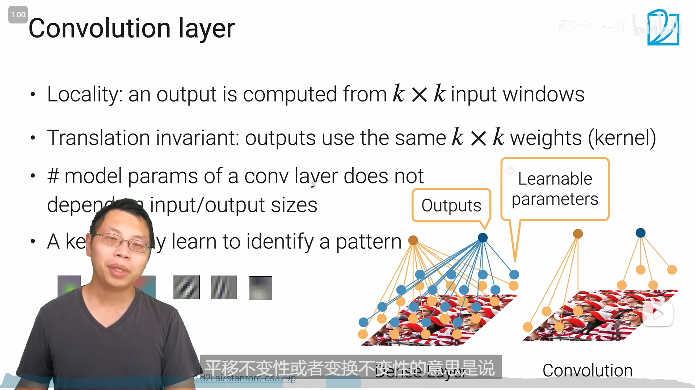{ loading=lazy }

所以CNN对于这题中的数据就用不上。

而RNN是适用于处理**有时间序列信息的数据**(我觉得可以直接理解成，数据是一串或多串连续的序列的情况)，如 正常语句的字符串 或者 用于价格预测的历史数据 之类的，就是说 **==适用于 之前的数据有可能会影响到之后的数据 的情况==**

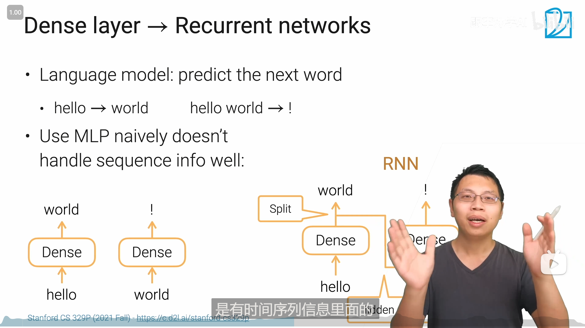{ loading=lazy }

所以觉得RNN适合用于这题的数据处理。

还了解到**RNN有两个优化的产物 GRU 和 LSTM** 。

但这个课程中的这几节课感觉讲的比较多的是一些概念性的东西，没有太多的实现，然后我就注意到这个大佬up主还有一门主要教授各种神经网络的实现(主要使用pytorch来实现)的课 [动手学深度学习v2](https://b23.tv/yec4GOm)，然后通过[在他主页上搜索 `rnn` ](https://space.bilibili.com/1567748478/search/video?keyword=rnn)，发现了两节课是讲rnn的，我觉得其中应该会有实现的代码，

-   [54 循环神经网络 RNN【动手学深度学习v2】\_哔哩哔哩\_bilibili](https://b23.tv/Fr7Ws3f)
-   [55 循环神经网络 RNN 的实现【动手学深度学习v2】\_哔哩哔哩\_bilibili](https://b23.tv/w6dXNqj)

但由于这天已经比较累了，所以就打算明天看这两节课来学习怎么实现RNN

## Day 2

### 了解递归神经网络RNN的python实现 (早)

早上起来，接着昨天的进度看。

在看 [54 循环神经网络 RNN](https://b23.tv/Fr7Ws3f) 时，看到介绍RNN的应用的部分，就感觉C题的数据应该确实是可以用RNN来处理的，所以就差不多决定要使用RNN了

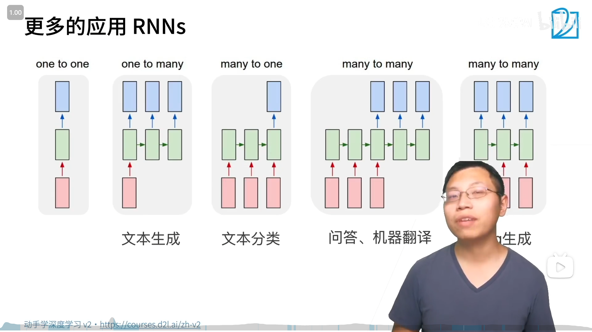{ loadind=lazy }

而在看 [55 循环神经网络 RNN 的实现](https://b23.tv/w6dXNqj) 时，本来是想边看边把视频中的代码敲出来，然后理解代码的每个部分的作用，但是看到[***训练***](https://www.bilibili.com/video/BV1kq4y1H7sw/?t=2038)部分的时候，发现有点复杂，开始不是那么好理解了 有点难懂😅，于是就去看[p2的简洁实现](https://www.bilibili.com/video/BV1kq4y1H7sw?p=2)了。

简洁实现 中的代码就没有那么多那么长了，于是我尝试运行，但发生了报错

```python
AttributeError: module 'd2l.torch' has no attribute 'load_data_time_machine'
```

显示 `d2l` 包中没有 `load_data_time_machine` 这个函数或类

>   `d2l` 包应该是这个课程对应的专门用于教学的包，因为课程的教材网站名就叫 d2l
>
>   >   -   中文版网站 [《动手学深度学习》 — 动手学深度学习 2.0.0 documentation (d2l.ai)](https://zh-v2.d2l.ai/)
>   >   -   英文版网站 [Dive into Deep Learning — Dive into Deep Learning 1.0.3 documentation (d2l.ai)](https://d2l.ai/)

最后猜测可能是中文版教材中 `d2l` 包对应的版本比较老了，新版的包可能已经做了修改，于是去查看了[英文版教材中的代码](https://d2l.ai/chapter_recurrent-neural-networks/rnn-concise.html)，复制出来然后尝试运行(我在两处 `predict` 的地方加了 `print` ，否则不会显示出结果)

```python linenums="1"
import torch
from torch import nn
from torch.nn import functional as F
from d2l import torch as d2l

class RNN(d2l.Module):
    """The RNN model implemented with high-level APIs."""
    def __init__(self, num_inputs, num_hiddens):
        super().__init__()
        self.save_hyperparameters()
        self.rnn = nn.RNN(num_inputs, num_hiddens)

    def forward(self, inputs, H=None):
        return self.rnn(inputs, H)
    
class RNNLM(d2l.RNNLMScratch):
    """The RNN-based language model implemented with high-level APIs."""
    def init_params(self):
        self.linear = nn.LazyLinear(self.vocab_size)

    def output_layer(self, hiddens):
        return self.linear(hiddens).swapaxes(0, 1)
    
data = d2l.TimeMachine(batch_size=1024, num_steps=32)
rnn = RNN(num_inputs=len(data.vocab), num_hiddens=32)
model = RNNLM(rnn, vocab_size=len(data.vocab), lr=1)
# model.predict('it has', 20, data.vocab)
print(model.predict('it has', 20, data.vocab))

trainer = d2l.Trainer(max_epochs=100, gradient_clip_val=1, num_gpus=1)
trainer.fit(model, data)

# model.predict('it has', 20, data.vocab, d2l.try_gpu()
print(model.predict('it has', 20, data.vocab, d2l.try_gpu()))
```

运行的结果

```bash
it hasiiidddyiididyiididyi
<Figure size 350x250 with 1 Axes>
<Figure size 350x250 with 1 Axes>
...
it has and the proment the
```

但课程中也有提到GRU和LSTM是一般RNN的改进，两者效果差不多，但GRU似乎比LSTM简单一些(LSTM好像要更复杂一些)，所以决定最后要使用GRU来处理题目所给的数据

### 尝试实现GRU (午)

我直接打开了英文教材中的GRU部分 [10.2. Gated Recurrent Units (GRU)](https://d2l.ai/chapter_recurrent-modern/gru.html) ，将代码复制出来

=== "从零实现"

    ```python linenums="1"
    import torch
    from torch import nn
    from d2l import torch as d2l
    
    class GRUScratch(d2l.Module):
        def __init__(self, num_inputs, num_hiddens, sigma=0.01):
            super().__init__()
            self.save_hyperparameters()
    
            init_weight = lambda *shape: nn.Parameter(torch.randn(*shape) * sigma)
            triple = lambda: (init_weight(num_inputs, num_hiddens),
                              init_weight(num_hiddens, num_hiddens),
                              nn.Parameter(torch.zeros(num_hiddens)))
            self.W_xz, self.W_hz, self.b_z = triple()  # Update gate
            self.W_xr, self.W_hr, self.b_r = triple()  # Reset gate
            self.W_xh, self.W_hh, self.b_h = triple()  # Candidate hidden state
    
    @d2l.add_to_class(GRUScratch)
    def forward(self, inputs, H=None):
        if H is None:
            # Initial state with shape: (batch_size, num_hiddens)
            H = torch.zeros((inputs.shape[1], self.num_hiddens),
                          device=inputs.device)
        outputs = []
        for X in inputs:
            Z = torch.sigmoid(torch.matmul(X, self.W_xz) +
                            torch.matmul(H, self.W_hz) + self.b_z)
            R = torch.sigmoid(torch.matmul(X, self.W_xr) +
                            torch.matmul(H, self.W_hr) + self.b_r)
            H_tilde = torch.tanh(torch.matmul(X, self.W_xh) +
                               torch.matmul(R * H, self.W_hh) + self.b_h)
            H = Z * H + (1 - Z) * H_tilde
            outputs.append(H)
        return outputs, H
    
    data = d2l.TimeMachine(batch_size=1024, num_steps=32)
    gru = GRUScratch(num_inputs=len(data.vocab), num_hiddens=32)
    model = d2l.RNNLMScratch(gru, vocab_size=len(data.vocab), lr=4)
    trainer = d2l.Trainer(max_epochs=50, gradient_clip_val=1, num_gpus=1)
    trainer.fit(model, data)
    
    print(model.predict('it has', 20, data.vocab, d2l.try_gpu()))
    ```

=== "简洁实现"

    ```python linenums="1"
    import torch
    from torch import nn
    from d2l import torch as d2l
    
    class GRU(d2l.RNN):
        def __init__(self, num_inputs, num_hiddens):
            d2l.Module.__init__(self)
            self.save_hyperparameters()
            self.rnn = nn.GRU(num_inputs, num_hiddens)
    
    data = d2l.TimeMachine(batch_size=1024, num_steps=32)
    gru = GRU(num_inputs=len(data.vocab), num_hiddens=32)
    model = d2l.RNNLM(gru, vocab_size=len(data.vocab), lr=4)
    trainer = d2l.Trainer(max_epochs=50, gradient_clip_val=1, num_gpus=1)
    trainer.fit(model, data)
    
    print(model.predict('it has', 20, data.vocab, d2l.try_gpu()))
    ```

尝试运行并运行成功。

由于课程是使用的GRU来进行文本的预测，所以数据的格式肯定和题目所给的表格类型不太一样，于是我想看看能不能修改数据的格式并且还用教材上的代码来进行预测，

于是尝试询问copilot

???+ example "chatlog"

    **RonaldLN**: 
    
    如果我不想训练文本以及预测文本，我想通过RNN训练类似于矩阵或者向量的数据，来获得数学的模型，应该如何修改这个文件中的代码？
    
    &nbsp;
    
    **GitHub Copilot**: 
    
    如果你想使用 RNN 来训练矩阵或向量数据，你需要做的主要是修改数据加载和预处理的部分。具体来说，你需要将 `d2l.TimeMachine` 替换为你自己的数据加载函数，这个函数需要返回一个可以迭代的数据集，每个元素都是一个形状为 `(batch_size, sequence_length, num_features)` 的张量，其中 `num_features` 是你的特征数量。
    
    此外，你可能还需要修改模型的输入和输出大小以匹配你的数据。具体来说，`num_inputs` 应该等于你的特征数量，而 `vocab_size` 应该等于你的目标值的数量。
    
    以下是一个修改后的代码示例：
    
    ```python
    import torch
    from torch import nn
    from d2l import torch as d2l
    
    class GRU(d2l.RNN):
        def __init__(self, num_inputs, num_hiddens):
            d2l.Module.__init__(self)
            self.save_hyperparameters()
            self.rnn = nn.GRU(num_inputs, num_hiddens)
    
    # 加载你的数据
    # data 应该是一个可以迭代的数据集，每个元素都是一个形状为 (batch_size, sequence_length, num_features) 的张量
    data = load_your_data()
    
    num_features = data[0].shape[-1]  # 特征数量
    num_targets = 1  # 目标值的数量，这里假设我们只有一个目标值
    
    gru = GRU(num_inputs=num_features, num_hiddens=32)
    model = d2l.RNNLM(gru, vocab_size=num_targets, lr=4)
    trainer = d2l.Trainer(max_epochs=50, gradient_clip_val=1, num_gpus=1)
    trainer.fit(model, data)
    ```
    
    请注意，这只是一个基本的示例，你可能需要根据你的具体需求来进一步修改这个代码。例如，你可能需要修改模型的架构，或者使用不同的优化器和损失函数。

然后我就觉得，如果要对教材中的代码进行修改来适配这题的数据的使用的话，感觉不是那么方便，所以先放弃了这个想法

### 理解22年C题F奖GRU相关代码

由于在美赛开始的一周前，队友给我分享了一个github仓库

[jishengpeng/2022MCM-C-problem: 2022美赛C题（MCM/ICM）F奖源码数据公开 (github.com)](https://github.com/jishengpeng/2022MCM-C-problem)

是一支在22年美赛选择C题并最终获得F奖的队伍，仓库内有他们的论文以及处理数据的代码

!!! quote

    <big>**关于美赛用到的模型**</big>
    
    主要用到的模型有小波降噪模型，GRU神经网络为基础的预测模型。然后利用贪心+规划的思想写了一个买卖比特币的策略。

**所以另一个思路就是修改他们的代码，使得能适用于我们的题目所给的数据**

### 确定衡量*势头*的方法

下午4点左右，因为在看着22年f奖的代码时，想到如果要将题目给的比赛时的各种状态的信息以及数据输入进行训练(或者说*监督学习 supervised learning*)，那么就还**需要有确定的实际的*势头*结果**用于训练时的检验，所以我突然有了一个想法，于是开始和队友讨论。

之前队友想的就是用下一分的输赢作为*势头*评判的标准(即把下一分赢的概率作为*势头*)，但我想到***==势头==*==应该不止是对下一分有影响，应该还有可能影响到之后的几分==**，于是就和队友进行了讨论。

我们大致假设势头只体现在之后3分上(或者说再往后的分相关性不是那么大了，所以就忽略掉)，设 $n_1$ $n_2$ $n_3$ 分别为之后第1 2 3分的输赢，赢为1 输为0，再假设势头与这3分结果的关系是这样的(最简单的线性关系，非线性感觉不好考虑)
$$
势头 = a \times n_1 + b \times n_2 + c \times n_3
$$
然后我们打算通过**分析一些比较显然的情况**来确定参数 $a$ $b$ $c$ 具体的大小(我认为直接凭感觉确定可能不一定是那么准确)，

-   首先可以确定的是后三分都赢或者后三分都输的情况，即 $n_1=n_2=n_3=1$ 和 $n_1=n_2=n_3=0$ 

    1.   三分都赢时，我们想定势头为1，即 $n_1=n_2=n_3=1$ 时 $势头=1$ ，那么就能得到
         $$
         a+b+c=1
         $$

    2.   三分都输时，我们认为势头应该为0，这个其实上只能得到*势头*的常数项为0，而我们假设的关系式中其实已经包含了这个条件

-   其次还可以确定的条件是，在后三分中只赢了1分的情况下，那么应该有 **赢第1分的势头 > 赢第2分的势头 > 赢第3分的势头** ，那么就可以得到
    $$
    a > b > c > 0
    $$

-   然后我们再取了一些特定的情况来进行比较，以此来进一步确定3个参数的大小。

    我们对**只赢第1分**和**只输第1分(即赢了第2 3分)**的情况进行分析比较，最后认为 只赢第1分的势头 应该**略大于** 只输第1分的势头，于是得到
    $$
    a > b + c
    $$

于是最后我们将系数确定成 $a=0.55, b=0.25, c=0.2$ ，即
$$
势头 = 0.55 n_1 + 0.25 n_2 + 0.2 n_3
$$
然后我让队友随便挑一场比赛的数据，处理后按照公式算一算，然后队友选了决赛，下面是前100分冠军的势头

{ loading=lazy }

我感觉看起来还蛮ok的，这个波动感觉还算比较真实。

这时已经是晚上，累了一天就没有再做什么了

## Day 3

### 继续理解22年C题F奖GRU相关代码 (早)

继续前一天的进度，

??? info "`GRU模型.py` 完整代码"

    ```python title="GRU模型.py" linenums="1"
    import numpy as np
    import pandas as pd
    import matplotlib.pyplot as plt
    import time
    from sklearn import linear_model
    from d2l import torch as d2l
    import torch
    import torch.nn as nn
    import csv
    path="/home/jishengpeng/美赛的模拟练习"
    BCHAIN_MKPRU=pd.read_csv(path+"/BCHAIN-MKPRU.csv",dtype={"Date":np.str,"Value":np.float64})
    LBMA_GOLD=pd.read_csv(path+"/LBMA-GOLD.csv",dtype={"Date":np.str,"Value":np.float64})
    Data=pd.read_csv(path+"/C题处理后的中间文件2.csv")
    
    def to_timestamp(date):
        return int(time.mktime(time.strptime(date,"%m/%d/%y")))
    
    #将日期变为自然数
    start_timestamp=to_timestamp(Data.iloc[0,0])
    for i in range(Data.shape[0]):
        Data.iloc[i,0]=(to_timestamp(Data.iloc[i,0])-start_timestamp)/86400
    print(Data)
    
    batch_size=1 # 应该只能为1
    start_input=30
    input_size=Data.shape[0]#训练：通过前input_size天预测input_size+1天，预测：通过2到input_size+1天预测第input_size+2天
    hidden_size=20
    # input_size=200
    output_size=1
    layers_size=3
    lr=10
    num_epochs=1000
    
    class GRUModel(nn.Module):
        def __init__(self, input_size, hidden_size, output_size, layers_size):
            super().__init__()
            self.GRU_layer = nn.GRU(input_size, hidden_size, layers_size)
            self.linear = nn.Linear(hidden_size, output_size)
    
        def forward(self, x):
            x, _ = self.GRU_layer(x)
            x = self.linear(x)
            return x
    
    device=torch.device("cuda")
    
    gru=GRUModel(30, hidden_size, output_size, layers_size).to(device)
    
    criterion = nn.L1Loss()
    optimizer = torch.optim.Adam(gru.parameters(), lr)
    
    ji=np.array(Data.iloc[0:input_size,3].dropna())
    input_size=ji.shape[0]-2
    
    trainB_x=torch.from_numpy(ji[input_size-30:input_size].reshape(-1,batch_size,30)).to(torch.float32).to(device)
    trainB_y=torch.from_numpy(ji[input_size].reshape(-1,batch_size,output_size)).to(torch.float32).to(device)
    
    losses = []
    
    for epoch in range(num_epochs):
        output = gru(trainB_x).to(device)
        loss = criterion(output, trainB_y)
        losses.append(loss)
    
        optimizer.zero_grad()
        loss.backward()
        optimizer.step()
        print("loss" + str(epoch) + ":", loss.item())
    
    # 预测，以比特币为例
    # pred_x_train=torch.from_numpy(np.array(Data.iloc[1:input_size+1,1]).reshape(-1,1,input_size)).to(torch.float32).to(device)
    pred_x_train=torch.from_numpy(ji[input_size-29:input_size+1]).reshape(-1,1,30).to(torch.float32).to(device)
    pred_y_train=gru(pred_x_train).to(device)
    print("prediction:",pred_y_train.item())
    print("actual:",ji[input_size+1])
    
    # 预测代码
    losses = []
    predictions = []
    actuals = []
    for i in range(start_input, input_size + 1):
        print("进行到input_size=", i)
        # gru=GRUModel(i, hidden_size, output_size, layers_size).to(device)
        gru = GRUModel(30, hidden_size, output_size, layers_size).to(device)
        criterion = nn.L1Loss()
        optimizer = torch.optim.Adam(gru.parameters(), lr)
    
        # 数据，以比特币为例
        trainB_x = torch.from_numpy(ji[i - 30:i].reshape(-1, batch_size, 30)).to(torch.float32).to(device)
        trainB_y = torch.from_numpy(ji[i].reshape(-1, batch_size, output_size)).to(torch.float32).to(device)
    
        loss = None
    
        for epoch in range(num_epochs):
            output = gru(trainB_x).to(device)
            loss = criterion(output, trainB_y)
    
            optimizer.zero_grad()
            loss.backward()
            optimizer.step()
            # print("loss"+str(epoch)+":", loss.item())
        losses.append(loss.item())
    
        # 预测，以比特币为例
        pred_x_train = torch.from_numpy(ji[i - 29:i + 1].reshape(-1, 1, 30)).to(torch.float32).to(device)
        pred_y_train = gru(pred_x_train).to(device)
        # print("prediction:",pred_y_train.item())
        # print("actual:",Data.iloc[i+1,1])
        predictions.append(pred_y_train.item())
        actuals.append(ji[i + 1])
    plt.plot(losses)
    
    plt.plot(predictions)
    plt.plot(actuals)
    
    print(np.array(predictions).shape[0])
    print(np.array(actuals).shape[0])
    print(input_size-29)
    
    f=open(path+'/周期lstm黄金预测1000版本.csv','w',encoding='utf-8',newline="")
    csv_writer=csv.writer(f)
    csv_writer.writerow(["实际价格","预测价格"])
    for i in range(0,input_size-29):
        tmp=[]
        tmp.append(actuals[i])
        tmp.append(round(predictions[i],2))
        csv_writer.writerow(tmp)
    f.close()
    ```

经过一段时间的查阅及分析，大致理解了代码各个部分的作用，

```python linenums="10"
path="/home/jishengpeng/美赛的模拟练习"
BCHAIN_MKPRU=pd.read_csv(path+"/BCHAIN-MKPRU.csv",dtype={"Date":np.str,"Value":np.float64})
LBMA_GOLD=pd.read_csv(path+"/LBMA-GOLD.csv",dtype={"Date":np.str,"Value":np.float64})
Data=pd.read_csv(path+"/C题处理后的中间文件2.csv")

def to_timestamp(date):
    return int(time.mktime(time.strptime(date,"%m/%d/%y")))

#将日期变为自然数
start_timestamp=to_timestamp(Data.iloc[0,0])
for i in range(Data.shape[0]):
    Data.iloc[i,0]=(to_timestamp(Data.iloc[i,0])-start_timestamp)/86400
print(Data)
```

这部分代码是在对数据进行加载和预处理，

```python linenums="24"
batch_size=1 # 应该只能为1
start_input=30
input_size=Data.shape[0]#训练：通过前input_size天预测input_size+1天，预测：通过2到input_size+1天预测第input_size+2天
hidden_size=20
# input_size=200
output_size=1
layers_size=3
lr=10
num_epochs=1000
```

这里是在设置模型的一些参数，其中我认为最后需要改动的只有 `input_size` 输入数据的维数 和 `num_epochs` 训练批次。

由于之前在测试运行原本的代码时，训练时间比较久，所以为了方便测试我就将 `num_epochs` 改成了 `1` 。

```python linenums="34"
class GRUModel(nn.Module):
    def __init__(self, input_size, hidden_size, output_size, layers_size):
        super().__init__()
        self.GRU_layer = nn.GRU(input_size, hidden_size, layers_size)
        self.linear = nn.Linear(hidden_size, output_size)

    def forward(self, x):
        x, _ = self.GRU_layer(x)
        x = self.linear(x)
        return x

device=torch.device("cuda")

gru=GRUModel(30, hidden_size, output_size, layers_size).to(device)

criterion = nn.L1Loss()
optimizer = torch.optim.Adam(gru.parameters(), lr)
```

这一块代码是在设置GRU模型的函数，但似乎用的只是线性的函数( `nn.Linear` 这一行)，并没有添加非线性的激活函数。

```python linenums="52"
ji=np.array(Data.iloc[0:input_size,3].dropna())
input_size=ji.shape[0]-2

trainB_x=torch.from_numpy(ji[input_size-30:input_size].reshape(-1,batch_size,30)).to(torch.float32).to(device)
trainB_y=torch.from_numpy(ji[input_size].reshape(-1,batch_size,output_size)).to(torch.float32).to(device)

losses = []

for epoch in range(num_epochs):
    output = gru(trainB_x).to(device)
    loss = criterion(output, trainB_y)
    losses.append(loss)

    optimizer.zero_grad()
    loss.backward()
    optimizer.step()
    print("loss" + str(epoch) + ":", loss.item())

# 预测，以比特币为例
# pred_x_train=torch.from_numpy(np.array(Data.iloc[1:input_size+1,1]).reshape(-1,1,input_size)).to(torch.float32).to(device)
pred_x_train=torch.from_numpy(ji[input_size-29:input_size+1]).reshape(-1,1,30).to(torch.float32).to(device)
pred_y_train=gru(pred_x_train).to(device)
print("prediction:",pred_y_train.item())
print("actual:",ji[input_size+1])
```

这一段代码似乎是进行的一次训练和预测的测试(因为在之后的代码中，与这段代码结构非常相似的代码被放在了 `for` 循环中)。

由于一开始没有看懂代码😅，所以把头5行代码拿来询问copilot

???+ example "chatlog"

    **RonaldLN**:
    
    `@workspace` `/explain` Write an explanation for the active selection as paragraphs of text.
    
    ```python
    ji=np.array(Data.iloc[0:input_size,3].dropna())
    input_size=ji.shape[0]-2
    
    trainB_x=torch.from_numpy(ji[input_size-30:input_size].reshape(-1,batch_size,30)).to(torch.float32).to(device)
    trainB_y=torch.from_numpy(ji[input_size].reshape(-1,batch_size,output_size)).to(torch.float32).to(device)
    ```
    
    &nbsp;
    
    **GitHub Copilot**: 
    
    The selected code is part of a larger Python script that uses the PyTorch library to train a Gated Recurrent Unit (GRU) model for time series prediction. The GRU model is a type of recurrent neural network (RNN) that is often used for sequence prediction problems.
    
    The first line of the selected code creates a numpy array `ji` from the third column of the DataFrame `Data`, starting from the first row up to `input_size` rows. The `dropna()` function is used to remove any missing values from the data.
    
    ```python
    ji=np.array(Data.iloc[0:input_size,3].dropna())
    ```
    
    The `input_size` is then updated to be two less than the number of elements in `ji`. This is likely done to account for the fact that the GRU model will be trained using a sliding window of 30 days, and the last two days of data will be used for prediction rather than training.
    
    ```python
    input_size=ji.shape[0]-2
    ```
    
    The next two lines of code create PyTorch tensors `trainB_x` and `trainB_y` from the numpy array `ji`. `trainB_x` is a 3D tensor that contains 30-day windows of data from `ji`, and `trainB_y` is a 1D tensor that contains the corresponding target values for each 30-day window. The `-1` in the `reshape()` function allows numpy to automatically calculate the size of that dimension based on the size of the input data and the other dimensions.
    
    ```python
    trainB_x=torch.from_numpy(ji[input_size-30:input_size].reshape(-1,batch_size,30)).to(torch.float32).to(device)
    trainB_y=torch.from_numpy(ji[input_size].reshape(-1,batch_size,output_size)).to(torch.float32).to(device)
    ```
    
    The `to(torch.float32)` function is used to convert the data to 32-bit floating point numbers, which are the standard data type for neural network weights and biases in PyTorch. The `to(device)` function is used to move the tensors to the GPU if one is available. This allows the model to be trained much faster than if it were trained on the CPU.
    
    ??? quote "Using 1 Reference"
    
        -   GRU模型.py
        
    ---
    
    ChatGPT的翻译：
    
    所选代码是一个较大的Python脚本的一部分，使用PyTorch库训练门控循环单元（GRU）模型进行时间序列预测。GRU模型是一种经常用于序列预测问题的循环神经网络（RNN）类型。
    
    所选代码的第一行从DataFrame `Data` 的第三列创建一个numpy数组 `ji` ，从第一行开始到 `input_size` 行。 `dropna()` 函数用于从数据中删除任何缺失值。
    
    ```python
    ji = np.array(Data.iloc[0:input_size, 3].dropna())
    ```
    
    然后，将 `input_size` 更新为 `ji` 元素数量减2。这可能是为了考虑到GRU模型将使用一个30天的滑动窗口进行训练，而最后两天的数据将用于预测而不是训练。
    
    ```python
    input_size = ji.shape[0] - 2
    ```
    
    接下来的两行代码从numpy数组 `ji` 创建PyTorch张量 `trainB_x` 和 `trainB_y` 。 `trainB_x` 是一个3D张量，包含来自 `ji` 的30天窗口的数据，而 `trainB_y` 是一个包含每个30天窗口对应目标值的1D张量。 `reshape()` 函数中的 `-1` 允许numpy根据输入数据和其他维度的大小自动计算该维度的大小。
    
    ```python
    trainB_x = torch.from_numpy(ji[input_size-30:input_size].reshape(-1, batch_size, 30)).to(torch.float32).to(device)
    trainB_y = torch.from_numpy(ji[input_size].reshape(-1, batch_size, output_size)).to(torch.float32).to(device)
    ```
    
    `to(torch.float32)` 函数用于将数据转换为32位浮点数，这是PyTorch中神经网络权重和偏差的标准数据类型。 `to(device)` 函数用于将张量移动到GPU（如果可用）。这使得模型的训练速度比在CPU上训练要快得多。

于是大概理解了代码的含义，先是从csv文件中取出 `黄金价值` 这一列的数据，

>   ```css title="C题处理后的中间文件2.csv" linenums="1"
>   日期(月/日/年),比特币价值,是否可以买卖黄金,黄金价值
>   9/11/16,621.65,1
>   9/12/16,609.67,0,1324.6
>   9/13/16,610.92,0,1323.65
>   ...
>   ```

然后取**倒数第32到倒数第3的30个数据**和**倒数第2个数据**作为训练的输入和输出，

>   他们好像是需要**==使用前30天的价格来预测下一天的价格==**，因此如果要预测哪一天，就需要取那一天往前数30天的数据作为输入

最后再取**倒数第31到倒数第2的30个数据**输入模型来对最后一天的价格进行预测，最后再和实际的价格一起显示进行比较。

而从 `# 预测代码` 开始的剩下的代码，就是依次从第31天到最后1天，每天取其前30天作为输入序列进行预测。

### 尝试对 `GRU模型.py` 的代码进行修改以输入多维数据 (午)

理解了 `GRU模型.py` 中的代码之后，我开始尝试在chatgpt的帮助下，修改他们的代码来实现多维数据的输入，

但大概尝试了一下感觉不是很好改，于是最后还是放弃了。

??? example "chatlog"

    **User**:
    
    ??? note "`my_test.py`"
        
        ```python linenums="1"
        import numpy as np
        import pandas as pd
        import matplotlib.pyplot as plt
        import time
        from sklearn import linear_model
        from d2l import torch as d2l
        import torch
        import torch.nn as nn
        import csv
        path="."
        BCHAIN_MKPRU=pd.read_csv(path+"/BCHAIN-MKPRU.csv",dtype={"Date":np.str,"Value":np.float64})
        LBMA_GOLD=pd.read_csv(path+"/LBMA-GOLD.csv",dtype={"Date":np.str,"Value":np.float64})
        Data=pd.read_csv(path+"/C题处理后的中间文件2.csv")
    
        def to_timestamp(date):
            return int(time.mktime(time.strptime(date,"%m/%d/%y")))
    
        #将日期变为自然数
        start_timestamp=to_timestamp(Data.iloc[0,0])
        for i in range(Data.shape[0]):
            Data.iloc[i,0]=(to_timestamp(Data.iloc[i,0])-start_timestamp)/86400
        print(Data)
    
        batch_size=1 # 应该只能为1
        start_input=30
        input_size=Data.shape[0]#训练：通过前input_size天预测input_size+1天，预测：通过2到input_size+1天预测第input_size+2天
        hidden_size=20
        # input_size=200
        output_size=1
        layers_size=3
        lr=10
        num_epochs=1
    
        # exit(0)
    
        class GRUModel(nn.Module):
            def __init__(self, input_size, hidden_size, output_size, layers_size):
                """
                Initializes a GRUModel instance.
    
                Args:
                    input_size (int): The number of expected features in the input x
                    hidden_size (int): The number of features in the hidden state h
                    output_size (int): The number of output features
                    layers_size (int): Number of recurrent layers
    
                """
                super().__init__()
                self.GRU_layer = nn.GRU(input_size, hidden_size, layers_size)
                self.linear = nn.Linear(hidden_size, output_size)
    
            def forward(self, x):
                """
                Forward pass of the GRUModel.
    
                Args:
                    x (Tensor): Input tensor of shape (seq_len, batch, input_size)
    
                Returns:
                    Tensor: Output tensor of shape (seq_len, batch, output_size)
    
                """
                x, _ = self.GRU_layer(x)
                x = self.linear(x)
                return x
    
        device=torch.device("cuda")
    
        gru=GRUModel(30, hidden_size, output_size, layers_size).to(device)
    
        criterion = nn.L1Loss()
        optimizer = torch.optim.Adam(gru.parameters(), lr)
    
        ji=np.array(Data.iloc[0:input_size,3].dropna())
        input_size=ji.shape[0]-2
    
        trainB_x=torch.from_numpy(ji[input_size-30:input_size].reshape(-1,batch_size,30)).to(torch.float32).to(device)
        trainB_y=torch.from_numpy(ji[input_size].reshape(-1,batch_size,output_size)).to(torch.float32).to(device)
    
        losses = []
    
        for epoch in range(num_epochs):
            output = gru(trainB_x).to(device)
            loss = criterion(output, trainB_y)
            losses.append(loss)
    
            optimizer.zero_grad()
            loss.backward()
            optimizer.step()
            print("loss" + str(epoch) + ":", loss.item())
    
        # 预测，以比特币为例
        # pred_x_train=torch.from_numpy(np.array(Data.iloc[1:input_size+1,1]).reshape(-1,1,input_size)).to(torch.float32).to(device)
        pred_x_train=torch.from_numpy(ji[input_size-29:input_size+1]).reshape(-1,1,30).to(torch.float32).to(device)
        pred_y_train=gru(pred_x_train).to(device)
        print("prediction:",pred_y_train.item())
        print("actual:",ji[input_size+1])
        ```
    
    这个python脚本中，读取的要输入的数据似乎都是单独的数字，如果我想给GRU输入的是一个n维的向量，我应该如何去修改代码？
    
    &nbsp;
    
    **ChatGPT**:
    
    若要修改代码以处理n维向量而不是单个数字，需要对输入数据的处理进行相应的调整。以下是一些可能的修改：
    
    1.   **修改数据预处理：**
         -   确保`Data`中的每个输入样本是一个n维向量，而不仅仅是一个单独的数字。你可能需要调整`Data`的结构，以包含一个n维向量的列，而不是单独的数字。
    
    2.   **修改GRU模型的输入和初始化：**
         -   修改`GRUModel`类的`__init__`方法，使其能够处理n维向量而不仅仅是单个数字。这涉及到修改`input_size`和`nn.GRU`的初始化参数。
         -   如果输入是n维向量，将`input_size`修改为n。例如，如果向量长度是10，那么将`GRUModel`的初始化修改为：`gru = GRUModel(10, hidden_size, output_size, layers_size).to(device)`
    
    3.   **修改数据加载和处理的部分：**
         -   确保`trainB_x`和`trainB_y`包含n维向量的信息。这可能涉及到对`ji`的处理方式的修改。
    
    以下是可能的修改代码片段：
    
    ```python
    # 假设每个输入样本是一个长度为n的向量
    n = 10  # 请根据你的实际需求设置向量的维度
    
    # ...
    
    class GRUModel(nn.Module):
        def __init__(self, input_size, hidden_size, output_size, layers_size):
            super().__init__()
            self.GRU_layer = nn.GRU(input_size, hidden_size, layers_size)
            self.linear = nn.Linear(hidden_size, output_size)
    
        def forward(self, x):
            x, _ = self.GRU_layer(x)
            x = self.linear(x)
            return x
    
    # ...
    
    # 数据处理部分
    ji = np.array(Data.iloc[0:input_size, 3:n+3].dropna())  # 修改为包含n维向量的处理方式
    input_size = ji.shape[0] - 2
    
    trainB_x = torch.from_numpy(ji[input_size-30:input_size].reshape(-1, batch_size, 30, n)).to(torch.float32).to(device)
    trainB_y = torch.from_numpy(ji[input_size].reshape(-1, batch_size, output_size)).to(torch.float32).to(device)
    
    # ...
    
    # 预测部分
    pred_x_train = torch.from_numpy(ji[input_size-29:input_size+1].reshape(-1, 1, 30, n)).to(torch.float32).to(device)
    ```
    
    这里的关键点是确保`ji`和`Data`中包含n维向量的信息，并且相应地调整模型的输入大小和初始化。
    
    &nbsp;
    
    ......
    
    **User**:
    
    我假设了这样一个公式，
    
    $$
    M(x, y, z) = ...
    $$
    
    并且有一个关于 x, y, z 的三维向量的一个序列，我想通过 GRU 模型来预测 M 的值，我应该如何写代码？
    
    &nbsp;
    
    **ChatGPT**:
    
    若想通过GRU模型来预测$M$的值，你需要进行如下修改：
    
    1.   **修改数据预处理：**
         -   确保`Data`中的每个输入样本是一个关于$x, y, z$的三维向量序列，而不仅仅是单个数字。你可能需要调整`Data`的结构，以包含一个序列的列，其中每个元素是一个三维向量。
    
    2.   **修改GRU模型的输入和初始化：**
         -   修改`GRUModel`类的`__init__`方法，使其能够处理整个序列而不仅仅是单个数字。这涉及到修改`input_size`和`nn.GRU`的初始化参数。
         -   如果每个元素是一个三维向量，将`input_size`修改为向量的维度。例如，如果向量维度是3，那么将`GRUModel`的初始化修改为：`gru = GRUModel(3, hidden_size, output_size, layers_size).to(device)`
    
    3.   **修改数据加载和处理的部分：**
         -   确保`trainB_x`和`trainB_y`包含整个序列的信息。这可能涉及到对`ji`的处理方式的修改。
    
    以下是可能的修改代码片段：
    
    ```python
    # 假设每个元素是一个长度为3的三维向量
    n = 3  # 请根据你的实际需求设置向量的维度
    
    # ...
    
    class GRUModel(nn.Module):
        def __init__(self, input_size, hidden_size, output_size, layers_size):
            super().__init__()
            self.GRU_layer = nn.GRU(input_size, hidden_size, layers_size)
            self.linear = nn.Linear(hidden_size, output_size)
    
        def forward(self, x):
            x, _ = self.GRU_layer(x)
            x = self.linear(x)
            return x
    
    # ...
    
    # 数据处理部分
    ji = np.array(Data.iloc[0:input_size, 3:n+3].dropna())  # 修改为包含n维向量的处理方式
    input_size = ji.shape[0] - 2
    
    # 构造训练数据
    trainB_x = torch.from_numpy(ji[input_size-30:input_size+1].reshape(-1, batch_size, 30, n)).to(torch.float32).to(device)
    trainB_y = torch.from_numpy(ji[input_size+1].reshape(-1, batch_size, output_size)).to(torch.float32).to(device)
    
    # ...
    
    # 预测部分
    pred_x_train = torch.from_numpy(ji[input_size-29:input_size+1].reshape(-1, 1, 30, n)).to(torch.float32).to(device)
    ```
    
    在这里，确保`ji`和`Data`中包含整个序列的信息，并且相应地调整模型的输入大小和初始化。然后，你可以使用GRU模型来训练和预测$M$的值。
    
    &nbsp;
    
    **User**:
    
    ```python
        trainB_x=torch.from_numpy(ji[input_size-30:input_size].reshape(-1,batch_size,30, 4)).to(torch.float32).to(device)
    TypeError: can't convert np.ndarray of type numpy.object_. The only supported types are: float64, float32, float16, complex64, complex128, int64, int32, int16, int8, uint8, and bool.
    ```
    
    ---
    
    这是为什么，我应该怎么修改？
    
    &nbsp;
    
    **ChatGPT**:
    
    该错误通常表示在转换`np.ndarray`为PyTorch tensor时，`np.ndarray`中包含了不支持的数据类型。在这种情况下，可能是由于`ji`数组中的某些元素具有不同的数据类型。
    
    确保`ji` 中所有元素都具有相同的数据类型，最好使用 `astype` 将其转换为一致的类型。在你的情况下，尝试将 `ji` 转换为 `float32` 数据类型，以确保它包含支持的类型之一。
    
    ```python
    ji = np.array(Data.iloc[0:input_size, 3:n+3].dropna(), dtype=np.float32)
    ```
    
    然后，你可以使用这个更新后的 `ji` 构造 `trainB_x`：
    
    ```python
    trainB_x = torch.from_numpy(ji[input_size-30:input_size].reshape(-1, batch_size, 30, n)).to(torch.float32).to(device)
    ```
    
    这样应该能够解决上述错误。确保数据类型一致性，以便成功转换为 PyTorch tensor。
    
    &nbsp;
    
    **User**:
    
    ```python
    ji: [1324.6  1323.65 1321.75 ... 1786.   1788.25 1794.6 ]
    ji: [[1.000000e+00 6.096700e+02 0.000000e+00 1.324600e+03]
     [2.000000e+00 6.109200e+02 0.000000e+00 1.323650e+03]
     [3.000000e+00 6.088200e+02 0.000000e+00 1.321750e+03]
     ...
     [1.249000e+03 1.027538e+04 0.000000e+00 1.563700e+03]
     [1.250000e+03 1.035430e+04 0.000000e+00 1.575050e+03]
     [1.251000e+03 1.024243e+04 0.000000e+00 1.581400e+03]]
    Traceback (most recent call last):
      ..."E:\Programs\Anaconda3\envs\genrec\lib\site-packages\torch\nn\modules\rnn.py", line 206, in check_input
        raise RuntimeError(
    RuntimeError: input must have 3 dimensions, got 5
    ```
    
    ---
    
    为什么会出现5维？
    
    &nbsp;
    
    **ChatGPT**:
    
    问题出在对 `GRU` 模型的输入数据格式上。在这里，`trainB_x` 的形状被设置为 `(batch_size, sequence_length, input_size) = (1, 30, 4)`，然后通过 `torch.from_numpy(ji[input_size-30:input_size].reshape(-1, batch_size, 30, n))` 这行代码，维度被转换为 `(batch_size, 1, sequence_length, input_size, n) = (1, 1, 30, 4, 3)`。
    
    这可能是由于在数据处理中的某一步造成的，因此需要修改数据处理的方式，确保数据形状传递给模型是正确的。
    
    在处理时，你只需要确保`trainB_x`的形状是 `(sequence_length, batch_size, input_size)` 就可以了。如果`ji` 中的每个元素都是一个长度为 `n` 的向量，而你想要使用 `30` 个这样的向量作为输入，你可以这样处理：
    
    ```python
    # 构造训练数据
    trainB_x = torch.from_numpy(ji[input_size-30:input_size].reshape(30, batch_size, n)).to(torch.float32).to(device)
    trainB_y = torch.from_numpy(ji[input_size+1].reshape(-1, batch_size, output_size)).to(torch.float32).to(device)
    ```
    
    这应该能够解决维度问题。请确保输入的形状是 `(sequence_length, batch_size, input_size)`。
    
    ......

### 开始尝试使用TensorFlow来实现GRU

新建了一个与chatgpt的对话，询问如果输入是个多维向量的序列，应该如何编写代码，而这时chatgpt让我使用TensorFlow来实现，然后看了一下它给的代码，感觉比用pytorch实现GRU要简单许多，于是产生了尝试使用tensorflow实现的想法。

???+ example "chatlog"

    **User**:
    
    我假设了这样一个公式，
    
    $$
    M(x, y, z) = ...
    $$
    
    并且有一个关于 x, y, z 的三维向量的一个序列，我想通过 GRU 来对这个序列进行监督学习，来获得pt权重文件，我应该如何编写代码？
    
    &nbsp;
    
    **ChatGPT**:
    
    你的问题涉及到使用 GRU（Gated Recurrent Unit）进行监督学习，以获得权重文件，但在你的问题中，缺少一些细节，比如目标是什么，损失函数是什么等。我将提供一个简单的示例代码，假设你要解决的是一个回归问题，即给定输入序列，预测一个连续值。
    
    在这个示例中，我将使用 Python 和深度学习框架 TensorFlow 来实现。首先，确保你已经安装了 TensorFlow：
    
    ```bash
    pip install tensorflow
    ```
    
    然后，你可以使用以下代码作为起点：
    
    ```python
    import tensorflow as tf
    from tensorflow.keras.models import Sequential
    from tensorflow.keras.layers import GRU, Dense
    import numpy as np
    
    # 生成虚拟数据
    def generate_data():
        # 生成输入序列和对应的目标值
        seq_length = 10
        num_samples = 1000
        x = np.random.rand(num_samples, seq_length, 3)  # 3维向量的输入序列
        y = np.sum(x, axis=2)  # 目标值是输入序列各元素之和
    
        return x, y
    
    # 构建模型
    def build_model():
        model = Sequential()
        model.add(GRU(50, input_shape=(None, 3)))  # 使用50个GRU单元
        model.add(Dense(1))  # 输出层，用于回归问题
    
        return model
    
    # 编译模型
    model = build_model()
    model.compile(optimizer='adam', loss='mean_squared_error')
    
    # 生成数据
    x_train, y_train = generate_data()
    
    # 训练模型
    model.fit(x_train, y_train, epochs=10, batch_size=32)
    
    # 保存权重文件
    model.save_weights('gru_weights.h5')
    ```
    
    在这个例子中，`generate_data` 函数生成了一个包含 1000 个样本的数据集，每个样本包含一个长度为 10 的序列，其中每个元素是一个 3 维向量。模型使用了一个包含 50 个单元的 GRU 层，最后输出一个单一值。我们使用均方误差作为损失函数，并用 Adam 优化器进行训练。
    
    最后，通过 `model.save_weights` 方法保存模型的权重到名为 `gru_weights.h5` 的文件中。你可以根据你的问题和数据集来修改模型结构、损失函数等。

然后尝试运行了一下chatgpt给我的代码，发现能运行，于是打算在这个代码的基础上进行修改尝试

### debug并最终成功实现数据的训练和预测

>   此时大约下午4:30

一开始是想看看能不能使用gpu来进行训练，于是询问继续chatgpt

???+ example "chatlog"

    (对话连着前面)
    
    &nbsp;
    
    **User**:
    
    我想使用 cuda 和 cudnn 加速， 我应该如何修改代码？
    
    &nbsp;
    
    **ChatGPT**:
    
    如果你想使用CUDA和cuDNN来加速你的深度学习模型，你需要确保你的TensorFlow版本已经配置好支持GPU，并且你的机器上已经安装了NVIDIA的CUDA和cuDNN库。
    
    首先，确保你的TensorFlow版本支持GPU。你可以通过以下命令来安装TensorFlow GPU版本：
    
    ```bash
    pip install tensorflow-gpu
    ```
    
    然后，确保你的机器上已经正确安装了CUDA和cuDNN。可以参考NVIDIA的官方文档进行安装配置。
    
    修改代码以使用GPU加速时，只需确保TensorFlow能够自动选择GPU设备。这通常是默认行为，但你可以添加以下代码来确保：
    
    ```python
    # 导入 TensorFlow 并检查 GPU 是否可用
    import tensorflow as tf
    print("Num GPUs Available: ", len(tf.config.experimental.list_physical_devices('GPU')))
    
    # 其余的代码保持不变
    # ...
    
    # 编译模型，确保 Tensorflow 使用 GPU 加速
    model.compile(optimizer='adam', loss='mean_squared_error')
    
    # 训练模型，TensorFlow 会自动使用 GPU
    model.fit(x_train, y_train, epochs=10, batch_size=32)
    
    # 保存权重文件
    model.save_weights('gru_weights.h5')
    ```
    
    以上代码会输出可用的GPU数量。如果TensorFlow能够正确识别GPU并使用它，你的模型将在GPU上运行。
    
    确保你的TensorFlow和CUDA/cuDNN版本是兼容的。你可以查看TensorFlow的文档以获取关于兼容性的详细信息。
    
    注意：在使用GPU时，确保你的模型和数据都适合GPU的内存。有时候需要调整批处理大小等超参数，以便适应GPU内存。

于是我尝试运行命令

```bash
pip install tensorflow-gpu
```

但是发生了报错

```bash
...
        File "E:\Programs\Anaconda3\envs\genrec\lib\site-packages\setuptools\_vendor\packaging\requirements.py", line 37, in __init__
          raise InvalidRequirement(str(e)) from e
      setuptools.extern.packaging.requirements.InvalidRequirement: Expected end or semicolon (after name and no valid version specifier)
          python_version>"3.7"
                        ^
      [end of output]

  note: This error originates from a subprocess, and is likely not a problem with pip.
error: metadata-generation-failed

× Encountered error while generating package metadata.
╰─> See above for output.

note: This is an issue with the package mentioned above, not pip.
hint: See above for details.
```

然后搜索相关信息，找到这个issue

[`pip install tensorflow-gpu` gives `setuptools.extern.packaging.requirements.InvalidRequirement` · Issue #60074 · tensorflow/tensorflow (github.com)](https://github.com/tensorflow/tensorflow/issues/60074)

根据 [tilakrayal的回答](https://github.com/tensorflow/tensorflow/issues/60074#issuecomment-1480717509)，在新的版本中，tensorflow已经不区分gpu和非gpu版本了，合并成一个版本

>   From tensorflow v2.12, removed redundant packages **tensorflow-gpu and tf-nightly-gpu**. These packages were removed and replaced with packages that direct users to switch to **tensorflow or tf-nightly respectively**.

于是我就尝试chatgpt回答中的这个代码

```python
print("Num GPUs Available: ", len(tf.config.experimental.list_physical_devices('GPU')))
```

但是显示了 0。

最后我感觉要弄好这个gpu可能比较费时间，并且cpu也足够用，于是就不打算再追究这个。

---

将原本chatgpt给我的代码稍加修改了一下(为了查看输入数据/矩阵的形状，以及进行预测)(由于生成的数据太多，为了方便查看所以将 `num_samples` 设置成了 `10` )，

???+ note "`my_test2.py`"

    ```python linenums="1"
    import tensorflow as tf
    from tensorflow.keras.models import Sequential
    from tensorflow.keras.layers import GRU, Dense
    import numpy as np
    
    # 生成虚拟数据
    def generate_data():
        # 生成输入序列和对应的目标值
        seq_length = 10
        num_samples = 10
        x = np.random.rand(num_samples, seq_length, 3)  # 3维向量的输入序列
        y = np.sum(x, axis=2)  # 目标值是输入序列各元素之和
    
        return x, y
    
    # 构建模型
    def build_model():
        model = Sequential()
        model.add(GRU(50, input_shape=(None, 3)))  # 使用50个GRU单元
        model.add(Dense(1))  # 输出层，用于回归问题
    
        return model
    
    # 编译模型
    model = build_model()
    model.compile(optimizer='adam', loss='mean_squared_error')
    
    # 生成数据
    x_train, y_train = generate_data()
    
    print(x_train)
    print(y_train)
    
    for a, b in zip(x_train[0], y_train[0]):
        print(f"sum {a} = {b}")
    
    # exit(0)
    
    # 训练模型
    model.fit(x_train, y_train, epochs=10, batch_size=32)
    
    # 保存权重文件
    model.save_weights('gru_weights.h5')
    
    # 预测并计算每个序列输出的和
    predictions = model.predict(x_train)
    sum_predictions = np.sum(predictions, axis=1)
    
    # 打印结果
    print("Predictions:")
    print(predictions)
    ```

终端输出出来的 `x_train` `y_train` (31和32行的两个 `print` )是这样的

=== "`x_train`"

    ```python
    [[[0.7944328  0.19991478 0.1717165 ]
      [0.52863161 0.18222096 0.70395594]
      [0.57382239 0.64215397 0.63834019]
      [0.1210313  0.22205257 0.51856381]
      [0.64116937 0.40346543 0.73267251]
      [0.68666603 0.96090184 0.69283727]
      [0.72992198 0.02034594 0.84201691]
      [0.81079883 0.20875773 0.03558987]
      [0.81432445 0.47643867 0.87499175]
      [0.28032208 0.5911067  0.99797703]]
    
     ...
    
     [[0.41748414 0.33052038 0.83109248]
      [0.70159718 0.8524119  0.02944102]
      [0.22653771 0.11587124 0.50194598]
      [0.75814563 0.03297447 0.14874201]
      [0.30183465 0.36516737 0.5084972 ]
      [0.46178636 0.34466552 0.93100872]
      [0.85690693 0.26805801 0.61805625]
      [0.08040773 0.75785972 0.98884817]
      [0.11996411 0.0269658  0.932087  ]
      [0.72871391 0.80410475 0.30108709]]]
    ```

=== "`y_train`"

    ```python
    [[1.16606407 1.4148085  1.85431655 0.86164768 1.77730731 2.34040514
      1.59228483 1.05514643 2.16575486 1.86940581]
     [1.579097   1.5834501  0.84435492 0.93986211 1.17549922 1.73746061
      1.74302119 1.82711561 1.0790169  1.83390576]
     [1.05626799 1.40353675 1.45449643 1.47791795 1.33798364 1.23835848
      1.22593666 0.61404874 1.56806409 2.00279187]
     [1.52692854 1.02003715 1.43574853 2.16162096 1.87126819 2.39616241
      1.58802291 0.59642459 1.03014043 2.33408625]
     [0.6888727  1.89631828 2.22542497 2.02600974 1.80885565 2.04338134
      1.39698629 1.74913134 2.41820951 2.1095142 ]
     [1.45975555 1.66387383 1.31121027 2.17661788 1.53556581 1.65127684
      1.4565594  0.7422163  1.27289512 1.5068791 ]
     [0.54572599 0.89128647 1.99626636 1.02370802 2.11791123 0.68699581
      1.49900562 1.77851229 2.19032219 0.97705314]
     [1.59726203 1.81477729 1.27713759 1.28049124 0.39606842 2.15493916
      1.24729366 0.96491842 1.44108162 1.70740263]
     [2.08867844 0.4113912  1.61522844 1.86740305 2.00394564 2.32879784
      1.17513393 1.68913914 2.71357174 0.92150995]
     [1.46399312 2.29460573 1.33109995 1.54187649 1.93523676 1.60621029
      2.06562629 0.79873924 1.14552017 1.76911693]]
    ```

但是发现输出的 `predictions` 结果格式好像有些不一样，或者说不正确

```python
Predictions:
[[0.7516717 ]
 [0.6875819 ]
 [0.6742991 ]
 [0.68913144]
 [0.8163525 ]
 [0.6028297 ]
 [0.625753  ]
 [0.6262842 ]
 [0.70508885]
 [0.65028405]]
```

**本来应该是输入的每个数据都是一个3维的向量，并对应一个数值的输出，如 `[0.7944328  0.19991478 0.1717165 ]` 对应 `1.16606407` ，所以最后的预测应该是一个 10\*10 的矩阵，而 `predictions` 只是一个 10\*1 的矩阵**，

于是继续询问chatgpt

???+ example "chatlog"

    (对话连着前面)
    
    &nbsp;
    
    **User**:
    
    ??? note "`my_test2.py`"
    
        ```python linenums="1"
        import tensorflow as tf
        from tensorflow.keras.models import Sequential
        from tensorflow.keras.layers import GRU, Dense
        import numpy as np
    
        # 生成虚拟数据
        def generate_data():
            # 生成输入序列和对应的目标值
            seq_length = 10
            num_samples = 1000
            x = np.random.rand(num_samples, seq_length, 3)  # 3维向量的输入序列
            y = np.sum(x, axis=2)  # 目标值是输入序列各元素之和
    
            return x, y
    
        # 构建模型
        def build_model():
            model = Sequential()
            model.add(GRU(50, input_shape=(None, 3)))  # 使用50个GRU单元
            model.add(Dense(1))  # 输出层，用于回归问题
    
            return model
    
        # 编译模型
        model = build_model()
        model.compile(optimizer='adam', loss='mean_squared_error')
    
        # 生成数据
        x_train, y_train = generate_data()
    
        print(x_train)
        print(y_train)
    
        for a, b in zip(x_train[0], y_train[0]):
            print(f"sum {a} = {b}")
    
        # exit(0)
    
        # 训练模型
        model.fit(x_train, y_train, epochs=10, batch_size=32)
    
        # 保存权重文件
        model.save_weights('gru_weights.h5')
        ```
    
    为什么 `model.predict(x_train)` 的结果是
    
    ```python
    [[1.644006 ]
    [1.5395831]
    [1.5784358]
    [1.3815761]
    [1.4156687]
    [1.3671852]
    [1.5763392]
    [1.4610821]
    [1.5581633]
    ...
    ]
    ```
    
    和 `y_train` 不一样？
    
    &nbsp;
    
    **ChatGPT**:
    
    在你的代码中，你生成了输入数据 `x_train` 和对应的目标数据 `y_train`。在 `generate_data` 函数中，你计算了每个序列的元素之和作为目标值。但在你的 `for` 循环中，你使用了 `zip(x_train[0], y_train[0])`，这会输出第一个样本的输入序列和目标值的对应关系。然而，这并不是一个合适的对应关系。
    
    GRU 模型的输入形状是 `(batch_size, time_steps, input_dim)`，在你的情况下是 `(None, 10, 3)`，而输出形状是 `(batch_size, units)`，在你的情况下是 `(None, 50)`。因此，使用 `model.predict(x_train)` 会返回每个输入序列对应的输出值，但这并不是输入序列的元素之和。
    
    如果你想要得到模型预测的和，你可以计算每个序列输出的和。下面是一个修改后的代码示例：
    
    ```python
    # 预测并计算每个序列输出的和
    predictions = model.predict(x_train)
    sum_predictions = np.sum(predictions, axis=1)
    
    # 打印结果
    print("Predictions:")
    print(predictions)
    print("Sum of predictions:")
    print(sum_predictions)
    ```
    
    这样做会打印模型预测的每个序列的输出值，以及每个序列输出值的和。这个和应该接近于输入序列元素之和的值。

从chatgpt的回答中得知了一个 ==重要信息==， **GRU 模型的输入形状是 `(batch_size, time_steps, input_dim)` (即输入矩阵的形状)**，在之前4号学习课程时有了解到 `batch_size` 是每一次训练时 丢进去的数据的个数，再结合 `time_steps` (根据名字的意思猜测)应该指的是**(单个)序列的长度**，(最后的 `input_dim` 是代表输入的单个数据的维度)所以理解了这个之后，再结合题目的数据，我认为应该是 ==一场比赛的数据作为一个单独的序列，而这场比赛中总共打的==*==分==*==就是序列的长度==。

但是chatgpt的回答并没有给我解决输出不正确的方法，于是我去查看 `.fit()` 方法的说明

```python
@keras_export("keras.Model", "keras.models.Model")
class Model(base_layer.Layer, version_utils.ModelVersionSelector):
    ...
    @traceback_utils.filter_traceback
    def fit(
        self,
        x=None,
        y=None,
        batch_size=None,
        epochs=1,
        ...
    ):
        """Trains the model for a fixed number of epochs (dataset iterations).

        Args:
            x: Input data. It could be:
              - A Numpy array (or array-like), or a list of arrays
                (in case the model has multiple inputs).
              - A TensorFlow tensor, or a list of tensors
                (in case the model has multiple inputs).
              - A dict mapping input names to the corresponding array/tensors,
                if the model has named inputs.
              - A `tf.data` dataset. Should return a tuple
                of either `(inputs, targets)` or
                `(inputs, targets, sample_weights)`.
              - A generator or `keras.utils.Sequence` returning `(inputs,
                targets)` or `(inputs, targets, sample_weights)`.
              - A `tf.keras.utils.experimental.DatasetCreator`, which wraps a
                callable that takes a single argument of type
                `tf.distribute.InputContext`, and returns a `tf.data.Dataset`.
                `DatasetCreator` should be used when users prefer to specify the
                per-replica batching and sharding logic for the `Dataset`.
                See `tf.keras.utils.experimental.DatasetCreator` doc for more
                information.
              A more detailed description of unpacking behavior for iterator
              types (Dataset, generator, Sequence) is given below. If these
              include `sample_weights` as a third component, note that sample
              weighting applies to the `weighted_metrics` argument but not the
              `metrics` argument in `compile()`. If using
              `tf.distribute.experimental.ParameterServerStrategy`, only
              `DatasetCreator` type is supported for `x`.
            y: Target data. Like the input data `x`,
              it could be either Numpy array(s) or TensorFlow tensor(s).
              It should be consistent with `x` (you cannot have Numpy inputs and
              tensor targets, or inversely). If `x` is a dataset, generator,
              or `keras.utils.Sequence` instance, `y` should
              not be specified (since targets will be obtained from `x`).
        ...
        """
```

用chatgpt翻译了一些(我认为)关键/有用的部分

!!! tip

    ```markdown
                x: 输入数据。可能是：
                   - 一个 Numpy 数组（或类似数组），或者数组列表
                     （如果模型有多个输入）。
                   - 一个 TensorFlow 张量，或者张量列表
                     （如果模型有多个输入）。
                   - 如果模型有命名输入，还可以是将输入名称映射到相应数组/张量的字典。
                   ...
                y: 目标数据。与输入数据 `x` 类似，
                   它可以是 Numpy 数组或 TensorFlow 张量。
                   它应与 `x` 保持一致（不能有 Numpy 输入和
                   张量目标，反之亦然）。如果 `x` 是数据集、生成器，
                   或 `keras.utils.Sequence` 实例，则不应指定 `y`
                   （因为目标将从 `x` 中获取）。
    ```

由于在函数说明中提到 目标数据 `y` 需要和输入数据 `x` 的形状保持一致，而在之前的代码中没有保持一致( `x_train` 是3维矩阵而 `y_train` 是2维矩阵)，不知道是不是这个地方使得预测时输出的数据形状不正确，

于是我将函数 `generate_data` 稍微修改了一下

```python
def generate_data():
    # 生成输入序列和对应的目标值
    seq_length = 10
    num_samples = 10
    x = np.random.rand(num_samples, seq_length, 3)  # 3维向量的输入序列
    y = np.sum(x, axis=2)  # 目标值是输入序列各元素之和

    # 将y的每个元素转换为自身的列表
    y_as_list = np.array([[[element] for element in row] for row in y])

    return x, y_as_list
```

这样 `y_train` 就变成了

```python
[[[1.55256756]
  [1.54053964]
  [1.03681008]
  [1.85271063]
  [1.42733873]
  [1.31950369]
  [2.30268749]
  [1.30466184]
  [0.82556753]
  [0.85749012]]

 ...
]
```

这就与输入的 `x_train` 对应上了(就变成了一个3维向量对应一个1维向量)。

但是运行进行测试，预测输出的矩阵还是和原来一样😫😵(debug了弄了半天结果还是原样，这时候感觉精神非常萎靡，感觉脑子快成一团浆糊了)，

>   此时大约刚过晚上8点

---

此时已经有些没有动力去debug，因此就想着搜索一些现成的使用tensorflow的代码，

{ loading=lazy }

但搜索了一段时间感觉也不太能找到比较合适的。

>   搜索过程中找到了一个tensorflow官网上的指导
>
>   [`内存数据` = 用 tf.data 加载 CSV 数据  | TensorFlow Core (google.cn)](https://tensorflow.google.cn/tutorials/load_data/csv?hl=zh-cn#内存数据)
>
>   这里有介绍用pandas来读取csv文件中的数据并输入模型中进行训练的一些示例代码(感觉还算比较有用)

!!! info

    之前还有尝试过把输入数据改成2维的矩阵，因为 `.fit()` 函数说明中提到 `x` 可以是numpy数组的列表( `a list of arrays` )，
    
    但是这样改动后发生了这样的报错
    
    ```python
    ...
    Epoch 1/10
    Traceback (most recent call last):
      File "E:\Github\Repo-for-2024MCM\2022MCM-C-problem\代码和中间数据结果\my_test2.py", line 42, in <module>
        model.fit(x_train, y_train, epochs=10, batch_size=32)
      ...
        File "E:\Programs\Anaconda3\envs\genrec\lib\site-packages\keras\src\engine\input_spec.py", line 235, in assert_input_compatibility
            raise ValueError(
    
        ValueError: Exception encountered when calling layer 'sequential' (type Sequential).
    
        Input 0 of layer "gru" is incompatible with the layer: expected ndim=3, found ndim=2. Full shape received: (None, 3)
    
        Call arguments received by layer 'sequential' (type Sequential):
          • inputs=tf.Tensor(shape=(None, 3), dtype=float32)
          • training=True
          • mask=None
    
    进程已结束，退出代码为 1
    ```
    
    于是在google上搜索这样的报错，
    
    [ValueError: Exception encountered when calling layer 'sequential' (type Sequential). Input 0 of layer "gru" is incompatible with the layer: expected ndim=3, found ndim=2. Full shape received: (None, 3) Call arguments received by layer 'sequential' (type Sequential): • inputs=tf.Tensor(shape=(None, 3), dtype=int32) • training=False • mask=None - Google 搜索](https://www.google.com/search?q=ValueError%3A+Exception+encountered+when+calling+layer+%27sequential%27+%28type+Sequential%29.++%0D%0AInput+0+of+layer+%22gru%22+is+incompatible+with+the+layer%3A+expected+ndim%3D3%2C+found+ndim%3D2.+Full+shape+received%3A+%28None%2C+3%29%0D%0A%0D%0ACall+arguments+received+by+layer+%27sequential%27+%28type+Sequential%29%3A%0D%0A++%E2%80%A2+inputs%3Dtf.Tensor%28shape%3D%28None%2C+3%29%2C+dtype%3Dint32%29%0D%0A++%E2%80%A2+training%3DFalse%0D%0A++%E2%80%A2+mask%3DNone&newwindow=1&sca_esv=37f724872de16756&sxsrf=ACQVn0-LuFmna4ijpPFbjNeaYA25l8Od3g%3A1707050979991&source=hp&ei=44e_Zeq8OuihkPIP3tawgA8&iflsig=ANes7DEAAAAAZb-V8wWi2TcRtFaesvqSe8m0GdSVVhzX&ved=0ahUKEwiqupi63JGEAxXoEEQIHV4rDPAQ4dUDCA0&uact=5&oq=ValueError%3A+Exception+encountered+when+calling+layer+%27sequential%27+%28type+Sequential%29.++%0D%0AInput+0+of+layer+%22gru%22+is+incompatible+with+the+layer%3A+expected+ndim%3D3%2C+found+ndim%3D2.+Full+shape+received%3A+%28None%2C+3%29%0D%0A%0D%0ACall+arguments+received+by+layer+%27sequential%27+%28type+Sequential%29%3A%0D%0A++%E2%80%A2+inputs%3Dtf.Tensor%28shape%3D%28None%2C+3%29%2C+dtype%3Dint32%29%0D%0A++%E2%80%A2+training%3DFalse%0D%0A++%E2%80%A2+mask%3DNone&gs_lp=Egdnd3Mtd2l6IucCVmFsdWVFcnJvcjogRXhjZXB0aW9uIGVuY291bnRlcmVkIHdoZW4gY2FsbGluZyBsYXllciAnc2VxdWVudGlhbCcgKHR5cGUgU2VxdWVudGlhbCkuICAKSW5wdXQgMCBvZiBsYXllciAiZ3J1IiBpcyBpbmNvbXBhdGlibGUgd2l0aCB0aGUgbGF5ZXI6IGV4cGVjdGVkIG5kaW09MywgZm91bmQgbmRpbT0yLiBGdWxsIHNoYXBlIHJlY2VpdmVkOiAoTm9uZSwgMykKCkNhbGwgYXJndW1lbnRzIHJlY2VpdmVkIGJ5IGxheWVyICdzZXF1ZW50aWFsJyAodHlwZSBTZXF1ZW50aWFsKToKICDigKIgaW5wdXRzPXRmLlRlbnNvcihzaGFwZT0oTm9uZSwgMyksIGR0eXBlPWludDMyKQogIOKAoiB0cmFpbmluZz1GYWxzZQogIOKAoiBtYXNrPU5vbmVIAFAAWABwAHgAkAEAmAEAoAEAqgEAuAEDyAEA-AEC-AEB&sclient=gws-wiz)
    
    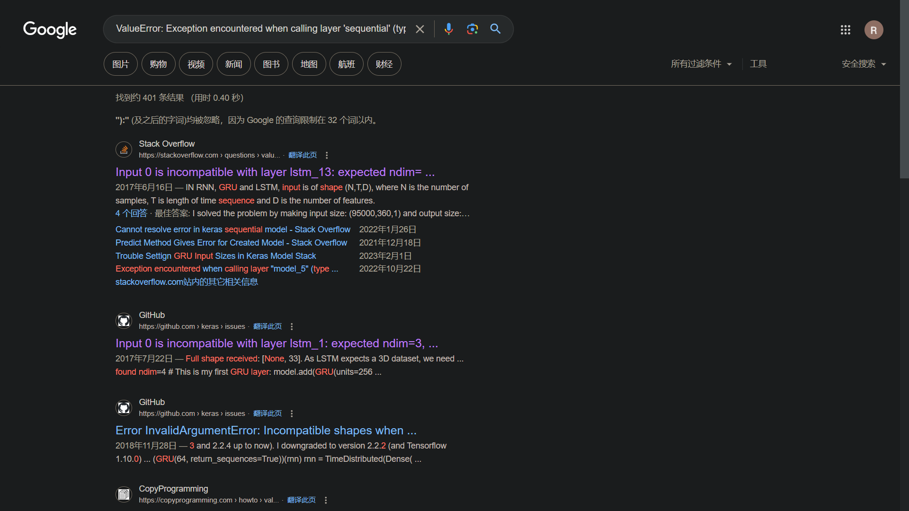{ loading=lazy }

在google上搜索时，发现了在这两个问题的回答中

-   [python - ValueError: Input 0 is incompatible with layer lstm_13: expected ndim=3, found ndim=4 - Stack Overflow](https://stackoverflow.com/questions/44583254/valueerror-input-0-is-incompatible-with-layer-lstm-13-expected-ndim-3-found-n)
-   [Input 0 is incompatible with layer lstm_1: expected ndim=3, found ndim=4 · Issue #7403 · keras-team/keras (github.com)](https://github.com/keras-team/keras/issues/7403)

**都有人提到了将 `.fit()` 的 `return_sequences` 这个参数设置成 `True`**

>   -   [stackoverflow上的回答](https://stackoverflow.com/a/55086664)
>   -   [github上的回答](https://github.com/keras-team/keras/issues/7403#issuecomment-317199855)

虽然不明白含义，但是由于脑子比较累了，于是就不报希望地尝试了一下，

==结果发现居然成功实现了== 😲😲😲

??? note "`my_test2.py`"

    ```python hl_lines="22" linenums="1"
    import tensorflow as tf
    from tensorflow.keras.models import Sequential
    from tensorflow.keras.layers import GRU, Dense
    import numpy as np
    
    # 生成虚拟数据
    def generate_data():
        # 生成输入序列和对应的目标值
        seq_length = 10
        num_samples = 10
        x = np.random.rand(num_samples, seq_length, 3)  # 3维向量的输入序列
        y = np.sum(x, axis=2)  # 目标值是输入序列各元素之和
    
        # 将y的每个元素转换为自身的列表
        y_as_list = np.array([[[element] for element in row] for row in y])
    
        return x, y_as_list
    
    # 构建模型
    def build_model():
        model = Sequential()
        model.add(GRU(50, input_shape=(None, 3), return_sequences=True))  # 使用50个GRU单元
        model.add(Dense(1))  # 输出层，用于回归问题
    
        return model
    
    # 编译模型
    model = build_model()
    model.compile(optimizer='adam', loss='mean_squared_error')
    
    # 生成数据
    x_train, y_train = generate_data()
    
    print(x_train)
    print(y_train)
    
    for a, b in zip(x_train[0], y_train[0]):
        print(f"sum {a} = {b}")
    
    # exit(0)
    
    # 训练模型
    model.fit(x_train, y_train, epochs=10, batch_size=32)
    
    # 保存权重文件
    model.save_weights('gru_weights.h5')
    
    # 预测并计算每个序列输出的和
    predictions = model.predict(x_train)
    sum_predictions = np.sum(predictions, axis=1)
    
    # 打印结果
    print("Predictions:")
    print(predictions)
    ```

终端中显示的预测的输出变成了

```python
Predictions:
[[[0.3234646 ]
  [0.5083787 ]
  [0.5576476 ]
  [0.54944414]
  [0.47944394]
  [0.5049154 ]
  [0.50329256]
  [0.5258315 ]
  [0.69459194]
  [0.7504357 ]]
 ...
]
```

然后我在末尾添加了这样几行代码来**比较预测结果和目标结果**，并将 `epochs` 设置成了 `1000`

```python linenums="56"
for i in range(10):
    print(i, " -------")
    for a, b, c in zip(x_train[i], y_train[i], predictions[i]):
        print(f"act_sum {a} = {b}, pre: {c}")
```

下面是训练后进行预测的(部分)结果

```python
...
9  -------
act_sum [0.17794148 0.2804384  0.91154308] = [1.36992296], pre: [1.3727927]
act_sum [0.9505687  0.57981087 0.11528877] = [1.64566833], pre: [1.6547668]
act_sum [0.10600898 0.16341549 0.22128649] = [0.49071096], pre: [0.49099457]
act_sum [0.32428769 0.09856033 0.46073104] = [0.88357906], pre: [0.8894826]
...
```

>   😲没想到被卡了这么久的地方就这样被解决了😅😭

---

在之后思考了一下 `return_sequences` 分别为 `True` 和 `False` 的区别，

我的理解中，如果为 `True` 应该就是像这题里我们想要处理的数据一样，**==每一个输入的数据都对应一个输出==**，

而如果为 `False` 应该就是像22年C题一样 **比如需要用之前一段序列的数据来获得单个的数据(用前30天的价格来预测下一天的价格)**

### 用决赛数据进行训练和预测

队友之前已经将冠军决赛的数据处理好发给我了，于是我就重新写了一个python文件，

???+ note "`my_test5.py`"

    ```python linenums="1"
    import pandas as pd
    import numpy as np
    
    import tensorflow as tf
    from tensorflow.keras import Sequential
    from tensorflow.keras.layers import GRU, Dense
    
    data = pd.read_csv("CA(test)_2.csv")
    data = np.array([data])
    print(data)
    
    data = data[:, :, 2:].astype(np.float32)
    print(data)
    labels, data, val = data[:, :-15, :1], data[:, :-15, 1:], data[:, :, :]
    Shi, val = val[:, :, :1], val[:, :, 1:]
    print(data)
    print(labels)
    
    def build_model():
        model = Sequential()
        model.add(GRU(50, input_shape=(None, 14), return_sequences=True))  # 使用50个GRU单元
        model.add(Dense(1))  # 输出层，用于回归问题
    
        return model
    
    # 编译模型
    model = build_model()
    model.compile(optimizer='adam', loss="mean_absolute_error")
    
    # 训练模型
    model.fit(data, labels, epochs=1000, batch_size=1)
    
    # 保存权重文件
    model.save_weights('Shi.h5')
    
    pre = model.predict(val)
    for _ in zip(pre[0], Shi[0]):
        print("pre: ", _[0], "act: ", _[1])
    ```

```python linenums="8"
data = pd.read_csv("CA(test)_2.csv")
data = np.array([data])
```

首先，用pandas读取csv中的数据，需要注意的是(如果参数都使用默认设置) `read_csv` 函数读取数据时会将第一行认为是标题而不与其他数据一起存储。

然后，将读取出来的数据 `data` 转换成numpy数组，这里由于csv表格读取出来是类似一个2维的矩阵，又因为只有一个序列，所以在 `data` 外再套一层列表再转换成numpy数组即可。

```python linenums="12"
data = data[:, :, 2:].astype(np.float32)
```

再将头两列 选手名 和 *分*数 去除，并将数据全部转换成numpy的 `float32` 类型(如果数据格式不同意，在训练时会报错)。

```python linenums="14"
labels, data, val = data[:, :-15, :1], data[:, :-15, 1:], data[:, :, :]
Shi, val = val[:, :, :1], val[:, :, 1:]
```

将(去除后的)第一列作为目标数据，其余列作为输入数据，并都除去最后15个数据用于之后的预测比较，

复制一份完整数据用于预测。

```python linenums="19"
def build_model():
    model = Sequential()
    model.add(GRU(50, input_shape=(None, 14), return_sequences=True))  # 使用50个GRU单元
    model.add(Dense(1))  # 输出层，用于回归问题

    return model
```

因为输入数据有14的指标，所以设为14维，而**激活函数 `activation` 已经有默认的设置**所以就不用添加了。

!!! info

    ```python
    @keras_export("keras.layers.GRU", v1=[])
    class GRU(DropoutRNNCellMixin, RNN, base_layer.BaseRandomLayer):
        ...
        def __init__(
            self,
            units,
            activation="tanh",
            recurrent_activation="sigmoid",
            ...
    ```

```python linenums="31"
model.fit(data, labels, epochs=1000, batch_size=1)
```

由于只有一个序列的数据，所以 `batch_size` 设置为 `1` 。

最后输出的结果(展示了20个)

```python
...
pre:  [0.47406548] act:  [0.55]
pre:  [-0.01765729] act:  [0.]
pre:  [0.18175407] act:  [0.2]
pre:  [0.49228787] act:  [0.45]
pre:  [0.97142494] act:  [1.]
pre:  [0.8183602] act:  [1.]
pre:  [0.731129] act:  [0.8]
pre:  [0.7134777] act:  [0.55]
pre:  [0.4599433] act:  [0.]
pre:  [0.8594324] act:  [0.2]
pre:  [1.2307503] act:  [0.25]
pre:  [1.5505791] act:  [0.55]
pre:  [1.2079588] act:  [0.2]
pre:  [1.3865234] act:  [0.45]
pre:  [1.6969306] act:  [0.8]
pre:  [1.2981229] act:  [0.75]
pre:  [0.9129096] act:  [0.45]
pre:  [1.3361117] act:  [0.]
pre:  [1.0873715] act:  [0.]
pre:  [0.786334] act:  [0.]
```

>   数据保存成了 `Shi.csv`

将用公式计算的*势头*和预测的*势头*用excel画出折线图比较

=== "version 1"

    { loading=lazy }

=== "version 2"

    { loading=lazy }

没想到在完全预测部分的结果中，变换的趋势都是能对应上的😲，所以感觉还不错😄。

由于累了一天，并且下一天可能还需要熬夜通宵，所以把数据传给队友就结束今天的任务了。

## Day 4 & Day 5

### 扩大决赛数据的预测部分 (5号早)

>   大约早上8点半至9点

打算减少用于训练的数据占比，将完全进行预测的数据增大到1/3，看看预测的效果

```python title="my_test5.py" linenums="14"
nums = len(data[0])
labels, data, val = data[:, :-nums//3, :1], data[:, :-nums//3, 1:], data[:, :, :]
```

>   数据保存成了 `Shi_2.csv`

=== "version 1"

    { loading=lazy }

=== "version 2"

    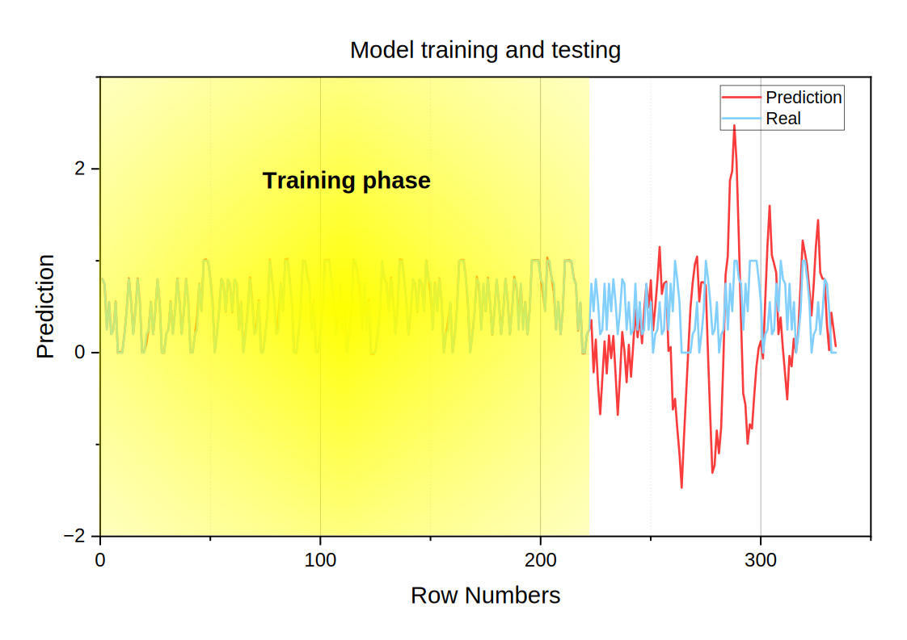{ loading=lazy }

### 尝试查看 `.h5` 权重文件

这时想通过查看权重文件中的参数来分析每个指标/维度与*势头*的相关性，

于是搜索，然后发现这两篇文章

-   [可视化工具打开hdf5文件_hdf5文件用什么打开-CSDN博客](https://blog.csdn.net/qq_42508076/article/details/116600303)
-   [查看h5文件方法——vitables-CSDN博客](https://blog.csdn.net/weixin_45674669/article/details/130029509)

都提到使用vitables来查看 `.h5` 文件，于是按照文章所说， `pip install vitables` 之后，

```bash
vitables Shi_2.h5
```

{ loading=lazy }

但弄了一番之后感觉似乎并不是太有用，于是就不打算再研究 `.h5` 文件了

>   期间还有尝试生成不同的单位向量(每个维度对应一个)，然后输入进行预测，进而查看结果，然后通过结果来分析不同维度对*势头*的相关性，
>
>   但是后来想了想，觉得有些不合理，并且关系都是非线性的，可能预测的结果体现不出相关性，最后就放弃了这样的思路

### 增添决赛的数据并再次训练 (5号午)

快中午时，查看决赛的数据的时候，感觉 **每一局中还剩几分能获胜** 应该是一个对势头影响比较大的因素，而队友却没有放在csv文件中，于是让队友重新处理添加了数据，

然后到了下午我重新进行了训练和预测。

>   数据保存成了 `Shi_3.csv`

---

这个时候还顺带发现了，原来tensorflow可以直接保存模型文件😅(而不是权重文件)

???+ tip

    之前chatgpt提供的代码(最开始提供的tensorflow GRU模型的代码)中包含了保存权重文件的部分，
    
    ```python
    # 保存权重文件
    model.save_weights('gru_weights.h5')
    ```
    
    于是在那之后不久又去询问了如何加载权重文件，
    
    ```python
    def build_model():
        ...
    
    model = build_model()
    model.load_weights('gru_weights.h5')
    ```
    
    并且需要注意，**==构建的模型需要与之前的模型结构一样==**，否则可能会报错。

已经训练好的模型通过 `save` 方法即可保存，如

```python
model.save('my_gru_model.keras')
```

>   keras文件应该就是tensorflow自己的模型文件格式，因为keras好像就是tensorflow下的一个包

然后就可以(==非常迅速地==😎)**直接从文件中加载模型**(与之相对的就是，先搭建好模型再用模型加载权重文件)

```python
from tensorflow.keras.models import load_model

model = load_model("my_gru_model.keras")
```

然后就可以直接进行预测等操作。

### 着手处理全部的数据

队友之前已经将这列我们认为没有太大作用的数据去除了，

```css
winner_shot_type
p1_distance_run
p2_distance_run
rally_count
speed_mph
serve_widt
serve_depth
return_depth
```

然后我又让他再看看还有什么在处理决赛数据时能用上的操作，发现只能替换分数，

>   在 `p1_score` 和 `p2_score` 那两列，
>
>   -   把 `15` 替换成 `1`
>   -   把 `30` 替换成 `2`
>   -   把 `40` 替换成 `3`
>   -   把 `AD` 替换成 `4`

于是他替换好分数之后把总的csv发给了我，然后我就开始写处理全部数据的python代码。

>   此时大约下午4点

---

这时我有两种思路，

1.   选出第一轮32个选手的数据，然后用32个数据序列来进行训练
2.   选出冠军5场比赛的所有数据进行训练

我先处理第一种思路，

???+ note "`my_test7.py` `my_test8.py` `my_test9.py`"

    === "`my_test7.py`"
    
        ```python title="my_test7.py" linenums="1"
        import pandas as pd
        import numpy as np
    
        all_data = pd.read_csv("Wimbledon_featured_matches.csv")
    
        print(all_data)
        print(all_data.columns)
    
        all_data = np.array(all_data)
    
        print(all_data)
    
        # exit(0)
    
        # 将 match_id 结尾为 13xx 的数据筛选出来，并且将每一个 id 的数据存在单独的 csv 文件中
        data_of_13 = np.array(list(filter(lambda x: int(x[0][-4:]) // 100 == 13, all_data)))
    
        print(data_of_13)
    
        result = {}
        for data in data_of_13:
            if data[0] not in result:
                result[data[0]] = []
            result[data[0]].append(data)
        for i, data in zip(range(len(result)), result.values()):
            df = pd.DataFrame(data)
            # name like: 00 01 02 ...
            df.to_csv(f"everyone/{(2*i+1):02d}.csv", index=False, header=True)
            # copy the file to another name
            df.to_csv(f"everyone/{(2*i+2):02d}.csv", index=False, header=True)
        ```
    
    === "`my_test8.py`"
    
        ```python title="my_test8.py" linenums="1"
        import pandas as pd
        import numpy as np
    
        all_data = pd.read_csv("Wimbledon_featured_matches.csv")
    
        print(all_data)
        print(all_data.columns)
    
        col_list = list(all_data.columns)
        thing_to_find = ("match_id", "elapsed_time", "set_no", "game_no", "point_no",
                         "game_victor", "set_victor", "p1_net_pt", "p2_net_pt", "p1_net_pt_won",
                         "p2_net_pt_won", 'p1_points_won', 'p2_points_won')
        # get the index of the column
        index_to_find = []
        for i in range(len(col_list)):
            if col_list[i] in thing_to_find:
                index_to_find.append(i)
    
        # exit(0)
    
        for i in range(1, 33):
            data = pd.read_csv(f"everyone/{i:02d}.csv")
            data = np.array(data)
            # delete the column whose index is in index_to_find
            data = np.delete(data, index_to_find, axis=1)
            # print(data)
    
            # save the data to the file
            df = pd.DataFrame(data)
            df.to_csv(f"everyone/{i:02d}.csv", index=False, header=True)
        ```
    
    === "`my_test9.py`"
    
        ```python title="my_test9.py" linenums="1"
        import pandas as pd
        import numpy as np
    
        """
        ['player1', 'player2',
               'p1_sets', 'p2_sets', 
               'p1_games', 'p2_games', 
               'p1_score', 'p2_score', 
               'server', 'serve_no', 
               'point_victor',
               'p1_ace', 'p2_ace',
               'p1_winner', 'p2_winner', 
               'p1_double_fault', 'p2_double_fault',
               'p1_unf_err', 'p2_unf_err',
               'p1_break_pt', 'p2_break_pt', 
               'p1_break_pt_won', 'p2_break_pt_won', 
               'p1_break_pt_missed', 'p2_break_pt_missed']
        """
    
        for i in range(1, 33):
            data = pd.read_csv(f"everyone/{i:02d}.csv")
            data = np.array(data)
    
            # 算 领先盘数 领先局数 领先球数 是不是一局最后三球 几球赢这局 势头
            # add a new column to the end of data
            new_column = np.zeros((len(data), 6))
            data = np.hstack((data, new_column))
    
            for j in range(len(data)):
                data[j][-6] = data[j][2] - data[j][3]
                data[j][-5] = data[j][4] - data[j][5]
                data[j][-4] = data[j][6] - data[j][7]
                if i % 2 == 0:
                    data[j][-6] *= -1
                    data[j][-5] *= -1
                    data[j][-4] *= -1
    
                # 是否影响下一局
                if j < len(data) - 3:
                    data[j][-3] = 0 if data[j][8] == data[j+3][8] else 1
    
                # 判断还剩几球赢这局
                me, they = (6, 7) if i % 2 == 1 else (7, 6)
                if data[j][4] == 6 and data[j][5] == 6:  # 判断是否抢七
                    target = 10 if data[j][2] == 2 and data[j][3] == 2 else 7
                    # 对手超过6就加分
                    data[j][-2] = data[j][they] + 2 - data[j][me] if data[j][they] >= target - 1 else target - data[j][me]
                else:
                    if data[j][they] < 3:
                        data[j][-2] = 4 - data[j][me]
                    elif data[j][they] == 3:
                        data[j][-2] = 5 - data[j][me]
                    else:
                        data[j][-2] = 3
    
            index_to_delete = list(range(i%2, 8, 2)) + list(range(i%2+11, 25, 2))
    
            data = np.delete(data, index_to_delete, axis=1)
    
            """
            ['player1',
                   'p1_sets',
                   'p1_games',
                   'p1_score',
                   'server', 'serve_no', 
                   'point_victor',
                   'p1_ace',
                   'p1_winner', 
                   'p1_double_fault',
                   'p1_unf_err',
                   'p1_break_pt', 
                   'p1_break_pt_won', 
                   'p1_break_pt_missed']
            """
    
            for x in data:
                if x[4]%2 == i % 2:
                    x[4] = 1
                else:
                    x[4] = 0
    
                if x[6]%2 == i % 2:
                    x[6] = 1
                else:
                    x[6] = 0
    
            # 计算势头
            a, b, c = 0.55, 0.25, 0.2
            for j in range(len(data) - 3):
                data[j][-1] = a * data[j+1][6] + b * data[j+2][6] + c * data[j+3][6]
    
            # save the data to the file
            df = pd.DataFrame(data)
            df.to_csv(f"everyone/{i:02d}.csv", index=False, header=True)
        ```

<h4><big>第一步，在 my_test7.py 中</big></h4>

先读取了csv中的数据并转换成numpy数组，

```python
all_data = pd.read_csv("Wimbledon_featured_matches.csv")
...
all_data = np.array(all_data)
```

再将 `match_id` 结尾为 `13xx` 的数据筛选出来，

!!! tip

    在 `Wimbledon_featured_matches.csv` 中，一共进行了5轮比赛，
    
    -   第1轮，`match_id` 以 `13xx` 结尾，对应**32进16**
    -   第2轮，`match_id` 以 `14xx` 结尾，对应**16进8**
    -   第3轮，`match_id` 以 `15xx` 结尾，对应**8进4**
    -   第4轮，`match_id` 以 `16xx` 结尾，对应**4进2**
    -   第5轮，`match_id` 以 `17xx` 结尾，对应**决赛**

并且将每一个 id 的数据存在单独的csv文件中，

且由于每场比赛有两个选手的数据，所以每场比赛都各复制了一份，

```python linenums="15"
# 将 match_id 结尾为 13xx 的数据筛选出来，并且将每一个 id 的数据存在单独的 csv 文件中
data_of_13 = np.array(list(filter(lambda x: int(x[0][-4:]) // 100 == 13, all_data)))

print(data_of_13)

result = {}
for data in data_of_13:
    if data[0] not in result:
        result[data[0]] = []
    result[data[0]].append(data)
for i, data in zip(range(len(result)), result.values()):
    df = pd.DataFrame(data)
    # name like: 00 01 02 ...
    df.to_csv(f"everyone/{(2*i+1):02d}.csv", index=False, header=True)
    # copy the file to another name
    df.to_csv(f"everyone/{(2*i+2):02d}.csv", index=False, header=True)
```

这里在调用 `to_csv` 时，设置 `header=True` 是因为pandas在 `read_csv` 时会默认把第一行当作列标题(之前也有提到过)，所以在村文件的时候要给新的csv添加列标题。

<h4><big>第二步，在 my_test8.py 中</big></h4>

由于需要删除几列没有用的数据，所以采取了这样的方法，

因为原来的 `Wimbledon_featured_matches.csv` 列名是数据名，而要使用numpy中的 `detele` 函数需要传入要删除列的下标序号，

所以我先在 `Wimbledon_featured_matches.csv` 中获取了列名的列表，

```python
all_data = pd.read_csv("Wimbledon_featured_matches.csv")
...
col_list = list(all_data.columns)
```

再获取要删去的列的下标序号，

```python linenums="10"
thing_to_find = ("match_id", "elapsed_time", "set_no", "game_no", "point_no",
                 "game_victor", "set_victor", "p1_net_pt", "p2_net_pt", "p1_net_pt_won",
                 "p2_net_pt_won", 'p1_points_won', 'p2_points_won')
# get the index of the column
index_to_find = []
for i in range(len(col_list)):
    if col_list[i] in thing_to_find:
        index_to_find.append(i)
```

最后在第一步得到的csv中删去对应的列，

```python linenums="21"
for i in range(1, 33):
    data = pd.read_csv(f"everyone/{i:02d}.csv")
    data = np.array(data)
    # delete the column whose index is in index_to_find
    data = np.delete(data, index_to_find, axis=1)
    # print(data)

    # save the data to the file
    df = pd.DataFrame(data)
    df.to_csv(f"everyone/{i:02d}.csv", index=False, header=True)
```

<h4><big>第三步，在 my_test9.py 中</big></h4>

需要将每个选手的数据保留而删去对手的数据，并添加/计算一些所需的数据。

由于有6个数据需要新添，所以在矩阵末尾添加6个新列，并初始化为0，

```python linenums="24"
# 算 领先盘数 领先局数 领先球数 是不是一局最后三球 几球赢这局 势头
# add a new column to the end of data
new_column = np.zeros((len(data), 6))
data = np.hstack((data, new_column))
```

???+ tip

    `np.hstack` 的用法似乎是在numpy矩阵的**最后一个层(或者说数组的维度)**添加数据。
    
    而numpy还有一个 `np.stack` 函数，与 `np.hstack` 用法类似，但还需要传入一个参数 `axis=` 来指定**在哪一层插入新的元素**
    
    ???+ example "chatlog"
    
        **User**:
    
        如何将多个 二维 numpy array 合并成 一个三维 numpy array?
    
        &nbsp;
    
        **ChatGPT**:
    
        要将多个二维NumPy数组合并成一个三维NumPy数组，可以使用 `np.stack` 函数或 `np.concatenate` 函数。这两个函数允许你在指定的轴上合并数组。
    
        以下是使用 `np.stack` 的示例：
    
        ```python
        import numpy as np
    
        # 假设有两个二维数组 arr1 和 arr2
        arr1 = np.array([[1, 2, 3], [4, 5, 6]])
        arr2 = np.array([[7, 8, 9], [10, 11, 12]])
    
        # 使用 np.stack 沿着新的轴（第三维度）合并数组
        result = np.stack((arr1, arr2), axis=2)
    
        # 打印结果
        print(result)
        ```
    
        或者，使用 `np.concatenate` ：
    
        ```python
        import numpy as np
    
        # 使用 np.concatenate 沿着新的轴（第三维度）合并数组
        result = np.concatenate((arr1[:, :, np.newaxis], arr2[:, :, np.newaxis]), axis=2)
    
        # 打印结果
        print(result)
        ```
    
        这两种方法都将 `arr1` 和 `arr2` 合并到一个新的三维数组中，其中第三维度是合并的维度。确保调整轴和数组的形状以适应你的实际需求。

-   计算领先的盘数，如果是p2(player2)，则乘个 `-1`

    ```python linenums="30"
    data[j][-6] = data[j][2] - data[j][3]
    data[j][-5] = data[j][4] - data[j][5]
    data[j][-4] = data[j][6] - data[j][7]
    if i % 2 == 0:
        data[j][-6] *= -1
        data[j][-5] *= -1
        data[j][-4] *= -1
    ```

-   判断是否是一局的最后其中三分(计算的势头包含下一局的分)

    ```python linenums="38"
    # 是否影响下一局
    if j < len(data) - 3:
        data[j][-3] = 0 if data[j][8] == data[j+3][8] else 1
    ```

-   计算还剩几分可以赢得这一局(**==需要判断是否是==*==抢七==*==或者==*==抢十==*==的情况==**)

    ```python linenums="42"
    # 判断还剩几球赢这局
    me, they = (6, 7) if i % 2 == 1 else (7, 6)
    if data[j][4] == 6 and data[j][5] == 6:  # 判断是否抢七
        target = 10 if data[j][2] == 2 and data[j][3] == 2 else 7
        # 对手超过6就加分
        data[j][-2] = data[j][they] + 2 - data[j][me] if data[j][they] >= target - 1 else target - data[j][me]
    else:
        if data[j][they] < 3:
            data[j][-2] = 4 - data[j][me]
        elif data[j][they] == 3:
            data[j][-2] = 5 - data[j][me]
        else:
            data[j][-2] = 3
    ```

删除对手的数据，

```python linenums="56"
index_to_delete = list(range(i%2, 8, 2)) + list(range(i%2+11, 25, 2))

data = np.delete(data, index_to_delete, axis=1)
```

处理选手当前分是否赢的数据(原本为 `point_victor` ， `p1` 赢则为 `1` ， `p2` 赢则为 `2` )，

```python linenums="76"
for x in data:
    if x[4]%2 == i % 2:
        x[4] = 1
    else:
        x[4] = 0

    if x[6]%2 == i % 2:
        x[6] = 1
    else:
        x[6] = 0
```

计算*势头*，

```python linenums="87"
# 计算势头
a, b, c = 0.55, 0.25, 0.2
for j in range(len(data) - 3):
    data[j][-1] = a * data[j+1][6] + b * data[j+2][6] + c * data[j+3][6]
```

最后保存数据，

```python linenums="92"
# save the data to the file
df = pd.DataFrame(data)
df.to_csv(f"everyone/{i:02d}.csv", index=False, header=True)
```

---

继续处理第二种思路，

??? note "`my_test7_1.py` `my_test8_1.py` `my_test9_1.py`"

    === "`my_test7_1.py`"
    
        ```python title="my_test7_1.py" linenums="1"
        import pandas as pd
        import numpy as np
    
        all_data = pd.read_csv("Wimbledon_featured_matches.csv")
    
        print(all_data)
        print(all_data.columns)
    
        all_data = np.array(all_data)
    
        print(all_data)
    
        # exit(0)
    
        # 将 match_id 结尾为 13xx 的数据筛选出来，并且将每一个 id 的数据存在单独的 csv 文件中
        data_of_one = np.array(list(filter(lambda x: x[1] == "Carlos Alcaraz", all_data)))
    
        print(data_of_one)
    
        result = {}
        for data in data_of_one:
            if data[0] not in result:
                result[data[0]] = []
            result[data[0]].append(data)
    
        for data in result.values():
            df = pd.DataFrame(data)
    
            # name like: 00 01 02 ...
            df.to_csv(f"onlyone/{data[0][0][-4:]}.csv", index=False, header=True)
        ```
    
    === "`my_test8_1.py`"
    
        ```python title="my_test8_1.py" linenums="1"
        import pandas as pd
        import numpy as np
    
        all_data = pd.read_csv("Wimbledon_featured_matches.csv")
    
        print(all_data)
        print(all_data.columns)
    
        col_list = list(all_data.columns)
        thing_to_find = ("match_id", "elapsed_time", "set_no", "game_no", "point_no",
                        "game_victor", "set_victor", "p1_net_pt", "p2_net_pt", "p1_net_pt_won",
                        "p2_net_pt_won", 'p1_points_won', 'p2_points_won')
        # get the index of the column
        index_to_find = []
        for i in range(len(col_list)):
            if col_list[i] in thing_to_find:
                index_to_find.append(i)
    
        # exit(0)
    
        for i in range(13, 18):
            data = pd.read_csv(f"onlyone/{i:02d}01.csv")
            data = np.array(data)
            # delete the column whose index is in index_to_find
            data = np.delete(data, index_to_find, axis=1)
            # print(data)
    
            # save the data to the file
            df = pd.DataFrame(data)
            df.to_csv(f"onlyone/{i:02d}01.csv", index=False, header=True)
        ```
    
    === "`my_test9_1.py`"
    
        ```python title="my_test9_1.py" linenums="1"
        import pandas as pd
        import numpy as np
    
        """
        ['player1', 'player2',
            'p1_sets', 'p2_sets', 
            'p1_games', 'p2_games', 
            'p1_score', 'p2_score', 
            'server', 'serve_no', 
            'point_victor',
            'p1_ace', 'p2_ace',
            'p1_winner', 'p2_winner', 
            'p1_double_fault', 'p2_double_fault',
            'p1_unf_err', 'p2_unf_err',
            'p1_break_pt', 'p2_break_pt', 
            'p1_break_pt_won', 'p2_break_pt_won', 
            'p1_break_pt_missed', 'p2_break_pt_missed']
        """
    
        for i in range(13, 18):
            data = pd.read_csv(f"onlyone/{i:02d}01.csv")
            data = np.array(data)
    
            # 算 领先盘数 领先局数 领先球数 是不是一局最后三球 几球赢这局 势头
            # add a new column to the end of data
            new_column = np.zeros((len(data), 6))
            data = np.hstack((data, new_column))
    
            for j in range(len(data)):
                data[j][-6] = data[j][2] - data[j][3]
                data[j][-5] = data[j][4] - data[j][5]
                data[j][-4] = data[j][6] - data[j][7]
                # if i % 2 == 0:
                #     data[j][-6] *= -1
                #     data[j][-5] *= -1
                #     data[j][-4] *= -1
    
                # 是否影响下一局
                if j < len(data) - 3:
                    data[j][-3] = 0 if data[j][8] == data[j+3][8] else 1
    
                # 判断还剩几球赢这局
                me, they = (6, 7)  # if i % 2 == 1 else (7, 6)
                if data[j][4] == 6 and data[j][5] == 6:  # 判断是否抢七
                    target = 10 if data[j][2] == 2 and data[j][3] == 2 else 7
                    # 对手超过6就加分
                    data[j][-2] = data[j][they] + 2 - data[j][me] if data[j][they] >= target - 1 else target - data[j][me]
                else:
                    if data[j][they] < 3:
                        data[j][-2] = 4 - data[j][me]
                    elif data[j][they] == 3:
                        data[j][-2] = 5 - data[j][me]
                    else:
                        data[j][-2] = 3
    
            index_to_delete = list(range(1, 8, 2)) + list(range(1+11, 25, 2))
    
            data = np.delete(data, index_to_delete, axis=1)
    
            """
            ['player1',
                'p1_sets',
                'p1_games',
                'p1_score',
                'server', 'serve_no', 
                'point_victor',
                'p1_ace',
                'p1_winner', 
                'p1_double_fault',
                'p1_unf_err',
                'p1_break_pt', 
                'p1_break_pt_won', 
                'p1_break_pt_missed']
            """
    
            for x in data:
                if x[4] == 1:
                    x[4] = 1
                else:
                    x[4] = 0
    
                if x[6] == 1:
                    x[6] = 1
                else:
                    x[6] = 0
    
            # 计算势头
            a, b, c = 0.55, 0.25, 0.2
            for j in range(len(data) - 3):
                data[j][-1] = a * data[j+1][6] + b * data[j+2][6] + c * data[j+3][6]
    
            # save the data to the file
            df = pd.DataFrame(data)
            df.to_csv(f"onlyone/{i:02d}01.csv", index=False, header=True)
        ```

这次我基本上是基于处理第一种思路时的代码进行修改的，所以大体上差不多。

### 用处理好的数据进行训练及预测 (5号晚)

??? note "两种思路分别对应的模型训练python代码"

    === "`my_test10.py`"
    
        ```python title="my_test10.py" linenums="1"
        import pandas as pd
        import numpy as np
    
        import tensorflow as tf
        from tensorflow.keras import Sequential
        from tensorflow.keras.layers import GRU, Dense
    
        all_datas = []
        for i in range(1, 33):
            if i != 5 and i != 6:
                data = pd.read_csv(f"everyone/{i:02d}.csv")
                all_datas.append(np.array(data)[:164, :])
        # data = pd.read_csv("CA(test)_2.csv")
        data = np.stack(tuple(all_datas))
        print(data)
    
        data = data[:, :, 1:].astype(np.float32)  # delete name
        print(data)
    
        # input()
    
        nums = len(data[0])
        labels, data, val = data[:, :, -1:], data[:, :, :-1], data[:, -nums//3:, :]
        # Shi, val = val[:, :, :1], val[:, :, 1:]
        print(data)
        print(labels)
    
        # input()
    
        def build_model():
            model = Sequential()
            model.add(GRU(50, input_shape=(None, 18), return_sequences=True))  # 使用50个GRU单元
            model.add(Dense(1))  # 输出层，用于回归问题
    
            return model
    
        # 编译模型
        model = build_model()
        model.compile(optimizer='adam', loss="mean_absolute_error")
    
        # 训练模型
        model.fit(data, labels, epochs=10000, batch_size=30)
    
        # 保存权重文件
        name = "Shi_everyone"
        model.save_weights(name + '.h5')
        model.save(name + ".keras")
        ```
    
    === "`my_test10_1.py`"
    
        ```python title="my_test10_1.py" linenums="1"
        import pandas as pd
        import numpy as np
    
        import tensorflow as tf
        from tensorflow.keras import Sequential
        from tensorflow.keras.layers import GRU, Dense
    
        all_datas = []
        for i in range(13, 18):
            # if i != 5 and i != 6:
            data = pd.read_csv(f"onlyone/{i:02d}01.csv")
            all_datas.append(np.array(data)[:159-3, :])
        # data = pd.read_csv("CA(test)_2.csv")
        data = np.stack(tuple(all_datas))
        print(data)
    
        data = data[:, :, 1:].astype(np.float32)  # delete name
        print(data)
    
        # input()
    
        nums = len(data[0])
        labels, data, val = data[:, :, -1:], data[:, :, :-1], data[:, -nums//3:, :]
        # Shi, val = val[:, :, :1], val[:, :, 1:]
        print(data)
        print(labels)
    
        # input()
    
        def build_model():
            model = Sequential()
            model.add(GRU(50, input_shape=(None, 18), return_sequences=True))  # 使用50个GRU单元
            model.add(Dense(1))  # 输出层，用于回归问题
    
            return model
    
        # 编译模型
        model = build_model()
        model.compile(optimizer='adam', loss="mean_absolute_error")
    
        # 训练模型
        model.fit(data, labels, epochs=10000, batch_size=5)
    
        # 保存权重文件
        name = "Shi_onlyone"
        model.save_weights(name + '.h5')
        model.save(name + ".keras")
        ```

这里需要注意的是，32个选手即对应32个数据序列，所以 `batch_size` 设为 `32` ，

但输入数据是一个矩阵，即 **==每个序列的长度必须一样==**。

于是获取到了16场比赛各自进行了多少*分*,

```css
1   300, 201, 134, 337, 
5   246, 332, 232, 190, 
9   213, 318, 170, 275, 
13  290, 185, 198, 167,
```

再通过代码计算出能使用最多数据进行训练的方案，

??? note "`my_test11.py`"

    ```python linenums="1"
    import pandas as pd
    import numpy as np
    
    import tensorflow as tf
    from tensorflow.keras import Sequential
    from tensorflow.keras.layers import GRU, Dense
    
    # res = []
    # for i in range(1, 33):
    #     data = pd.read_csv(f"everyone/{i:02d}.csv")
    #     res.append(len(np.array(data)))
    #
    # print(res)
    
    res = [300, 300, 201, 201, 134, 134, 337, 337, 246, 246, 332, 332, 232, 232, 190, 190, 213, 213, 318, 318, 170, 170, 275, 275, 290, 290, 185, 185, 198, 198, 167, 167]
    
    print(min(res))
    print(len(list(filter(lambda x: x < 167, res))))
    
    s = sum(res)
    
    for x in res:
        sublist = list(filter(lambda y: y >= x, res))
        print(f"{s - sum(sublist)}, {len(sublist) * x}")
    ```

最后得到的方案是，只除去比分最少(134)的一场，其余的序列长度都保留至164(167-3，最后三分势头无法进行预测)，

```python title="my_test10.py" linenums="8"
all_datas = []
for i in range(1, 33):
    if i != 5 and i != 6:
        data = pd.read_csv(f"everyone/{i:02d}.csv")
        all_datas.append(np.array(data)[:164, :])
# data = pd.read_csv("CA(test)_2.csv")
data = np.stack(tuple(all_datas))
```

>   训练结果命名为 `Shi_everyone.xxx`

---

第二种思路也有相似的处理步骤，

```python title="my_test10_1.py" linenums="8"
all_datas = []
for i in range(13, 18):
    # if i != 5 and i != 6:
    data = pd.read_csv(f"onlyone/{i:02d}01.csv")
    all_datas.append(np.array(data)[:159-3, :])
# data = pd.read_csv("CA(test)_2.csv")
data = np.stack(tuple(all_datas))
```

!!! info

    5个序列长度分别是 `300, 225, 189, 159, 334`

>   训练结果命名为 `Shi_onlyone.xxx`

---

然后用第一种思路训练出来的模型对冠军第3轮1501的比赛的数据进行了预测，结果如下图

{ loading=lazy }

>   数据保存为 `Shi_everyone.csv`

感觉很ok😊

---

为了比较两种模型的预测效果，需要有一场在两边都没有使用过的比赛数据进行预测，于是又编写了 `my_test7_1_2.py` `my_test8_1_2.py` `my_test9_1_2.py` 来处理5场亚军的数据，

>   保存在了 `onlyone2/` 下

然后用亚军第4轮半决赛1502的比赛数据，一起输入两个模型进行预测，结果如下图

{ loading=lazy }

于是发现，居然 **==拿冠军个人的数据训练出来的模型的预测效果要比拿32名选手的数据训练出来的模型要好==** 😲，这是我没想到的情况，

于是鉴于这样的情况，我决定再用亚军的数据训练一个模型，再用三个模型一起预测同一场比赛。

>   此时大约6号0点40分

---

改出 `my_test10_2.py` 来训练亚军的数据，

??? note "`my_test10_2.py`"

    ```python linenums="1"
    import pandas as pd
    import numpy as np
    
    import tensorflow as tf
    from tensorflow.keras import Sequential
    from tensorflow.keras.layers import GRU, Dense
    
    all_datas = []
    for i in ("1316", "1408", "1504", "1602", "1701"):
        # if i != 5 and i != 6:
        data = pd.read_csv(f"onlyone_2/{i}.csv")
        all_datas.append(np.array(data)[:167-3, :])
    # data = pd.read_csv("CA(test)_2.csv")
    data = np.stack(tuple(all_datas))
    print(data)
    
    data = data[:, :, 1:].astype(np.float32)  # delete name
    print(data)
    
    # input()
    
    nums = len(data[0])
    labels, data, val = data[:, :, -1:], data[:, :, :-1], data[:, -nums//3:, :]
    # Shi, val = val[:, :, :1], val[:, :, 1:]
    print(data)
    print(labels)
    
    # input()
    
    def build_model():
        model = Sequential()
        model.add(GRU(50, input_shape=(None, 18), return_sequences=True))  # 使用50个GRU单元
        model.add(Dense(1))  # 输出层，用于回归问题
    
        return model
    
    # 编译模型
    model = build_model()
    model.compile(optimizer='adam', loss="mean_absolute_error")
    
    # 训练模型
    model.fit(data, labels, epochs=10000, batch_size=5)
    
    # 保存权重文件
    name = "Shi_onlyone_2"
    model.save_weights(name + '.h5')
    model.save(name + ".keras")
    ```

>    训练结果命名为 `Shi_onlyone_2.xxx`

然后处理出 **输给亚军的四强** 的4场比赛数据( `my_test7_1_3.py` `my_test8_1_3.py` `my_test9_1_3.py` )，然后用三个不同的模型对**他**第3轮1503的比赛数据进行预测(==用这一场因为三个模型都与这一场比赛无关==)，结果如下图

=== "3个模型一起预测"

    { loading=lazy }

=== "大众模型和亚军模型"

    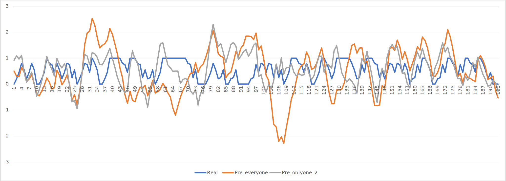{ loading=lazy }

看起来似乎确实用单人数据训练出来的模型要比大众训练出来的模型预测效果要好🤔，或许可能是因为同一个选手的比赛数据相关性更高，所以训练出的模型效果更好。

>   此时大约凌晨1点半

---

由于已经比较晚，所以也不知道还能怎样取数据进行预测和训练，就没有再去处理新的数据了。

### 分析预测准确的数据 (6号凌晨)

(由于已经没什么事了，于是)我在pycharm的copilot上询问它训练出来模型后，如何提取输入的特征

>   第二个问题是copilot提示/猜测我要询问它的问题，我觉得是个好问题于是继续按照它的提示询问它

???+ example "chatlog"

    **RonaldLN**:
    
    I have learned some data through TensorFlow's GRU to obtain a model that can predict given inputs. I would like to know how to extract the characteristics of the input when the predicted value matches the true value?
    
    &nbsp;
    
    **Github Copilot**:
    
    You can extract the characteristics of the input when the predicted value matches the true value by comparing the predicted outputs with the true outputs. If they match within a certain tolerance, you can store the corresponding input. Here's how you can do it:
    
    1.   Load your model.
    2.   Use the model to predict outputs based on your inputs.
    3.   Initialize an empty list to store inputs where predicted output matches true output.
    4.   Iterate over each predicted output:
         -   If the predicted output matches the true output within a certain tolerance, append the corresponding input to your list.
    
    Here's the Python code that implements this:
    
    ```python
    import numpy as np
    
    # Assuming you have your inputs and true outputs in variables `inputs` and `true_outputs`
    # And your model in variable `model`
    
    predicted_outputs = model.predict(inputs)
    
    # Initialize an empty list to store inputs where predicted output matches true output
    matching_inputs = []
    
    for i in range(len(predicted_outputs)):
        # If the predicted output matches the true output
        if np.allclose(predicted_outputs[i], true_outputs[i], atol=0.1):
            # Store the corresponding input
            matching_inputs.append(inputs[i])
    
    # Now, `matching_inputs` contains the inputs where the predicted output matches the true output
    ```
    
    In this code, `np.allclose` is used to check if the predicted output matches the true output within a tolerance of 0.1. You can adjust this tolerance as needed. The `matching_inputs` list will contain the inputs for which the predicted and true outputs match.
    
    ??? quote "Using 3 Reference"
    
        -   my_test10_predict.py
        -   my_test10_2.py
        -   my_test3.py
    
    &nbsp;
    
    **RonaldLN**:
    
    How can I visualize the characteristics of the input data that matches the true value?
    
    &nbsp;
    
    **Github Copilot**:
    
    You can visualize the characteristics of the input data that matches the true value by plotting histograms for each dimension of the input data. Here's how you can do it:
    
    1.   Convert your list of matching inputs to a numpy array for easier manipulation.
    2.   For each dimension in the input data, create a new figure and plot a histogram of the data in the current dimension.
    3.   Set the title of the plot to the current dimension and show the plot.
    
    Here's the Python code that implements this:
    
    ```python
    import matplotlib.pyplot as plt
    
    # Convert matching_inputs to a numpy array for easier manipulation
    matching_inputs_np = np.array(matching_inputs)
    
    # For each dimension in the input data
    for i in range(matching_inputs_np.shape[1]):
        # Create a new figure
        plt.figure()
    
        # Plot a histogram of the data in the current dimension
        plt.hist(matching_inputs_np[:, i], bins=20)
    
        # Set the title of the plot
        plt.title(f'Input Dimension {i + 1}')
    
        # Show the plot
        plt.show()
    ```
    
    In this code, `plt.hist` is used to plot a histogram of the data in the current dimension. The `bins` parameter is set to 20, but you can adjust this as needed. The title of the plot is set to the current dimension using `plt.title`. Finally, the plot is displayed using `plt.show`.
    
    ??? quote "Using 3 Reference"
    
        -   my_test10_predict.py
        -   my_test10_2.py
        -   my_test3.py
        
    ---
    
    ??? quote "ChatGPT翻译"
    
        **RonaldLN**：
    
        我通过TensorFlow的GRU学到了一些数据，得到了一个能够根据给定输入进行预测的模型。我想知道在预测值与真实值匹配时如何提取输入的特征？
    
        &nbsp;
    
        **Github Copilot**：
    
        当预测值与真实值匹配时，你可以通过比较预测输出和真实输出来提取输入的特征。如果它们在某个容差范围内匹配，你可以存储相应的输入。以下是具体步骤：
    
        1.   加载你的模型。
        2.   使用模型根据输入预测输出。
        3.   初始化一个空列表，用于存储预测输出与真实输出匹配的输入。
        4.   遍历每个预测输出：
             -   如果预测输出在某个容差范围内与真实输出匹配，则将相应的输入添加到列表中。
    
        以下是实现这一过程的Python代码：
    
        ```python
        import numpy as np
    
        # 假设你的输入和真实输出分别存储在变量`inputs`和`true_outputs`中
        # 你的模型存储在变量`model`中
    
        predicted_outputs = model.predict(inputs)
    
        # 初始化一个空列表，用于存储预测输出与真实输出匹配的输入
        matching_inputs = []
    
        for i in range(len(predicted_outputs)):
            # 如果预测输出与真实输出匹配
            if np.allclose(predicted_outputs[i], true_outputs[i], atol=0.1):
                # 存储相应的输入
                matching_inputs.append(inputs[i])
    
        # 现在，`matching_inputs`包含预测输出与真实输出匹配的输入
        ```
    
        在这段代码中，`np.allclose`用于检查预测输出是否在容差为0.1的范围内与真实输出匹配。你可以根据需要调整这个容差。`matching_inputs`列表将包含预测和真实输出匹配的输入。
    
        &nbsp;
    
        **RonaldLN**：
    
        我如何可视化与真实值匹配的输入数据的特征？
    
        &nbsp;
    
        **Github Copilot**：
    
        你可以通过绘制每个输入数据维度的直方图来可视化与真实值匹配的输入数据的特征。以下是具体步骤：
    
        1.   将匹配输入的列表转换为numpy数组，以便更容易处理。
        2.   对于输入数据的每个维度，创建一个新的图形，并绘制当前维度数据的直方图。
        3.   将图形的标题设置为当前维度，并显示图形。
    
        以下是实现这一过程的Python代码：
    
        ```python
        import matplotlib.pyplot as plt
    
        # 将匹配输入转换为numpy数组，以便更容易处理
        matching_inputs_np = np.array(matching_inputs)
    
        # 对于输入数据的每个维度
        for i in range(matching_inputs_np.shape[1]):
            # 创建一个新的图形
            plt.figure()
    
            # 绘制当前维度数据的直方图
            plt.hist(matching_inputs_np[:, i], bins=20)
    
            # 设置图形的标题
            plt.title(f'输入维度 {i + 1}')
    
            # 显示图形
            plt.show()
        ```
    
        在这段代码中，`plt.hist`用于绘制当前维度数据的直方图。`bins`参数设置为20，但你可以根据需要调整。使用`plt.title`设置图形的标题为当前维度。最后，使用`plt.show`显示图形。

于是我按照copilot提供的代码，编写了 `my_test12.py` (为了适配我的输出的数据做了部分修改)，使用冠军模型来预测决赛亚军的数据，并对预测结果进行分析，

??? note "`my_test12.py`"

    ```python linenums="1"
    import pandas as pd
    import numpy as np
    import matplotlib.pyplot as plt
    
    import tensorflow as tf
    from tensorflow.keras import Sequential
    from tensorflow.keras.layers import GRU, Dense
    from tensorflow.keras.models import load_model, Model
    
    data = pd.read_csv("onlyone_2/1602.csv")
    data = np.array([data])
    inputs = data[:, :, 1:][:, :, :-1].astype(np.float32)
    true_outputs = data[:, :, -1:].astype(np.float32)
    
    model = load_model("Shi_onlyone.keras")
    
    # Assuming you have your inputs and true outputs in variables `inputs` and `true_outputs`
    # And your model in variable `model`
    
    predicted_outputs = model.predict(inputs)
    
    print(predicted_outputs)
    
    # Initialize an empty list to store inputs where predicted output matches true output
    matching_inputs = []
    
    for i in range(len(predicted_outputs[0])):
        # If the predicted output matches the true output
        if np.allclose(predicted_outputs[0][i][0], true_outputs[0][i][0], atol=0.1):
            # Store the corresponding input
            matching_inputs.append(inputs[0][i])
    
    # Now, `matching_inputs` contains the inputs where the predicted output matches the true output
    print(matching_inputs)
    print(len(matching_inputs))
    print(len(inputs[0]))
    
    # Convert matching_inputs to a numpy array for easier manipulation
    matching_inputs_np = np.array(matching_inputs)
    
    # For each dimension in the input data
    for i in range(matching_inputs_np.shape[1]):
        # Create a new figure
        plt.figure()
    
        # Plot a histogram of the data in the current dimension
        plt.hist(matching_inputs_np[:, i], bins=20)
    
        # Set the title of the plot
        plt.title(f'Input Dimension {i + 1}')
    
        # Show the plot
        # plt.show()
        plt.savefig(f"pic/matching Input Dimension {i + 1}.png")
    
        # close the plot
        plt.close()
    
    # Initialize an empty list to store inputs where predicted output does not match true output
    non_matching_inputs = []
    
    for i in range(len(predicted_outputs[0])):
        # If the predicted output does not match the true output
        if not np.allclose(predicted_outputs[0][i][0], true_outputs[0][i][0], atol=0.1):
            # Store the corresponding input
            non_matching_inputs.append(inputs[0][i])
    
    # Now, `non_matching_inputs` contains the inputs where the predicted output does not match the true output
    
    # Convert non_matching_inputs to a numpy array for easier manipulation
    non_matching_inputs_np = np.array(non_matching_inputs)
    
    # For each dimension in the input data
    for i in range(non_matching_inputs_np.shape[1]):
        # Create a new figure
        plt.figure()
    
        # Plot a histogram of the data in the current dimension
        plt.hist(non_matching_inputs_np[:, i], bins=20)
    
        # Set the title of the plot
        plt.title(f'Input Dimension {i+1}')
    
        # Show the plot
        # plt.show()
        plt.savefig(f"pic/non_matching Input Dimension {i + 1}.png")
    
        # close the plot
        plt.close()
    ```

**需要注意的是**，在使用 `np.allclose` 函数时，除了传入预测值和真实值，还**设置 `rtol` 和 `atol` 参数**，大概是允许误差的范围/误差容忍( `tol` 对应 tolerance)，

一开始我没有设置(就采用的是它默认的值，默认的值很小)，所以运行出来显示预测结果中没有与真实数据相近的😅。

 `np.allclose` 的函数说明如下

```python
@array_function_dispatch(_allclose_dispatcher)
def allclose(a, b, rtol=1.e-5, atol=1.e-8, equal_nan=False):
    """
    Returns True if two arrays are element-wise equal within a tolerance.

    The tolerance values are positive, typically very small numbers.  The
    relative difference (`rtol` * abs(`b`)) and the absolute difference
    `atol` are added together to compare against the absolute difference
    between `a` and `b`.
    
    ...
    
    Parameters
    ----------
    a, b : array_like
        Input arrays to compare.
    rtol : float
        The relative tolerance parameter (see Notes).
    atol : float
        The absolute tolerance parameter (see Notes).
    ...
    
    Notes
    -----
    If the following equation is element-wise True, then allclose returns
    True.

     absolute(`a` - `b`) <= (`atol` + `rtol` * absolute(`b`))
     
    The above equation is not symmetric in `a` and `b`, so that
    ``allclose(a, b)`` might be different from ``allclose(b, a)`` in
    some rare cases.
    
    ...
    """
```

然后又问了一下chatgpt

???+ example "chatlog"

    **User**:
    
    ```markdown
        Notes
        -----
        If the following equation is element-wise True, then allclose returns
        True.
    
         absolute(`a` - `b`) <= (`atol` + `rtol` * absolute(`b`))
    
        The above equation is not symmetric in `a` and `b`, so that
        ``allclose(a, b)`` might be different from ``allclose(b, a)`` in
        some rare cases.
    ```
    
    translate to chinese
    
    &nbsp;
    
    **ChatGPT**:
    
    ```markdown
        注释
        -----
        如果以下方程在元素级别上为True，则allclose返回True。
    
         绝对值（`a` - `b`）<=（`atol` + `rtol` * 绝对值（`b`））
    
        上述方程在`a`和`b`中不对称，因此在一些罕见情况下，``allclose(a, b)``可能与``allclose(b, a)``不同。
    ```
    
    &nbsp;
    
    **User**:
    
    `atol` 和 `rtol` 分别是什么？
    
    &nbsp;
    
    **ChatGPT**:
    
    在上述文档中，`atol` 和 `rtol` 是用于控制`allclose`函数的两个参数。
    
    -   `atol` 是"absolute tolerance"（绝对容差）的缩写。它是一个绝对值，表示两个数值在进行比较时的绝对容忍度。如果两个数值之间的差异小于或等于`atol`，则被认为是相等的。在上述的等式中，`atol` 控制了两个数值之间的差异是否被认为足够小，以使它们被视为相等。
    -   `rtol` 是"relative tolerance"（相对容差）的缩写。它是一个比例值，表示两个数值在进行比较时的相对容忍度。具体来说，如果两个数值之间的相对差异小于或等于 `rtol` 乘以第二个数值的绝对值，那么它们被认为是相等的。在上述的等式中，`rtol` 控制了相对容忍度的程度。
    
    这两个参数一起确定了在使用`allclose`函数进行数值比较时的容忍度范围。

于是弄明白参数 `rtol` 和 `atol` 的含义之后，我打算只设置 `atol` 的值就行了。

经过几次尝试，最后我将 `atol` 设置成了 `0.1` ，因为此时被认为是预测准确的数据有34个，比例差不多占15%这样。

---

最后将预测较准确的数据和不准确数据的个数分别绘制成柱形图，部分结果如下

=== "维度2: 当前盘所赢局数"

    预测较准数据：
    
    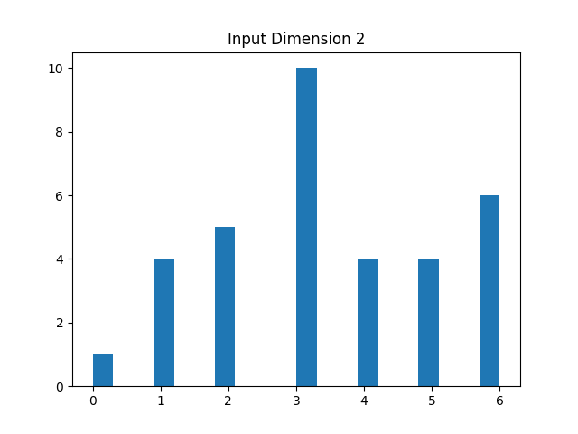{ loading=lazy }
    
    其余数据：
    
    { loading=lazy }

=== "维度3: 当前局所赢分数"

    预测较准数据：
    
    { loading=lazy }
    
    其余数据：
    
    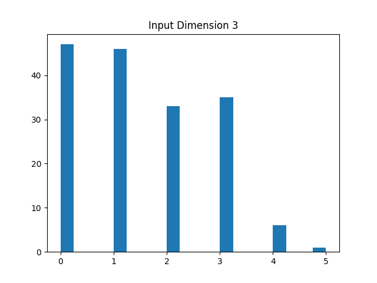{ loading=lazy }

=== "维度7: 是否ace"

    预测较准数据：
    
    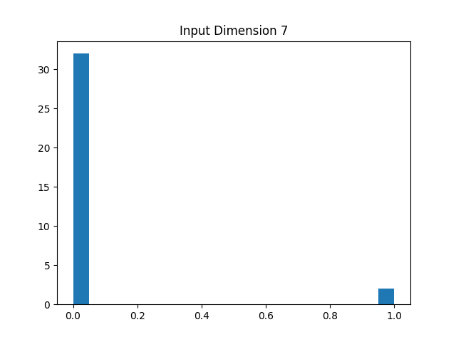{ loading=lazy }
    
    其余数据：
    
    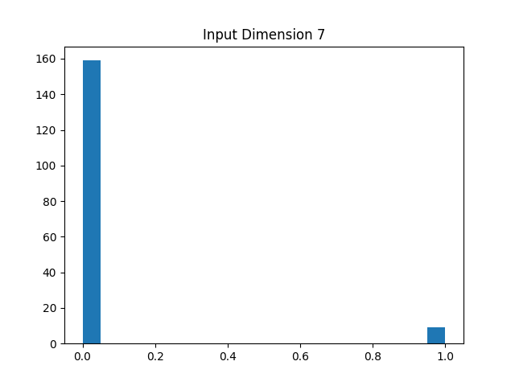{ loading=lazy }

=== "维度14: 领先盘数"

    预测较准数据：
    
    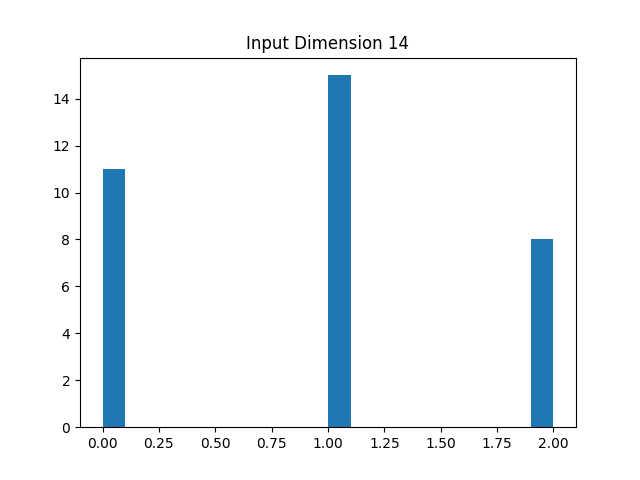{ loading=lazy }
    
    其余数据：
    
    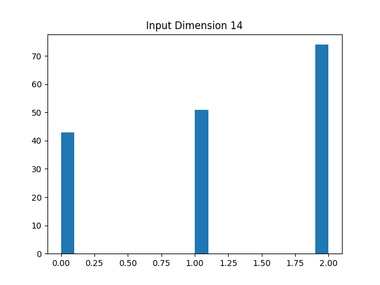{ loading=lazy }

=== "维度15: 领先局数"

    预测较准数据：
    
    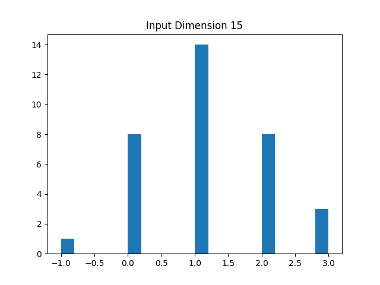{ loading=lazy }
    
    其余数据：
    
    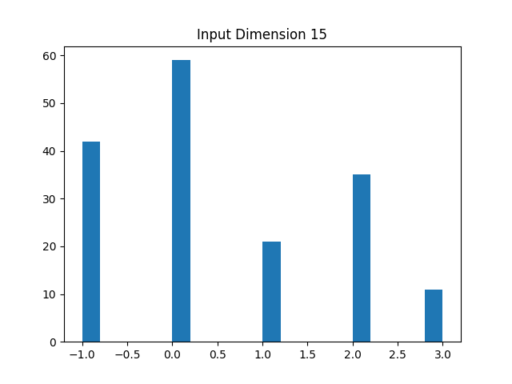{ loading=lazy }

=== "维度16: 领先分数"

    预测较准数据：
    
    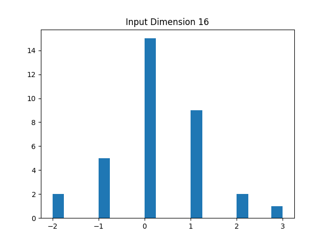{ loading=lazy }
    
    其余数据：
    
    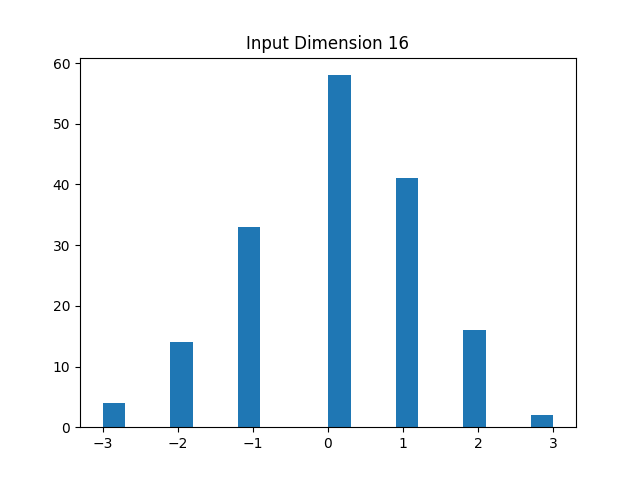{ loading=lazy }

=== "维度14: 是否一局最后3球"

    预测较准数据：
    
    { loading=lazy }
    
    其余数据：
    
    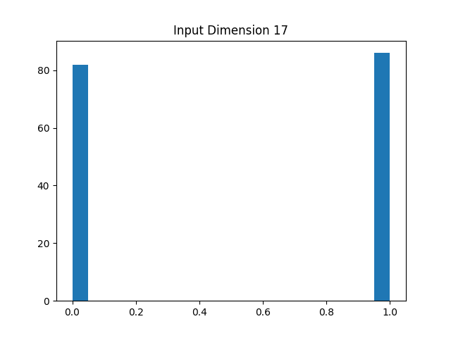{ loading=lazy }

=== "维度18: 当前局获胜所需分数"

    预测较准数据：
    
    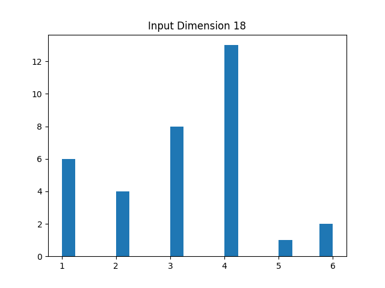{ loading=lazy }
    
    其余数据：
    
    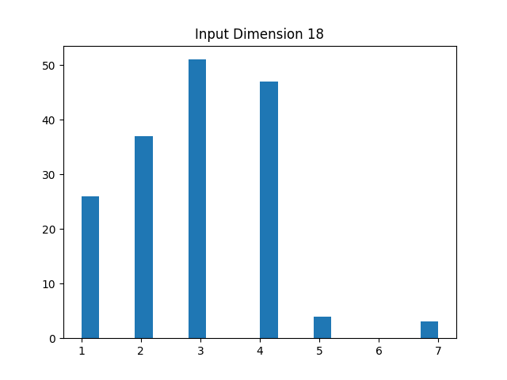{ loading=lazy }

我分析感觉，**那些准确和不准确中比例都差不多的维度/指标，说明就和势头相关性不是那么大，而 ==比例有明显不同== 的维度/指标，就意味着对准确度是关键因素**。

于是把图片传给队友，不知道他是否用上。

然后发现其实还可以更改 **准确** 的判断依据，比如检查 ***势头*上升下降或转折的趋势** 是否和真实数据一致，但是由于距离比赛结束时间不是很多了，最后就没有尝试这样的思路。

>   此时约凌晨3点40

---

最后就是队友在编写论文，我就没有什么任务了。

到了(6号)早上8点队友提交了论文。

## 一点感受

这几天下来是真的累😇，感觉每天都在头脑风暴，最后一天甚至需要通宵，

但是确实又学到了很多东西，个人觉得还是很有意义的🧐(只希望最后不要给我一个S奖，那我是真的会谢😅)。
