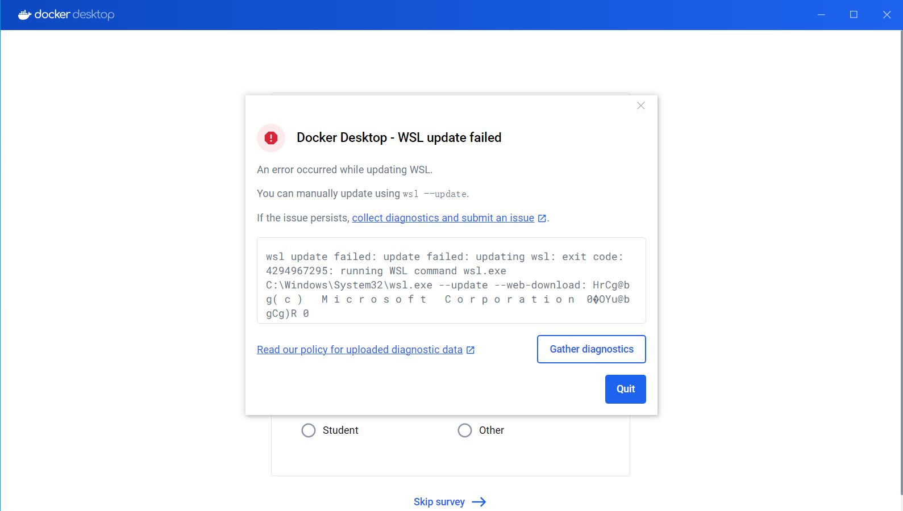

# 尝试本地部署大模型(Llama 3)

突然想尝试本地部署大模型，然后最近刚好同学又提到了Llama 3，于是搜索如何在本地部署这个模型，然后搜索到这个教程(还挺新的)

[Windows（Win10、Win11）本地部署开源大模型保姆级教程-CSDN博客](https://blog.csdn.net/xiangshangdemayi/article/details/137960175)

按照这个教程安装好了Ollama、Hyper-V、Docker Desktop，并下好了Llama 3 8B (默认就是8B)，

<!-- more -->

>   如果要下载70B版本，就需要运行
>
>   ```bash
>   ollama run llama3:70b
>   ```
>
>   >   参考
>   >
>   >   [使用 ollama 部署最新的Llama 3 70B本地模型_llama 3 70b本地部署需要的配置-CSDN博客](https://blog.csdn.net/yu101994/article/details/138076873)

但是在安装Open WebUI时，按教程中的运行这个命令一直没用反应

```bash
docker run -d -p 3000:8080 --add-host=host.docker.internal:host-gateway -v open-webui:/app/backend/data --name open-webui --restart always ghcr.io/open-webui/open-webui:main
```

在尝试过程中发现，如果**不启动Docker Desktop**，那么运行这个命令会直接报这样的错

```bash
docker: error during connect: in the default daemon configuration on Windows, the docker client must be run with elevated privileges to connect: Head "http://%2F%2F.%2Fpipe%2Fdocker_engine/_ping": open //./pipe/docker_engine: The system cannot find the file specified.
See 'docker run --help'.
```

而在我打开Docker Desktop时，总会显示**WSL update failed**

{ loading=lazy }

于是[google搜索相关解决方案](https://www.google.com/search?q=wsl+update+failed%3A+update+failed%3A+updating+wsl%3A+exit+code%3A+4294967295%3A+running+WSL+command+wsl.exe+C%3A%5CWINDOWS%5CSystem32%5Cwsl.exe+--update+--web-download%3A&sca_esv=1b85392d96a2d671&sxsrf=ACQVn09_hQ9YaGkKs5mb3cfF3klqmbEnfg%3A1714388868628&source=hp&ei=hH8vZoyzI6yCm9cPk8u8mAc&iflsig=ANes7DEAAAAAZi-NlGR4dx3unUfJ40fHZd6KMt5a7z1h&ved=0ahUKEwiMhZOcpOeFAxUsweYEHZMlD3MQ4dUDCBU&uact=5&oq=wsl+update+failed%3A+update+failed%3A+updating+wsl%3A+exit+code%3A+4294967295%3A+running+WSL+command+wsl.exe+C%3A%5CWINDOWS%5CSystem32%5Cwsl.exe+--update+--web-download%3A&gs_lp=Egdnd3Mtd2l6IpcBd3NsIHVwZGF0ZSBmYWlsZWQ6IHVwZGF0ZSBmYWlsZWQ6IHVwZGF0aW5nIHdzbDogZXhpdCBjb2RlOiA0Mjk0OTY3Mjk1OiBydW5uaW5nIFdTTCBjb21tYW5kIHdzbC5leGUgQzpcV0lORE9XU1xTeXN0ZW0zMlx3c2wuZXhlIC0tdXBkYXRlIC0td2ViLWRvd25sb2FkOkgAUABYAHAAeACQAQCYAQCgAQCqAQC4AQPIAQD4AQL4AQGYAgCgAgCYAwCSBwCgBwA&sclient=gws-wiz)，第一条结果是docker github仓库中的 issue

[Docker Desktop - WSL update failed · Issue #14022 · docker/for-win (github.com)](https://github.com/docker/for-win/issues/14022)

注意到其中的[这条回答](https://github.com/docker/for-win/issues/14022#issuecomment-2066462674)，

!!! quote "[minhruhr](https://github.com/minhruhr)"

    Same issue here. version 4.29.0 always tries to update my wsl although it's already on the latest version when I try to do it manually.
    
    >   wsl update failed: update failed: updating wsl: exit code: 4294967295: running WSL command wsl.exe C:\WINDOWS\System32\wsl.exe --update --web-download: Downloading: Windows Subsystem for Linux
    >   The requested operation requires elevation.
    >   : exit status 0xffffffff
    
    uninstalling and reinstalling 4.28.0 works again. But I can't seem to be able to update to 4.29.0
    
    Disgnostic ID:
    
    >   E440D448-382B-4F34-BEE3-C1D2FB5E0345/20240419121414

然后看了一下我装的版本，**恰好就是 `4.29.0`**，于是卸载，

然后搜索Docker Desktop历史版本下载界面(在[官方网页](https://www.docker.com/products/docker-desktop/)上没有找到入口)，找到历史版本发行说明

[Docker Desktop release notes | Docker Docs](https://docs.docker.com/desktop/release-notes/#4280)

找到 [`4.28.0` 版本的发行说明](https://docs.docker.com/desktop/release-notes/#4280)，然后下载并安装，发现Docker Desktop就能正常启动了，

然后运行 `docker run ...` 命令，但是显示了如下报错，

```bash
Unable to find image 'ghcr.io/open-webui/open-webui:main' locally
docker: Error response from daemon: Get "https://ghcr.io/v2/": net/http: TLS handshake timeout.
See 'docker run --help'.
```

搜寻信息半天无果后，注意到在那篇教程文章中，命令行[安装聊天界面](https://blog.csdn.net/xiangshangdemayi/article/details/137960175#t6)的截图中，**使用的端口是 `3500:8080`** ，于是修改命令再次运行

>   ```bash
>   docker run -d -p 3500:8080 --add-host=host.docker.internal:host-gateway -v open-webui:/app/backend/data --name open-webui --restart always ghcr.io/open-webui/open-webui:main
>   ```

然后刚才的报错就消失了，就能正常下载了。

下载好了之后，打开对应的链接，并且需要提前打开Ollama，然后就可以选择模型并在本地使用大模型了😆
