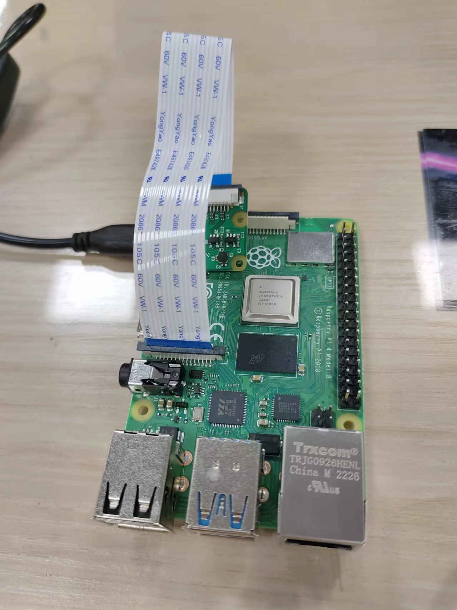
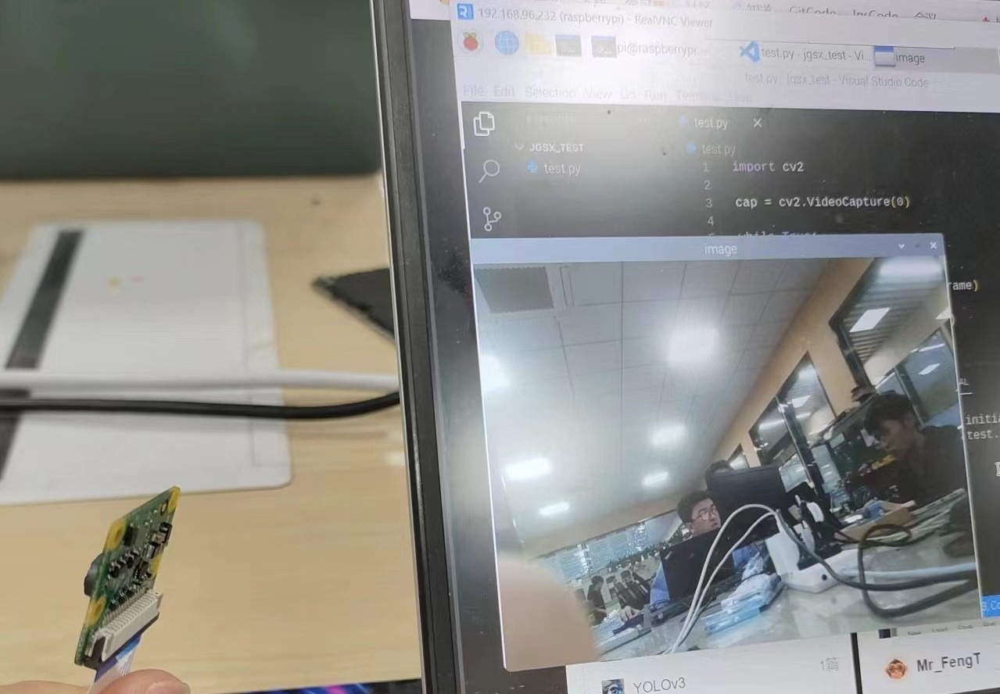

# 树莓派4B使用树莓派摄像头记录

由于金工实习任务是造一个小机器人，而队友打算使用树莓派4B并使用树莓派摄像头来进行图像识别，于是开始进行摸索(之前没有使用树莓派的经验)。

<!-- more -->

老师提供了树莓派4B的板子和树莓派摄像头

{ loading=lazy }

一开始我以为摄像头插上板子之后，就可以直接能够调用了(使用opencv)，但是发现不行(显示没有这个编号的摄像头)

>   ```python
>   import cv2
>   
>   cap = cv2.VideoCapture(0)
>   while True:
>       ret, frame = cap.read()
>       if ret:
>           cv2.imshow("cam", frame)
>       if cv2.waitKey(100) & 0xFF == ord('q'):
>           break
>   ```

于是在网上搜索树莓派使用摄像头的教程，发现这个文章

[树莓派4B摄像头的详细使用教程（拍照+录像+监控）_树莓派拍照-CSDN博客](https://blog.csdn.net/weixin_45994747/article/details/109605765)

发现按照文章说的，还需要打开树莓派的摄像头的接口，

1.   打开树莓派的配置界面

     ```bash
     sudo raspi-config
     ```

2.   选择『Interfacing Options』

3.   选择『Camera』

4.   选择『是』

重启之后再次尝试使用opencv调用摄像头，发现就可以正常使用了😄

{ loading=lazy }

