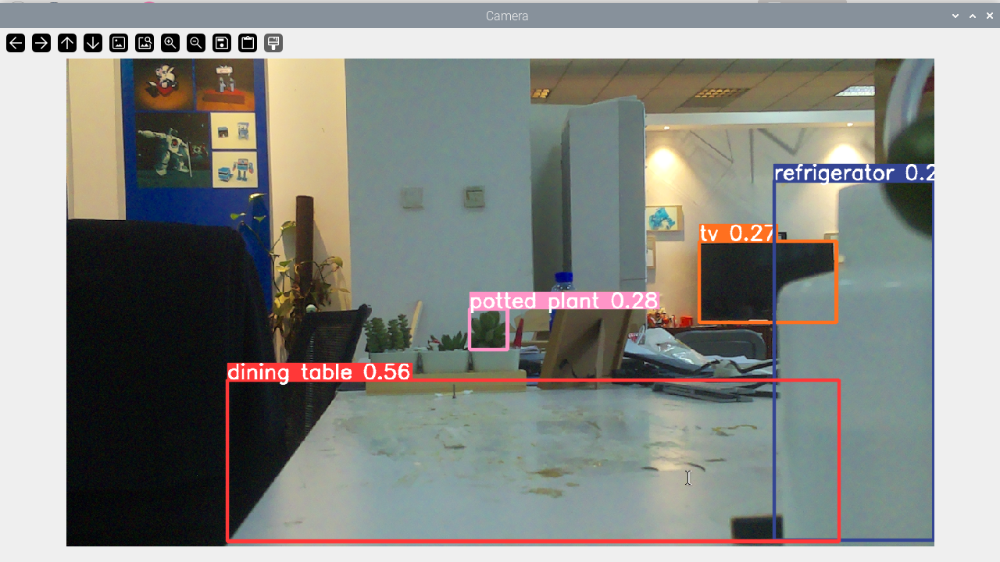
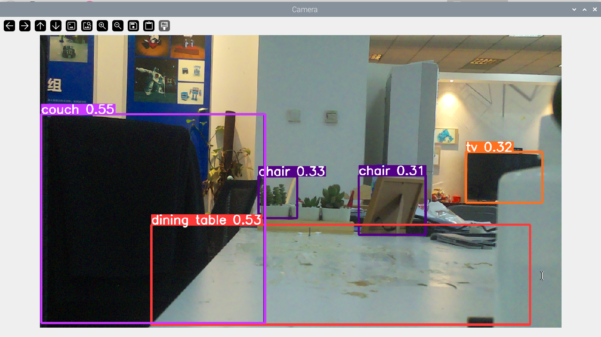

# 树莓派4B系统烧录、设置VNCViewer、配置YOLOv8过程记录

由于之前拿到的sd卡上烧录的树莓派系统是32位的，是armv7l架构，所以很多python包都没有编译好的whl文件，于是重新跟老师要了一张新的sd卡，打算重新烧录64位的系统

<!-- more -->

## 烧录树莓派系统

根据官网文档上的指示操作，[使用 Imager 安装](https://www.raspberrypi.com/documentation/computers/getting-started.html#raspberry-pi-imager)

[` Install an operating system` - Getting started - Raspberry Pi Documentation](https://www.raspberrypi.com/documentation/computers/getting-started.html#installing-the-operating-system)

## 设置VNCViewer

可以参考RealVNC的官方文档进行操作

[RealVNC Connect and Raspberry Pi – RealVNC Help Center](https://help.realvnc.com/hc/en-us/articles/360002249917-RealVNC-Connect-and-Raspberry-Pi)

需要注意的是，可能需要在树莓派接口的设置中把VNC打开(如果之前没有打开过的话)

>   select **Menu > Preferences > Raspberry Pi Configuration > Interfaces** and make sure **VNC** is set to **Enabled**.
>
>   Alternatively, run the command `sudo raspi-config`, navigate to **Interface Options > VNC** and select **Yes**.

然后在电脑上的vncviewer中输入树莓派的IP就可以连接树莓派了(电脑和树莓派需要连接同一个wifi)

## 配置YOLOv8

由于[YOLOv8官方文档](https://docs.ultralytics.com/guides/raspberry-pi/#start-with-docker)中推荐使用Docker进行安装，所以需要在树莓派上先安装Docker

### 安装Docker

根据Docker官方文档

[Install Docker Engine on Raspberry Pi OS (32-bit) | Docker Docs](https://docs.docker.com/engine/install/raspberry-pi-os/)

!!! warning "Important"

    This installation instruction refers to the 32-bit (armhf) version of Raspberry Pi OS. If you're using the 64-bit (arm64) version, follow the instructions for [Debian](https://docs.docker.com/engine/install/debian/).

由于 [**Install using the `apt` repository**](https://docs.docker.com/engine/install/debian/#install-using-the-repository) 中的方法在尝试时发现连接不上，于是使用 [**Install from a package**](https://docs.docker.com/engine/install/debian/#install-from-a-package) 中的方法

>   查看Debian系统的版本号
>
>   ```bash
>   lsb_release -a
>   ```
>
>   查看系统的架构
>
>   ```bash
>   uname -a
>   ```
>
>   >   ```bash
>   >   ronald@raspberrypi:~ $ lsb_release -a
>   >   No LSB modules are available.
>   >   Distributor ID:	Debian
>   >   Description:	Debian GNU/Linux 12 (bookworm)
>   >   Release:	12
>   >   Codename:	bookworm
>   >   ronald@raspberrypi:~ $ uname -a
>   >   Linux raspberrypi 6.6.31+rpt-rpi-v8 #1 SMP PREEMPT Debian 1:6.6.31-1+rpt1 (2024-05-29) aarch64 GNU/Linux
>   >   ```
>   >
>   >   aarch64 和 arm64 似乎是同一种架构

---

### 通过ssh连接树莓派

>   由于需要传输文件

username就是树莓派的用户名，ip地址就是树莓派的ip地址在vscode或者mobaxterm上设置好连接，然后输入密码即可

>   可以参考树莓派官方文档
>
>   [Remote access - Raspberry Pi Documentation](https://www.raspberrypi.com/documentation/computers/remote-access.html#ssh)

---

```bash
dpkg: dependency problems prevent configuration of docker-ce:
 docker-ce depends on iptables; however:
  Package iptables is not installed.
```

于是安装iptables

```bash
sudo apt-get install iptables
```

然后就安装好了docker-ce

### 安装Clash Verge并进行相应配置

由于安装好docker之后，尝试运行[YOLOv8官方文档](https://docs.ultralytics.com/guides/raspberry-pi/#start-with-docker)中的命令

```bash
t=ultralytics/ultralytics:latest-arm64 && sudo docker pull $t && sudo docker run -it --ipc=host $t
```

发现能运行，但是似乎连接不上，

而搜索了一下docker换源的方法似乎又没有比较方便的方法(刚好前几天docker hub很多镜像被关停了)，于是打算安装clash verge直接让树莓派翻墙，看看能不能从docker安装YOLOv8。

于是下载clash-verge arm64的deb安装文件

>   [clash-verge-rev/clash-verge-rev: Continuation of Clash Verge - A Clash Meta GUI based on Tauri (Windows, MacOS, Linux) (github.com)](https://github.com/clash-verge-rev/clash-verge-rev)

并安装，安装好之后运行 `clash-verge` 命令启动。

此时尝试运行上面安装yolov8的命令还是连接失败，

然后根据这两个文章，设置了一下

>   -   [如何在树莓派上使用 Clash | MR-Addict 的个人主页 (mraddict.top)](https://mraddict.top/posts/clash-on-rpi/index.html#%E5%9B%9B%E3%80%81%E9%85%8D%E7%BD%AE%E7%BB%88%E7%AB%AF%E4%BB%A3%E7%90%86)
>   -   [如何配置Docker网络代理 - ByteHandler - 博客园 (cnblogs.com)](https://www.cnblogs.com/bytehandler/p/17105379.html)

1.   **终端**的代理

     ```bash
     sudo vim /etc/environment
     ```

     添加如下内容

     ```bash
     export http_proxy="http://127.0.0.1:7897"
     export https_proxy="http://127.0.0.1:7897"
     export no_proxy="localhost, 127.0.0.1, *edu.cn"
     ```

2.   **Docker**的代理

     **==更新docker.service==**

     更新`/lib/systemd/system/docker.service`配置文件

     ```yaml
     [Service]
     Environment="HTTP_PROXY=http://127.0.0.1:7897"
     Environment="HTTPS_PROXY=http://127.0.0.1:7897"
     ```

     **重启docker**

     ```bash
     sudo systemctl daemon-reload
     sudo systemctl restart docker
     ```

然后重新运行命令

```bash
t=ultralytics/ultralytics:latest-arm64 && sudo docker pull $t && sudo docker run -it --ipc=host $t
```

就可以从docker安装YOLOv8了(终于😭)

### Docker的一些操作

通过以下命令可以查看容器

```bash
sudo docker ps [-aq]
```

`-aq` 则包含已经停止的所有容器，

```bash
ronald@raspberrypi:~ $ sudo docker ps
CONTAINER ID   IMAGE                                  COMMAND   CREATED          STATUS          PORTS     NAMES
1ccc998a556f   ultralytics/ultralytics:latest-arm64   "bash"    12 minutes ago   Up 12 minutes             eager_lumiere
```

存档容器的状态

```bash
sudo docker commit 1ccc998a556f myyolo:v1
```

再次从这个状态启动

```bash
sudo docker run -it --ipc=host myyolo:v1
```

如果要启动某一个容器并打开它的终端(通过容器id)

```bash
sudo docker start 63ecca25cf60
sudo docker exec -it 63ecca25cf60 /bin/bash
```

---

### 使用pip安装YOLOv8

由于尝试了很久，一直无法成功在docker容器中打开树莓派摄像头，

>   期间参考了这个文章进行尝试
>
>   [How to Access the Raspberry Pi Camera in Docker (losant.com)](https://www.losant.com/blog/how-to-access-the-raspberry-pi-camera-in-docker)
>
>   `How to Let Non-Root Users Access the Raspberry Pi Camera` 中，添加自定义的udev规则后
>
>   ```bash title="/etc/udev/rules.d/99-camera.rules"
>   SUBSYSTEM=="vchiq",MODE="0666"
>   ```
>
>   在启动容器时就可以添加设备了，但是要注意 `--device` 参数需要放在前面
>
>   ```bash
>   sudo docker run -it --ipc=host --device /dev/vchiq myyolo:v2
>   ```

于是打算不适用docker安装yolov8。

直接

```bash
pip install ultralytics
```

发现，产生了报错

```bash
ronald@raspberrypi:~ $ pip install ultralytics
error: externally-managed-environment

× This environment is externally managed
╰─> To install Python packages system-wide, try apt install
    python3-xyz, where xyz is the package you are trying to
    install.
    
    If you wish to install a non-Debian-packaged Python package,
    create a virtual environment using python3 -m venv path/to/venv.
    Then use path/to/venv/bin/python and path/to/venv/bin/pip. Make
    sure you have python3-full installed.
    
    For more information visit http://rptl.io/venv

note: If you believe this is a mistake, please contact your Python installation or OS distribution provider. You can override this, at the risk of breaking your Python installation or OS, by passing --break-system-packages.
hint: See PEP 668 for the detailed specification.
```

于是查看 [http://rptl.io/venv](http://rptl.io/venv)

>   Starting in Raspberry Pi OS *Bookworm*, packages installed via `pip` *must be installed into a Python virtual environment* (`venv`). A virtual environment is a container where you can safely install third-party modules so they won’t interfere with your system Python.
>
>   ---
>
>   从 Raspberry Pi OS *Bookworm* 开始，通过 `pip` 安装的软件包*必须安装到 Python 虚拟环境中* ( `venv` )。虚拟环境是一个容器，您可以在其中安全地安装第三方模块，这样它们就不会干扰您的系统 Python。

于是按照网站上的指示，创建虚拟环境并激活环境

```bash
python -m venv yolo
source yolo/bin/activate
```

然后再

```bash
pip install ultralytics
```

就可以安装yolov8了

```bash
Successfully installed MarkupSafe-2.1.5 certifi-2024.6.2 charset-normalizer-3.3.2 contourpy-1.2.1 cycler-0.12.1 filelock-3.15.1 fonttools-4.53.0 fsspec-2024.6.0 idna-3.7 jinja2-3.1.4 kiwisolver-1.4.5 matplotlib-3.9.0 mpmath-1.3.0 networkx-3.3 numpy-1.26.4 opencv-python-4.10.0.82 packaging-24.1 pandas-2.2.2 pillow-10.3.0 psutil-5.9.8 py-cpuinfo-9.0.0 pyparsing-3.1.2 python-dateutil-2.9.0.post0 pytz-2024.1 pyyaml-6.0.1 requests-2.32.3 scipy-1.13.1 seaborn-0.13.2 six-1.16.0 sympy-1.12.1 torch-2.3.1 torchvision-0.18.1 tqdm-4.66.4 typing-extensions-4.12.2 tzdata-2024.1 ultralytics-8.2.31 ultralytics-thop-0.2.8 urllib3-2.2.1
```

[`Inference with Camera` - Raspberry Pi - Ultralytics YOLO Docs](https://docs.ultralytics.com/guides/raspberry-pi/#inference-with-camera) 中给出的使用树莓派摄像头的方法是使用picamera2这个包，于是安装

```bash
pip install picamera2
```

过程中出现这个报错

```bash
Collecting python-prctl
  Using cached https://mirrors.bfsu.edu.cn/pypi/web/packages/c0/99/be5393cfe9c16376b4f515d90a68b11f1840143ac1890e9008bc176cf6a6/python-prctl-1.8.1.tar.gz (28 kB)
  Preparing metadata (setup.py) ... error
  error: subprocess-exited-with-error
  
  × python setup.py egg_info did not run successfully.
  │ exit code: 1
  ╰─> [1 lines of output]
      You need to install libcap development headers to build this module
      [end of output]
  
  note: This error originates from a subprocess, and is likely not a problem with pip.
error: metadata-generation-failed

× Encountered error while generating package metadata.
╰─> See above for output.

note: This is an issue with the package mentioned above, not pip.
hint: See above for details.
```

需要安装libcap-dev

```bash
sudo apt-get install libcap-dev
```

之后再安装picamera2就可以安装上了

---

但是发现，在创建venv虚拟环境时，添加 `--system-site-packages` 就可以使用系统的python包了

>   参考了这里
>
>   [How to install picamera2 - Raspberry Pi Forums](https://forums.raspberrypi.com/viewtopic.php?t=367558#p2204296)

然后picamera2就可以不用再安装了。

最后运行 [`Inference with Camera`](https://docs.ultralytics.com/guides/raspberry-pi/#__tabbed_5_1) 中的第1个方法的代码，并将权重换成之前导出的ncnn格式的权重，

```python hl_lines="15"
import cv2
from picamera2 import Picamera2

from ultralytics import YOLO

# Initialize the Picamera2
picam2 = Picamera2()
picam2.preview_configuration.main.size = (1280, 720)
picam2.preview_configuration.main.format = "RGB888"
picam2.preview_configuration.align()
picam2.configure("preview")
picam2.start()

# Load the YOLOv8 model
model = YOLO("yolov8n_ncnn_model")

while True:
    # Capture frame-by-frame
    frame = picam2.capture_array()

    # Run YOLOv8 inference on the frame
    results = model(frame)

    # Visualize the results on the frame
    annotated_frame = results[0].plot()

    # Display the resulting frame
    cv2.imshow("Camera", annotated_frame)

    # Break the loop if 'q' is pressed
    if cv2.waitKey(1) == ord("q"):
        break

# Release resources and close windows
cv2.destroyAllWindows()
```

就可以直接使用摄像头来进行识别功能了😆

{ loading=lazy }

{ loading=lazy }

{ loading=lazy }

