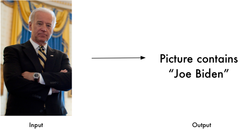

# 实现人脸比对功能的记录

由于比赛中，在完成任务之后，需要回到发出这个任务的志愿者前，所以需要识别出这个志愿者，因此需要使用人脸比对功能

于是询问Microsoft Copilot如何实现

<!-- more -->

## 使用 face_recognition

???+ example "对话记录"

    你
    
    so how to use python to implement face matching?
    
    &nbsp;
    
    Copilot:
    
    Implementing face matching in Python involves several steps, typically using libraries such as `face_recognition` or `dlib`. Here’s a simplified process to get you started:
    
    1.   **Install Libraries**: First, install the necessary Python libraries. The `face_recognition` library is widely used for this purpose. You can install it using pip:
    
         ```bash
         pip install face_recognition
         ```
    
    2.   **Load Images**: Load the images containing the faces you want to match. This can be done using the `face_recognition.load_image_file` function.
    
    3.   **Find Face Encodings**: Find the face encodings for each face in the images. Face encodings are essentially numerical representations of the features of a face.
    
         ```python
         import face_recognition
    
         # Load the images
         known_image = face_recognition.load_image_file("known_image.jpg")
         unknown_image = face_recognition.load_image_file("unknown_image.jpg")
    
         # Get the face encodings
         known_encoding = face_recognition.face_encodings(known_image)[0]
         unknown_encoding = face_recognition.face_encodings(unknown_image)[0]
         ```
    
    4.   **Compare Faces**: Use the `face_recognition.compare_faces` function to compare the faces and determine if they match.
    
         ```python
         # Compare faces
         results = face_recognition.compare_faces([known_encoding], unknown_encoding)
         ```
    
    5.   **Check Results**: The `compare_faces` function will return a list of `True`/`False` values indicating which known face encodings match the unknown face encoding.
    
         ```python
         if results[0]:
             print("It's a match!")
         else:
             print("Not a match.")
         ```
    
    6.   **Handle Multiple Faces**: If there are multiple faces in an image, you’ll need to loop through the encodings.
    
    7.   **Tune Tolerance**: You can adjust the tolerance parameter in `compare_faces` to make the matching more or less strict.
    
    Here’s a complete example that puts it all together:
    
    ```python
    import face_recognition
    
    # Load the images
    known_image = face_recognition.load_image_file("known_image.jpg")
    unknown_image = face_recognition.load_image_file("unknown_image.jpg")
    
    # Get the face encodings
    known_encoding = face_recognition.face_encodings(known_image)[0]
    unknown_encoding = face_recognition.face_encodings(unknown_image)[0]
    
    # Compare faces
    results = face_recognition.compare_faces([known_encoding], unknown_encoding)
    
    # Check results
    if results[0]:
        print("It's a match!")
    else:
        print("Not a match.")
    ```
    
    This is a basic example, and in a real-world scenario, you would need to handle cases where no faces are found or when multiple faces are present in an image. Additionally, you might want to implement a system to manage the known face encodings, possibly storing them in a database for a scalable solution.
    
    [Remember to respect privacy and ethical considerations when working with facial recognition technology](https://pyimagesearch.com/2018/06/18/face-recognition-with-opencv-python-and-deep-learning/) [`¹`](https://pyimagesearch.com/2018/06/18/face-recognition-with-opencv-python-and-deep-learning/) [`²`](https://github.com/pescheckit/face-recognition-fast) [`³`](https://realpython.com/face-recognition-with-python/).
    
    了解详细信息 [`1 | pyimagesearch.com`](https://pyimagesearch.com/2018/06/18/face-recognition-with-opencv-python-and-deep-learning/) [`2 | github.com`](https://github.com/pescheckit/face-recognition-fast) [`3 | realpython.com`](https://realpython.com/face-recognition-with-python/) [`4 | github.com`](https://github.com/sakshamjindal/Face-Matching)

用笔记本的摄像头拍了两张照片进行测试，发现能显示 `It's a match!` 。

然后取查看了这个包github上的仓库

[ageitgey/face_recognition: The world's simplest facial recognition api for Python and the command line (github.com)](https://github.com/ageitgey/face_recognition)

!!! abstract "README.md"

    <h4>Identify faces in pictures</h4>
    
    Recognize who appears in each photo.
    
    { loading=lazy }
    
    ```python
    import face_recognition
    known_image = face_recognition.load_image_file("biden.jpg")
    unknown_image = face_recognition.load_image_file("unknown.jpg")
    
    biden_encoding = face_recognition.face_encodings(known_image)[0]
    unknown_encoding = face_recognition.face_encodings(unknown_image)[0]
    
    results = face_recognition.compare_faces([biden_encoding], unknown_encoding)
    ```
    
    You can even use this library with other Python libraries to do real-time face recognition:
    
    See [this example](https://github.com/ageitgey/face_recognition/blob/master/examples/facerec_from_webcam_faster.py) for the code.

`README.md` 中的这一段就是人脸比对功能的相关说明，提到了如果想要进行**实时**的人脸对比，那么可以看 [`examples/facerec_from_webcam_faster.py`](https://github.com/ageitgey/face_recognition/blob/master/examples/facerec_from_webcam_faster.py) ，

直接cv下来尝试运行，但出现了这样的报错

```bash
Traceback (most recent call last):
  File "c:\VSCode\python\test3.py", line 55, in <module>
    face_encodings = face_recognition.face_encodings(rgb_small_frame, face_locations)
  File "C:\Users\Ronald\AppData\Local\Programs\Python\Python310\lib\site-packages\face_recognition\api.py", line 214, in face_encodings
    return [np.array(face_encoder.compute_face_descriptor(face_image, raw_landmark_set, num_jitters)) for raw_landmark_set in raw_landmarks]
  File "C:\Users\Ronald\AppData\Local\Programs\Python\Python310\lib\site-packages\face_recognition\api.py", line 214, in <listcomp>  
    return [np.array(face_encoder.compute_face_descriptor(face_image, raw_landmark_set, num_jitters)) for raw_landmark_set in raw_landmarks]
TypeError: compute_face_descriptor(): incompatible function arguments. The following argument types are supported:
    1. (self: _dlib_pybind11.face_recognition_model_v1, img: numpy.ndarray[(rows,cols,3),numpy.uint8], face: _dlib_pybind11.full_object_detection, num_jitters: int = 0, padding: float = 0.25) -> _dlib_pybind11.vector
    2. (self: _dlib_pybind11.face_recognition_model_v1, img: numpy.ndarray[(rows,cols,3),numpy.uint8], num_jitters: int = 0) -> _dlib_pybind11.vector
    3. (self: _dlib_pybind11.face_recognition_model_v1, img: numpy.ndarray[(rows,cols,3),numpy.uint8], faces: _dlib_pybind11.full_object_detections, num_jitters: int = 0, padding: float = 0.25) -> _dlib_pybind11.vectors
    4. (self: _dlib_pybind11.face_recognition_model_v1, batch_img: List[numpy.ndarray[(rows,cols,3),numpy.uint8]], batch_faces: List[_dlib_pybind11.full_object_detections], num_jitters: int = 0, padding: float = 0.25) -> _dlib_pybind11.vectorss
    5. (self: _dlib_pybind11.face_recognition_model_v1, batch_img: List[numpy.ndarray[(rows,cols,3),numpy.uint8]], num_jitters: int = 0) -> _dlib_pybind11.vectors

Invoked with: <_dlib_pybind11.face_recognition_model_v1 object at 0x000002157EDD76B0>, array([[[163, 157, 158],
        [167, 155, 150],
        [171, 152, 144],
        ...,
        [151, 145, 144],
        [148, 147, 145],
        [149, 147, 148]],

       [[164, 157, 153],
        [167, 157, 153],
        [169, 154, 150],
        ...,
        [146, 148, 146],
        [147, 147, 147],
        [148, 144, 149]],

       [[168, 158, 156],
        [167, 158, 157],
        [167, 158, 156],
        ...,
        [142, 145, 146],
        [148, 145, 148],
        [144, 143, 145]],

       ...,

       [[109,  64,  59],
        [104,  63,  56],
        [102,  62,  55],
        ...,
        [111,  81,  80],
        [105,  75,  74],
        [107,  74,  72]],

       [[107,  65,  57],
        [106,  65,  55],
        [103,  64,  53],
        ...,
        [113,  80,  76],
        [106,  74,  70],
        [104,  72,  69]],

       [[102,  64,  55],
        [105,  63,  56],
        [106,  64,  56],
        ...,
        [112,  86,  79],
        [111,  82,  73],
        [108,  79,  69]]], dtype=uint8), <_dlib_pybind11.full_object_detection object at 0x00000215766646B0>, 1
```

google搜索这个报错

[opencv - face_recognition problem with face_encodings function - Stack Overflow](https://stackoverflow.com/questions/75926662/face-recognition-problem-with-face-encodings-function)

于是参照[Sahil Bandar的回答](https://stackoverflow.com/a/75943024)进行修改(由于代码中的函数和回答中的略有不同)

```python title="facerec_from_webcam_faster.py" linenums="50" hl_lines="3"
# Convert the image from BGR color (which OpenCV uses) to RGB color (which face_recognition uses)
# rgb_small_frame = small_frame[:, :, ::-1]
rgb_small_frame = np.ascontiguousarray(small_frame[:, :, ::-1])
```

然后就可以运行并显示摄像头实时检测的图像了。

但是测试发现，误差很大，不同的人脸基本上都能识别成同一个，于是打算换用别的库。

## 使用 face-recognition-using-deep-learning

[在github上搜索 `identify faces`](https://github.com/search?q=Identify+faces&type=repositories) ，第二个搜索结果

[aakashjhawar/face-recognition-using-deep-learning: Identify faces from video and images using OpenCV and Deep Learning (github.com)](https://github.com/aakashjhawar/face-recognition-using-deep-learning)

clone好之后按照 `README.md` 中的说明进行使用

>   How to use
>
>   ```
>   git clone https://github.com/aakashjhawar/face-recognition-using-opencv
>   cd face-recognition-using-opencv
>   ```
>
>   -   Create dataset of face images.
>   -   Place the face images in dataset folder.
>   -   Extract facial embeddings. `python extract_embeddings.py`
>   -   Train the SVM model `python train_model.py`
>   -   Test the model `python recognize_video.py`

按照 `dataset/` 已有的文件结构和格式，新的已知的人脸的照片放在 `dataset/<名字>/` 下即可，然后依次运行 `extract_embeddings.py` `train_model.py` 很快就可以训练好模型，

但是在运行 `recognize_video.py` 文件时，出现了这样的报错

```bash
Traceback (most recent call last):
  File "c:\Users\Ronald\face-recognition-using-opencv\recognize_video.py", line 22, in <module>
    recognizer = pickle.loads(open("output/recognizer.pickle", "rb").read())
ModuleNotFoundError: No module named 'copy_reg\r'
```

搜索发现issue中有人提到这个问题

[ModuleNotFoundError: No module named 'copy_reg\r' · Issue #5 · aakashjhawar/face-recognition-using-deep-learning (github.com)](https://github.com/aakashjhawar/face-recognition-using-deep-learning/issues/5)

然后根据[s-abinash的回答](https://github.com/aakashjhawar/face-recognition-using-deep-learning/issues/5#issuecomment-913741111)，进行修改

```python title="recognize_video.py" linenums="21" hl_lines="3"
# load the actual face recognition model along with the label encoder
# recognizer = pickle.loads(open("output/recognizer.pickle", "rb").read())
recognizer = pickle.loads(open("output/recognizer", "rb").read())
le = pickle.loads(open("output/le.pickle", "rb").read())
```

再次运行，就可以正常显示通过摄像头实时检测的画面了。

测试发现，训练用的同一个人脸的照片，如果只有1张的话，基本不太能识别出来，增加到7张左右，就可以大致识别出来了，并且不同的人脸基本不会识别成同一个
